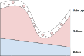
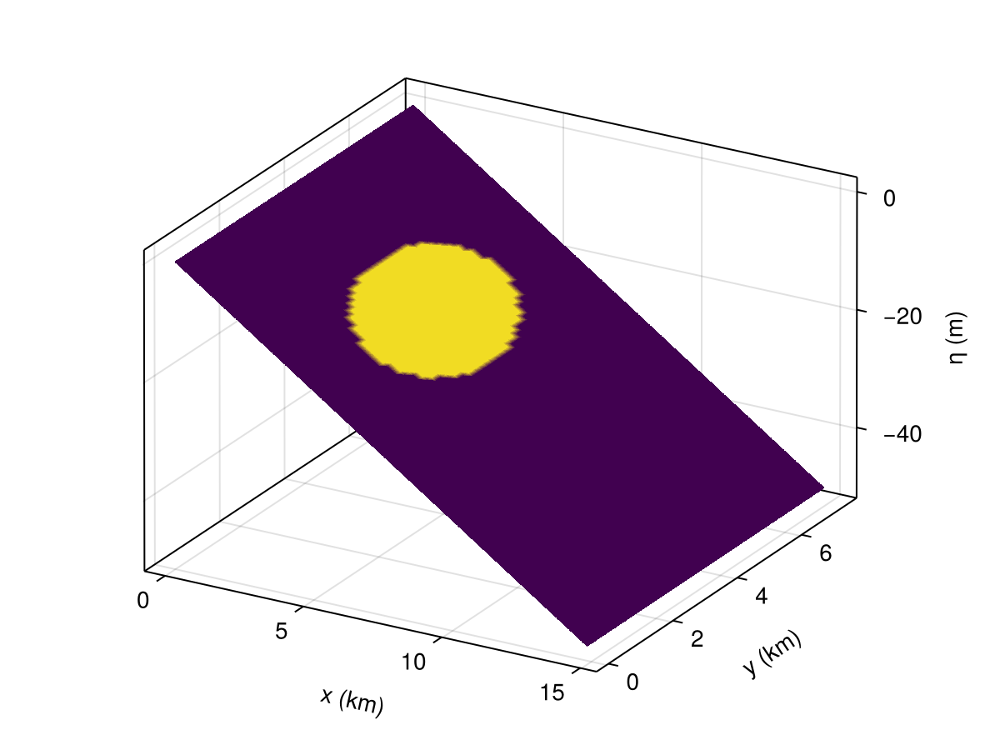
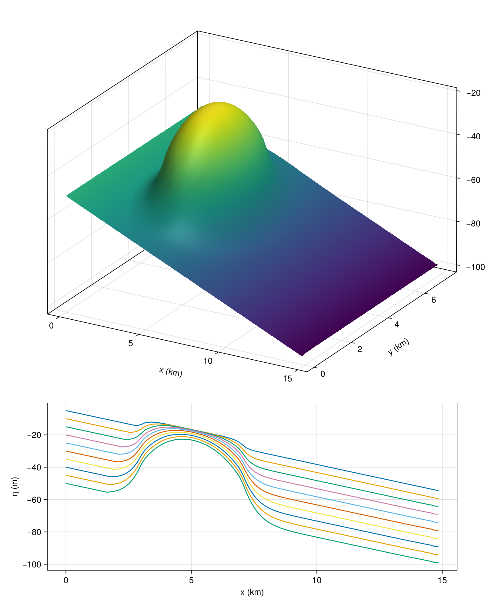
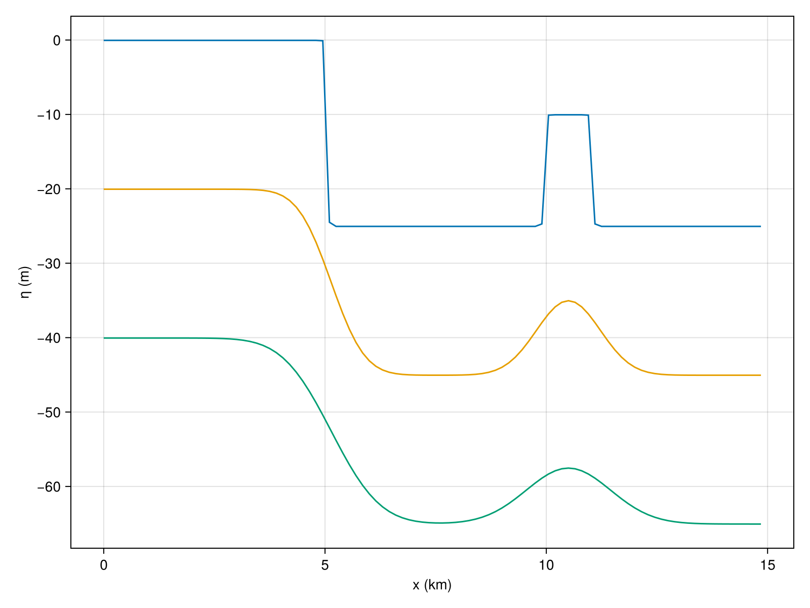

# Active Layer Transport

The following is inspired on well-known **active layer** approaches in river bed sediment transport [Paola1992](@cite) [James2010](@cite) [^1]. All quantities with subscript $f$ are facies dependent. Sediment is measured in meters of deposited material. $P_f$ is the production of sediment per facies in $m/s$. Further unit calculations would be more readable if we consider the unit of sediment as separate, so for instance it doesn't cancel against $m^2$ in the units of sediment flux. In the implementation, $\nu$ has the units of ${\rm m}$ which is totaly weird. TBC

[^1]: Literature on active (or mixing) layer transport modeling is vast. Most of which is concerned with much smaller time scales, and more complicated physics than we are mostly dealing with.

In a model without transport, we could write

$$\sigma + \sum_f {{\partial \eta_f} \over {\partial t}} = \sum_f P_f,$$

where $\sigma$ is the subsidence rate in $m/s$. We consider the mass balance for each facies separately.

We suppose that loose sediment, either fresh production or disintegrated older sediment, is being transported in a layer on top of the sea bed. The flux in this layer is assumed to be directly proportional to the local slope of the sea bed $| \nabla_x \eta_* |$, where $\eta_* = \sum_f \eta_f$, the sum over all facies contributions, including $\eta_0$, the initial bedrock eleveation.



The active layer now contains a concentration $C_f$ particles of different grain size (for each facies $f$). If needed, $C_f = \alpha_f P_f$ where $\alpha_f$ is some facies parameter determining the fraction of production that is available for transport. The sediment flux is given as,

$${\bf q_f} = -\nu_f C_f {\bf \nabla_x} \eta_*.$$

The following is the mass balance:

$$\sigma + {{\partial \eta_*} \over {\partial t}} = -\sum_f {\bf \nabla_x} \cdot {\bf q_f} + \sum_f P_f,$$

In our modelling we keep track of individual contributions per facies over time [^2].

[^2]: Note that in other approaches to active layer transport, like Paola 1992, there would be a factor $1/C_f$. Here we have a different interpretation to what the concentration means: the sediment settles down after transport, such that the concentration has no impact on the change in sediment surface elevation.

Combining these equations, and ignoring subsidence for the moment (which is a global effect and can't be expressed on a per-facies basis), we get a component-wise diffusion equation

$${{\partial \eta_f(x)}\over{\partial t}} = {\bf \nabla_x} \cdot \big[ \nu_f \alpha_f\ P_f(x)\ {\bf \nabla_x} \eta_{*}(x) \big] + P_f(x),$$

In our model we need to solve this equation one time-step each iteration. If we solve this using forward methods, we should be reminded of the CFL limit for diffusion equations (depending on the diffusion constants and grid size we shouldn't pick the time steps too large). Alternatively, for these two-dimensional situations, an implicit approach is feasible. Also we should take care that somehow $\nabla(\nu\alpha P \nabla \eta) + P > 0$. The interpretation being that we can't transport more than we produce, even if there is capacity to do so.

To solve this equation, it is nicer to expand the transport-diffusion term using the product rule, in short notation:

$$\partial_t \eta_f = \nu' \nabla P_f(x) \cdot \nabla \eta(x) + \nu' P_f(x) \nabla^2 \eta(x) + P_f(x),$$

where $\nu' = \nu_f \alpha_f$

So we have a advection component with velocity $\nu' \nabla P_f$ and a diffusion component with a coefficient $\nu' P_f$.

As part of the production $P_f$ we disintegrate older sediment at a fixed rate.

## Test 1: production transport

Suppose we have an incline in one direction, as per usual on a coastal slice. Production is happening in a circular patch in our box, with constant rate. In addition, we'll release the top 1m of sediment for further transport.

```@raw html
<details><summary>Test model</summary>
```

``` {.julia file=examples/transport/active-layer.jl}
module ActiveLayer

using Unitful
using CarboKitten.Stencil: convolution, stencil
using CarboKitten.Config: Box, axes
using CarboKitten.BoundaryTrait: Shelf
using CarboKitten.Utility: in_units_of
using CarboKitten.Transport.ActiveLayer: pde_stencil, Amount, Rate

<<example-active-layer>>

end
```

```@raw html
</details>
```

Our input structure facilitates a single facies, specifying an initial bedrock elevation, sediment layer and a function for a location dependent constant production rate. The transport is parametrized by a disintegration rate and a diffusion coefficient.

``` {.julia #example-active-layer}
@kwdef struct Input
    box
    Δt::typeof(1.0u"Myr")
    t_end::typeof(1.0u"Myr")
    initial_topography   # function (x::u"m", y::u"m") -> u"m"
    initial_sediment    # function (x::u"m", y::u"m") -> u"m"
    production          # function (x::u"m", y::u"m") -> u"m/s"
    disintegration_rate::typeof(1.0u"m/Myr")
    subsidence_rate::typeof(1.0u"m/Myr")
    diffusion_coefficient::typeof(1.0u"m")
end
```

### Production patch
Establish a grid of 100x50, 15km on each side, dropping from 0 to 50m depth. Keeping the disintegration rate to a similar value as the production rate seems a sensible choice.

``` {.julia #example-active-layer}
production_patch(center, radius, rate) = function(x, y)
    (pcx, pcy) = center
    (x - pcx)^2 + (y - pcy)^2 < radius^2 ?
        rate :
        0.0u"m/Myr"
end

const input = Input(
    box=Box{Shelf}(grid_size=(100, 50), phys_scale=150.0u"m"),
    Δt=0.001u"Myr",
    t_end=1.0u"Myr",

    initial_topography = (x, y) -> -x / 300.0,
    initial_sediment = (x, y) -> 0.0u"m",

    production = production_patch(
        (5000.0u"m", 3750.0u"m"),
        2.0u"km",
        50.0u"m/Myr"),

    disintegration_rate = 50.0u"m/Myr",
    subsidence_rate = 50.0u"m/Myr",

    diffusion_coefficient = 10000.0u"m"
)
```



```@raw html
<details><summary>Plotting code</summary>
```

``` {.julia .task file=examples/transport/active-layer-plot-production.jl}
#| requires: examples/transport/active-layer.jl
#| creates: docs/src/_fig/active-layer-production-patch.png
#| collect: figures

include("active-layer.jl")
using Unitful
using CarboKitten.Config: axes
using CarboKitten.Utility: in_units_of
using CairoMakie
using .ActiveLayer: input

function main()
  (x, y) = axes(input.box)
  η = input.initial_topography.(x, y')
  p = input.production.(x, y')

  fig = Figure()
  ax = Axis3(fig[1,1], xlabel="x (km)", ylabel="y (km)", zlabel="η (m)", azimuth=5π/3)
  surface!(ax, x |> in_units_of(u"km"), y |> in_units_of(u"km"), η |> in_units_of(u"m"), color = p |> in_units_of(u"m/Myr"))
  save("docs/src/_fig/active-layer-production-patch.png", fig)
end

main()
```

```@raw html
</details>
```

### Solving the PDE

Just as a reminder:

$$\partial_t \eta_f = \nu' \nabla P_f(x) \cdot \nabla \eta(x) + \nu' P_f(x) \nabla^2 \eta(x) + P_f(x)$$

Below is the kernel encoding a central differencing scheme i.e. `[-1, 0, 1]/(2Δx)` for first derivative and `[0 -1 0; -1 4 -1; 0 -1 0]/Δx^2` for the laplacian.

``` {.julia file=src/Transport/ActiveLayer.jl}
module ActiveLayer

using Unitful
using ...BoundaryTrait
using ...Boxes: Box
using ...Stencil: stencil

const Rate = typeof(1.0u"m/Myr")
const Amount = typeof(1.0u"m")

function pde_stencil(box::Box{BT}, ν) where {BT <: Boundary{2}}
    Δx = box.phys_scale

    function kernel(x)
        adv = ν * ((x[3, 2][1] - x[1, 2][1]) * (x[3, 2][2] - x[1, 2][2]) +
                    (x[2, 3][1] - x[2, 1][1]) * (x[2, 3][2] - x[2, 1][2])) /
                  (2Δx)^2

        dif = ν * x[2, 2][2] * (x[3, 2][1] + x[2, 3][1] + x[1, 2][1] +
                  x[2, 1][1] - 4*x[2, 2][1]) / (Δx)^2

        prd = x[2, 2][2]

        return max(0.0u"m", adv + dif + prd)
    end

    stencil(Tuple{Amount, Amount}, Amount, BT, (3, 3), kernel)
end

end
```

### Model loop

Every iteration we determine the maximum disintegrated sediment. If the total amount of sediment is smaller than the maximum, then that amount is disintegrated instead. We compute the concentrations in the active layer in terms of amounts of sediment, so $P \Delta t$. Since $P$ appears in every term of the PDE, we're free to do so.

``` {.julia #example-active-layer}
mutable struct State
    time::typeof(1.0u"Myr")
    sediment::Matrix{typeof(1.0u"m")}
end

function initial_state(input)
    x, y = axes(input.box)
    State(0.0u"Myr", input.initial_sediment.(x, y'))
end

struct Frame
    t::typeof(1.0u"Myr")
    δ::Matrix{Amount}
end

function propagator(input)
    δ = Matrix{Amount}(undef, input.box.grid_size...)
    x, y = axes(input.box)
    μ0 = input.initial_topography.(x, y')

    function active_layer(state)
        max_amount = input.disintegration_rate * input.Δt
        amount = min.(max_amount, state.sediment)
        state.sediment .-= amount

        input.production.(x, y') * input.Δt .+ amount
    end

    stc = pde_stencil(input.box, input.diffusion_coefficient)
    apply_pde(μ::Matrix{Amount}, p::Matrix{Amount}) = stc(tuple.(μ, p), δ)

    function (state)
        p = active_layer(state)
        apply_pde(state.sediment .+ μ0, p)
        return Frame(state.time, δ)
    end
end

function run_model(input)
    state = initial_state(input)
    prop = propagator(input)

    Channel{State}() do ch
        while state.time < input.t_end
            Δ = prop(state)
            state.sediment .+= Δ.δ
            state.time += input.Δt
            put!(ch, state)
        end
    end
end
```

### Running the model

We run the model with 1000 time steps but only inspect one in every 100.



```@raw html
<details><summary>Plotting code</summary>
```

``` {.julia .task file=examples/transport/active-layer-plot-result.jl}
#| requires: examples/transport/active-layer.jl
#| creates: docs/src/_fig/active-layer-test.png
#| collect: figures

module ActiveLayerPlot

include("active-layer.jl")
using CairoMakie
using Unitful
using CarboKitten.Config: axes
using CarboKitten.Utility: in_units_of
using .ActiveLayer: input, run_model

function main()
  result = Iterators.map(deepcopy,
      Iterators.filter(x -> mod(x[1], 100) == 0, enumerate(run_model(input)))) |> collect

    (x, y) = axes(input.box)
    η = input.initial_topography.(x, y') .+ result[10][2].sediment .- input.subsidence_rate * result[10][2].time
    # p = input.production.(x, y')

    fig = Figure(size=(800, 1000))
    ax = Axis3(fig[1:2,1], xlabel="x (km)", ylabel="y (km)", zlabel="η (m)", azimuth=5π/3)
    surface!(ax, x |> in_units_of(u"km"), y |> in_units_of(u"km"), η |> in_units_of(u"m"))

    ax2 = Axis(fig[3,1], xlabel="x (km)", ylabel="η (m)")

    for i in 1:10
        η = input.initial_topography.(x, y') .+ result[i][2].sediment .- input.subsidence_rate * result[i][2].time

        lines!(ax2, x |> in_units_of(u"km"), η[:, 25] |> in_units_of(u"m"))
    end

    save("docs/src/_fig/active-layer-test.png", fig)
end

end

ActiveLayerPlot.main()
```

```@raw html
</details>
```

Note in the bottom figure, due to sedimentation not keeping up with subsidence, the lines go down in time. We see the sediment transport being favoured to downslope areas, which is what we want. This effect could be made more extreme by increasing the disintegration rate.

## Test 2: erosion

Suppose now we have **no** production, but we start with a steep gradient in the existing sediment. We expect this gradient to erode.

In the input we set the `production` to zero, but we specify an initial sediment that contains both a step and a top-hat function. Erodability of these kind of features could be a measurable quantity to which we could potentially calibrate this transport model.

Note that, due to the way we populate the active layer, the gradient $\nabla P$ will vanish, leaving us with a pure diffusion system.

``` {.julia #example-active-layer-erosion}
function initial_sediment(x, y)
  if x < 5.0u"km"
    return 30.0u"m"
  end

  if x > 10.0u"km" && x < 11.0u"km"
    return 20.0u"m"
  end

  return 5.0u"m"
end

const INPUT = ActiveLayer.Input(
    box                   = Box{Shelf}(grid_size=(100, 1), phys_scale=150.0u"m"),
    Δt                    = 0.001u"Myr",
    t_end                 = 1.0u"Myr",

    initial_topography     = (x, y) -> -30.0u"m",
    initial_sediment      = initial_sediment,
    production            = (x, y) -> 0.0u"m/Myr",

    disintegration_rate   = 50.0u"m/Myr",
    subsidence_rate       = 50.0u"m/Myr",
    diffusion_coefficient = 10000.0u"m")
```



```@raw html
<details><summary>Plotting code</summary>
```

``` {.julia file=examples/transport/active-layer-erosion.jl}
#| requires: examples/transport/active-layer.jl
#| creates: docs/src/_fig/active-layer-erosion.png
#| collect: figures

module ActiveLayerErosion

include("active-layer.jl")

using Unitful
using CarboKitten.BoundaryTrait: Shelf
using CarboKitten.Config: Box, axes
using CarboKitten.Utility: in_units_of
using CairoMakie

<<example-active-layer-erosion>>

function main(input)
    y_idx = 1
    result = Iterators.map(deepcopy,
          Iterators.filter(x -> mod(x[1]-1, 400) == 0, enumerate(ActiveLayer.run_model(input)))) |> collect

    (x, y) = axes(input.box)
    # p = input.production.(x, y')

    fig = Figure(size=(800, 600))
    # ax = Axis3(fig[1:2,1], xlabel="x (km)", ylabel="y (km)", zlabel="η (m)", azimuth=5π/3)
    # surface!(ax, x |> in_units_of(u"km"), y |> in_units_of(u"km"), η |> in_units_of(u"m"))

    ax2 = Axis(fig[1,1], xlabel="x (km)", ylabel="η (m)")

    for r in result
        η = input.initial_topography.(x, y') .+ r[2].sediment .- input.subsidence_rate * r[2].time

        lines!(ax2, x |> in_units_of(u"km"), η[:, y_idx] |> in_units_of(u"m"))
    end

    save("docs/src/_fig/active-layer-erosion.png", fig)
end

end

ActiveLayerErosion.main(ActiveLayerErosion.INPUT)
```

```@raw html
</details>
```

## Active Layer Component

```component-dag
CarboKitten.Components.ActiveLayer
```

``` {.julia file=src/Components/ActiveLayer.jl}
@compose module ActiveLayer
@mixin WaterDepth, FaciesBase, SedimentBuffer

export disintegration, transportation

using ..Common
using CarboKitten.Transport.ActiveLayer: pde_stencil
using Unitful

@kwdef struct Facies <: AbstractFacies
    diffusion_coefficient::typeof(1.0u"m")
end

@kwdef struct Input <: AbstractInput
    disintegration_rate::Rate = 50.0u"m/Myr"
end

"""
    disintegration(input) -> f!

Prepares the disintegration step. Returns a function `f!(state::State)`. The returned function
modifies the state, popping sediment from the `sediment_buffer` and returns an array of `Amount`.
"""
function define_h(input::AbstractInput,state::AbstractState)
    max_h = input.disintegration_rate * input.time.Δt
    w = water_depth(input)(state)
    h = zeros(typeof(max_h), input.box.grid_size...)
    for i in CartesianIndices(input.box.grid_size)
        if w[i] > 0.0u"m"
            h[i] = min.(max_h, state.sediment_height[i])
        end
    end
    return h
end

function disintegration(input)
    #max_h = input.disintegration_rate * input.time.Δt
    output = Array{Float64, 3}(undef, n_facies(input), input.box.grid_size...)
        return function(state)
                #h = min.(max_h, state.sediment_height)
                h = define_h(input, state)
                state.sediment_height .-= h
                pop_sediment!(state.sediment_buffer, h ./ input.depositional_resolution .|> NoUnits, output)
                return output .* input.depositional_resolution 
        end
end

"""
    transportation(input::Input) -> f

Prepares the transportation step. Returns a function `f(state::State, active_layer)`,
transporting the active layer, returning a transported `Amount` of sediment.
"""
function transportation(input)
    x, y = box_axes(input.box)
    μ0 = input.initial_topography.(x, y')
    # We always return this array
    transported_output = Array{Amount, 3}(undef, n_facies(input), input.box.grid_size...)
    stencils = [
        let stc = pde_stencil(input.box, f.diffusion_coefficient)
            (μ, p) -> @views stc(tuple.(μ, p[i,:,:]), transported_output[i,:,:])
        end for (i, f) in enumerate(input.facies) ]

    return function(state, active_layer::Array{Amount, 3})
        μ = state.sediment_height .+ μ0
        for stc in stencils
            stc(μ, active_layer)
        end

        return transported_output
    end
end

end
```
