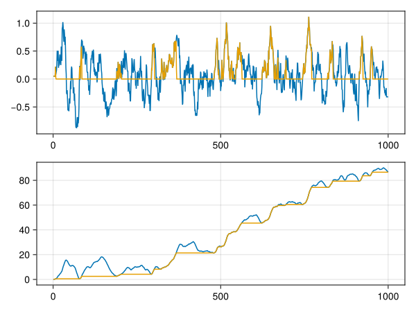

Stratigraphic Column
====================

The **stratigraphic column** algorithm is a method of making the sediment deposition positive everywhere, such that only the sediment that is actually present is shown. One way to do this is to take the cumulative sum (integrate), then take the cumulative minimum backward (like we compute the age depth model), and then take differences again. However, this method may incur number loss due to summing and subsequent differencing.

``` {.julia file=src/Algorithms/StratigraphicColumn.jl}
module StratigraphicColumn

export stratigraphic_column!

"""
    stratigraphic_column!(a)

Computes the stratigraphic column, given a time series of sediment
events. The input sequence will contain positive numbers for deposits
and negative numbers for disintegrates. The column is computed in-place.

Returns the mutated input.
"""
function stratigraphic_column!(a::AbstractVector{T}) where {T}
    for i in 2:length(a)
        a[i] += a[i-1]
    end
    for i in length(a):-1:2
        a[i-1] = min(a[i-1], a[i])
        a[i] -= a[i-1]
    end
    return a
end

end
```




### Plotting code

``` {.julia .task file=examples/algorithms/stratigraphic_column.jl}
#| description: Plot example of stratigraphic column computation.
#| creates: docs/src/_fig/monotonic_adm.svg
#| collect: figures
module Plot

using CairoMakie
using CarboKitten.Algorithms.StratigraphicColumn: stratigraphic_column!
using Random

function moving_average(a::AbstractVector{T}, n) where {T}
   	b = Vector{T}(undef, length(a))
   	m = div(n, 2)
   	for i in eachindex(b)
  		start = min(max(i - m, 1), length(a) - n)
  		b[i] = sum(a[start:start+n]) / n
   	end
   	return b
end

function main()
    Random.seed!(4)
    x = moving_average(randn(1000), 10) .+ 0.1

    fig = Figure()
    ax1 = Axis(fig[1, 1])
    ax2 = Axis(fig[2, 1])
    lines!(ax1, x)
    lines!(ax2, cumsum(x))

    stratigraphic_column!(x)
    lines!(ax1, x)
    lines!(ax2, cumsum(x))

    save("docs/src/_fig/monotonic_adm.svg", fig)
end

end

Plot.main()
```
