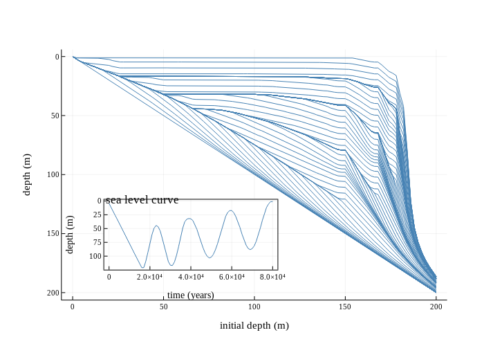

# Carbonate Production
**reproducing Bosscher & Schlager 1992**

The paper by @Bosscher1992 is an early computer model for simulating reef growth. This paper contains some of the essential ingredients that we find back in CarboCAT. Here we will try to reproduce their results.

## Parameters

> * Maximum growth rate $G_m$. The maximum rate of reef growth is in the range of $10-15 {\rm mm\ yr^{-1}}$ (Macintyre etal., 1977; Adey, 1978; Davies, 1983).
> * Extinction coefficient $k$. This is a measure of the extinction of photosynthetically active radiation (PAR), i.e. light with a wavelength of 400-700 nm.  The value of k for oceanic waters ranges from $0.04$ to $0.16\ {\rm m^{-1}}$ (Jerlov, 1976); reported values for reef waters also lie within this range (Brakel, 1979; Van den Hoek et al., 1975; Weinberg, 1976; Chalker, 1981; Porter, 1985).
> * Surface light intensity $I_0$. The light intensity at the water surface at midday in the tropics lies in the range of $2000-2250\ {\rm \mu E\ m^{-2}s^{-1}}$.
> * Saturating light intensity $I_k$. Light saturating intensities are in the range $50-450\ {\rm \mu E\ m^{-2}s^{-1}}$, depending on species and water depth (Chalker, 1981; Wyman et al., 1987). Photoadaptation of reef-building corals has not been taken into account. More generally, light does not become a limiting factor for coral growth until it reaches roughly 10% of its surface value (B. E. Chalker, in Done, 1983).
*from BS92*

## Growth Rate
The growth rate is

$$g(w) = g_m \tanh\left({{I_0 e^{-kw}} \over {I_k}}\right),$$

``` {.julia #carbonate-production}
g(gₘ, I₀, Iₖ, k, w) = gₘ * tanh(I₀/Iₖ * exp(-w * k))
```

``` {.julia #b92-model}
<<carbonate-production>>

struct Parameters
     I₀::Float64
     Iₖ::Float64
     k::Float64
     gₘ::Float64
end

g(p::Parameters, w) = g(p.gₘ, p.I₀, p.Iₖ, p.k, w)
```

where $w$ is the water depth in meters, $g_m$ is the maximum growth rate in ${\rm m}\ {\rm My}^-1$, $I_0$ is surface light intensity, $I_k$ is saturation light intensity, and $k$ is the extinction coefficient. We have exponential decay of light intensity as we get to deeper water, and the carbonate factories respond to light intensity through a $\tanh$ (hyperbolic tangent function). This is by no means an exact relation, rather the $\tanh$ function interpolates smoothly between one and zero. We specify a maximum growth rate and a typical intensity at which the species is no longer productive.

The shape of $\tanh \circ \exp$ look like this:


Notice that the numbers inside the exponential need to be unit-free, so does the output. The value of $\tanh \circ \exp$ at a depth of 0 is $0.7615\dots$. This does not make much sense, as I believe we should start at a value of 1 at the surface. By setting $I_0 / I_k$ to some value $>1$ this can be alleviated, but it changes the interpretation of the constants a little. The idea is that above a certain insolation, light is not the limiting factor to the rate of photosynthesis.

To reproduce Figure 2 in B13, I had to change the values for $g_m$ to 500, 250, and 125 respectively, the other values from Table 2 remained the same. I guess this was done for illustration purposes.


```@raw html
<details><summary>Plotting code</summary>
```

``` {.gnuplot .build file=examples/plot-tanh.gnuplot target=docs/src/fig/tanh.svg}
set term svg size 700, 300 font "sans serif, 14" linewidth 1.5
set xrange [-5:10]
set yrange [-0.1:1.1]
set grid
set key outside
set xlabel "x"
set ylabel "y"
plot tanh(exp(-x)) lc rgb 'black', tanh(exp(4)*exp(-x)), tanh(exp(-0.5*x))
```

``` {.gnuplot .build file=examples/burgess2013-fig2.gnuplot target=docs/src/fig/b13-fig2.svg}
set term svg size 500, 600 font "sans serif,14" linewidth 1.5
set trange [0:100]
set yrange [100:0]
set xrange [-20:520]
set parametric
set key right bottom
set grid
set ylabel "Water depth (m)"
set xlabel "Production rates"
plot 500*tanh(6.7 * exp(-0.8 * t)), t title 'Carbonate factory 1', \
     250*tanh(6.7 * exp(-0.1 * t)), t title 'Carbonate factory 2', \
     125*tanh(6.7 * exp(-0.005 * t)), t title 'Carbonate factory 3'
```

```@raw html
</details>
```

## Depth Evolution

The use of water depth in both BS92 and B13 can be a bit confusing. Plots are shown up-side-down and little is done to disambiguate depth with sea level rising or lowering, or sediment accreting. Growth in deposition should give shallower sea bed. BS92 write $w = (h_0 + h(t)) - (s_0 + s(t))$. Actually $s_0$ is best set to 0, or simply included into $s(t)$ and $h_0$ can be replaced with setting $h(t=0) = h_0$. Then, as we have the growth rate as a function of water depth $g(w)$, we can say

[$$\partial_t h = -g_m {\rm tanh}\left[\frac{I_0}{I_k} \exp(-k (h - s(t)))\right].$$]{#eq:growth-eqn}

``` {.julia #b92-model}
function model(p::Parameters, s, t_end::Float64, h₀::Float64)
     ∂h(h::Float64, _, t::Float64) = let w = h - s(t)
          w >= 0.0 ? -g(p, h - s(t)) : 0.0
     end
     ode = ODEProblem(∂h, h₀, (0.0, t_end), Nothing)
     solve(ode, Euler(), dt=10.0, reltol=1e-6, saveat=1000.0)
end
```

It seems Eq. 5 in BS92 (the most important equation in the paper mind you!) is missing both a minus sign and a set of parentheses. Also, we should remark that at negative depth (subareal exposure) we should halt all growth.

## Crosssection
The most impressive result in BS92 is the last figure. They show an input curve for $s(t)$ but give no functional description. The curve starts with a linear drop from 0 to 120m depth over a time of 20000 years, then slowly rises with $s(t) = a +  bt + A \sin(2\pi t / P)$, with a period $P = \sim 15-20 {\rm kyr}$, amplitude $A = \sim 40 {\rm m}$. It might be easiest to take a screenshot of the PDF and convert the graph into a table.

```@raw html
<details><summary>Extracting Sealevel Curve from an image</summary>
```

``` {.julia .build file=src/BS92/fig8-sealevel.jl target=data/bs92-sealevel-curve.csv deps="data/bs92-sealevel-input.png"}
module Script
    using Images
    using DataFrames
    using CSV

    function main()
        img = load("data/bs92-sealevel-input.png")
        img_gray = Gray.(img)
        signal = 1.0 .- channelview(img_gray)
        signal ./= sum(signal; dims=[1])
        (n_y, n_x) = size(signal)
        y = sum(signal .* (1:n_y); dims=[1]) / n_y * 200.0
        df = DataFrame(
            time = LinRange(0.0, 80_000.0, n_x),
            depth = y[1, :])
        CSV.write("data/bs92-sealevel-curve.csv", df)
    end
end

Script.main()
```

```@raw html
</details>
```

Using `DifferentialEquations.jl` we can integrate Equation @eq:growth-eqn. Interestingly, the only integrator that gave me noise free results is `Euler`. This may be due to the sudden shut-down of production at $w = 0$.

``` {.julia file=src/BS92.jl}
module BS92

using DifferentialEquations
using CSV
using DataFrames
using Interpolations

<<b92-model>>

function sealevel_curve()
     data = DataFrame(CSV.File("data/bs92-sealevel-curve.csv"))
     linear_interpolation(data.time, data.depth)
end

struct Scenario
     param::Parameters
     sealevel
     t_end::Float64
end

model(s::Scenario, h₀::Float64) = model(s.param, s.sealevel, s.t_end, h₀)

SCENARIO_A = Scenario(
     Parameters(2000.0, 250.0, 0.05, 0.005),
     sealevel_curve(),
     80_000.0)

end
```

Finally, we can try to reproduce figure 8 in BS92.



Note the simplicity of this result: there is no dependency on space, only on the initial depth $h_0$.

```@raw html
<details><summary>Plotting code</summary>
```

``` {.julia .build file=examples/bosscher-schlager-1992.jl target=docs/src/fig/bs92-fig8.png deps=data/bs92-sealevel-curve.csv}
module Script
     using CarboKitten.BS92
     using Plots

     function main()
          h0 = LinRange(0, 200, 101)
          result = hcat([BS92.model(BS92.SCENARIO_A, h).u for h in h0]...)
          t = LinRange(0, 80_000, 81)

          plotlyjs()

          plot(h0, result',
               xaxis=("initial depth (m)"),
               yaxis=("depth (m)", :flip),
               legend_position=:none, lc=:steelblue,
               size=(700, 700), fontfamily="Merriweather,serif")

          plot!(t, BS92.SCENARIO_A.sealevel(t),
               title="sea level curve", titlelocation=:left,
               titlefontsize=12,
               xaxis=("time (years)"),
               yaxis=("depth (m)", :flip),
               guidefontsize=10,
               legend_position=:none,
               lc=:steelblue,
               inset=(1, bbox(0.11, 0.60, 0.45, 0.28)),
               subplot=2,
               framestyle=:box)

          mkpath("docs/src/fig")
          savefig("docs/src/fig/bs92-fig8.png")
     end
end

Script.main()
```

```@raw html
</details>
```

