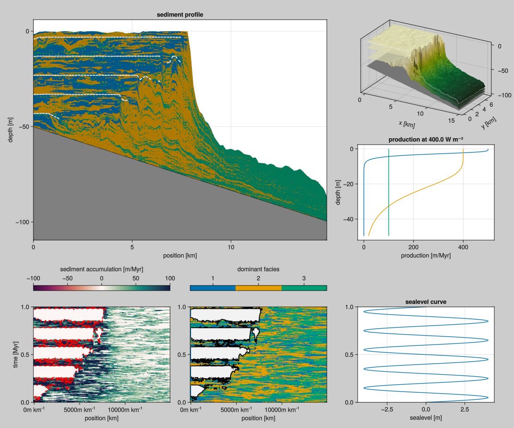

# CA with production

This model combines BS92 production with the B13 cellular automaton. This production model is implemented in the [`CAProduction` component](components/production.md).



## Complete example

This example is running for 10000 steps to 1Myr on a 100 $\times$ 50 grid, starting with a sloped height down to 50m. The `sea_level`, and `initial_depth` arguments are functions. The `phys_scale` argument translate pixels on the grid into physical metres. The `write_interval` indicates to write output every 10 iterations, summing the production over that range.

``` {.julia .task file=examples/model/cap/run.jl}
#| creates: data/output/cap1.h5
#| requires: src/Models/CAP.jl

module Script

using CarboKitten

const PERIOD = 200.0u"kyr"
const AMPLITUDE = 4.0u"m"

const FACIES = [
	    CAP.Facies(
        viability_range = (4, 10),
        activation_range = (6, 10),
        maximum_growth_rate = 500u"m/Myr",
        extinction_coefficient = 0.8u"m^-1",
        saturation_intensity = 60u"W/m^2"),

	    CAP.Facies(
        viability_range = (4, 10),
        activation_range = (6, 10),
        maximum_growth_rate = 400u"m/Myr",
        extinction_coefficient = 0.1u"m^-1",
        saturation_intensity = 60u"W/m^2"),

	    CAP.Facies(
        viability_range = (4, 10),
        activation_range = (6, 10),
        maximum_growth_rate = 100u"m/Myr",
        extinction_coefficient = 0.005u"m^-1",
        saturation_intensity = 60u"W/m^2")
	]

	const INPUT = CAP.Input(
		tag = "cap1",
		box = Box{Coast}(grid_size=(100, 50), phys_scale=150.0u"m"),
		time = TimeProperties(
			Δt = 200.0u"yr",
			steps = 5000),

        output = Dict(
            :topography => OutputSpec(write_interval = 500),
            :profile => OutputSpec(slice = (:, 25))),

		sea_level = t -> 4.0u"m" * sin(2π * t / 0.2u"Myr"),
		initial_topography = (x, y) -> - x / 300.0,
		subsidence_rate = 50.0u"m/Myr",
		insolation = 400.0u"W/m^2",
		facies = FACIES)

	main() = run_model(Model{CAP}, INPUT, "data/output/cap1.h5")
end

Script.main()
```

This writes output to an HDF5 file that you may use for further analysis and visualization.

``` {.julia .task file=examples/model/cap/plot.jl}
#| creates: docs/src/_fig/cap1-summary.png
#| requires: data/output/cap1.h5
#| collect: figures
using GLMakie
using CarboKitten.Visualization

GLMakie.activate!()

save("docs/src/_fig/cap1-summary.png", summary_plot("data/output/cap1.h5"))
```

## Implementation

```component-dag
CarboKitten.Models.CAP
```

``` {.julia file=src/Models/CAP.jl}
@compose module CAP
@mixin Tag, Output, CAProduction

using ..Common
using ..CAProduction: production
using ..TimeIntegration
using ..WaterDepth
using ...Output: Frame
using ModuleMixins: @for_each

export Input, Facies

function initial_state(input::Input)
    ca_state = CellularAutomaton.initial_state(input)
    for _ in 1:20
        CellularAutomaton.step!(input)(ca_state)
    end

    sediment_height = zeros(Height, input.box.grid_size...)
    return State(
        step=0, sediment_height=sediment_height,
        ca=ca_state.ca, ca_priority=ca_state.ca_priority)
end

function step!(input::Input)
    τ = production(input)
    step_ca = CellularAutomaton.step!(input)

    function (state::State)
        if mod(state.step, input.ca_interval) == 0
            step_ca(state)
        end

        prod = τ(state)
        Δη = sum(prod; dims=1)[1, :, :]
        state.sediment_height .+= Δη
        state.step += 1

        return Frame(
            production=prod,
            deposition=prod)
    end
end

function write_header(input::AbstractInput, output::AbstractOutput)
    @for_each(P -> P.write_header(input, output), PARENTS)
end
end
```
