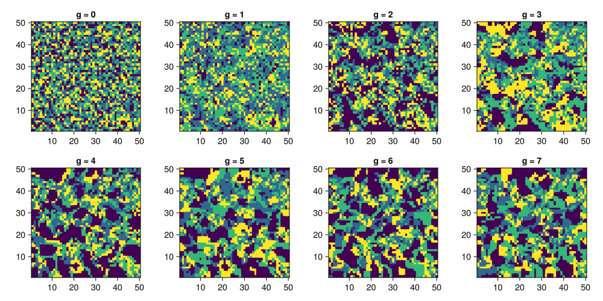
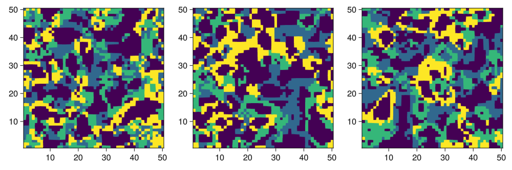

## Cellular Automaton
The paper talks about cycling the order of preference for occupying an empty cell at each iteration. This means that the rules change slightly every iteration.

``` {.julia #cycle-permutation}
cycle_permutation(n_species::Int) =
    (circshift(1:n_species, x) for x in Iterators.countfrom(0))
```

The `stencil` function has an `args...` variadic arguments that are forwarded to the given rule. This means we can create a `rules` function that we pass the preference order as a second argument.

``` {.julia #burgess2013-rules}
function rules(facies::Vector{Facies})
    function (neighbourhood::Matrix{Int}, order::Vector{Int})
        cell_facies = neighbourhood[3, 3]
        neighbour_count(f) = sum(neighbourhood .== f)
        if cell_facies == 0
            for f in order
                n = neighbour_count(f)
                (a, b) = facies[f].activation_range
                if a <= n && n <= b
                    return f
                end
            end
            0
        else
            n = neighbour_count(cell_facies) - 1
            (a, b) = facies[cell_facies].viability_range
            (a <= n && n <= b ? cell_facies : 0)
        end
    end    
end

function run_ca(::Type{B}, facies::Vector{Facies}, init::Matrix{Int}, n_species::Int) where {B <: Boundary{2}}
    r = rules(facies)
    Channel{Matrix{Int}}() do ch
        target = Matrix{Int}(undef, size(init))
        put!(ch, init)
        stencil_op = stencil(Int, B, (5, 5), r)
        for perm in cycle_permutation(n_species)
            stencil_op(init, target, perm)
            init, target = target, init
            put!(ch, init)
        end
    end
end
```

This function is not yet adaptible to the given rule set. Such a modification is not so hard to make. 

The paper talks about a 50x50 grid initialized with uniform random values.

``` {.julia file=src/Burgess2013/CA.jl}
module CA

using ...BoundaryTrait
using ...Stencil
using ..Config: Facies

export run_ca

<<cycle-permutation>>
<<burgess2013-rules>>

end
```

First, let us reproduce Figure 3 in Burgess 2013.



By eye comparison seems to indicate that this CA is working the same. I'm curious to the behaviour after more iterations. Let's try 10, 100, 10000 and so on.



The little qualitative change between 100 and 1000 iterations would indicate that this CA remains "interesting" for a long time.

On my laptop I can run about 150 iterations per second with current code. When using periodic boundaries, I get to 1500 iterations per second, which is peculiar. A lot can still be optimized.

```@raw html
<details><summary>Plotting code</summary>
```

``` {.julia .build file=examples/ca/burgess-2013.jl target="docs/src/_fig/b13-fig3.png"}
module Script
    using .Iterators: flatten
    using CarboKitten
    using CarboKitten.Burgess2013
    using CarboKitten.Stencil: Reflected
    using CarboKitten.Utility
    using GLMakie

    function main()
        init = rand(0:3, 50, 50)
        ca = run_ca(Reflected{2}, MODEL1, init, 3)

        fig = Figure(resolution=(1000, 500))
        axis_indices = flatten(eachrow(CartesianIndices((2, 4))))
        for (i, st) in zip(axis_indices, ca)
            ax = Axis(fig[Tuple(i)...], aspect=AxisAspect(1))
            heatmap!(ax, st)
        end
        save("docs/src/_fig/b13-fig3.png", fig)
    end
end

Script.main()
```


``` {.julia .build file=examples/ca/long-term.jl target="docs/src/_fig/b13-long-term.png"}
module Script
    using CarboKitten
    using CarboKitten.Burgess2013
    using CarboKitten.Stencil
    using CarboKitten.Utility
    using GLMakie

    function main()
        init = rand(0:3, 50, 50)
        result = select(run_ca(Periodic{2}, MODEL1, init, 3), [10, 100, 10000])

        fig = Figure(resolution=(1000, 333))
        for (i, st) in enumerate(result)
            ax = Axis(fig[1, i], aspect=AxisAspect(1))
            heatmap!(ax, st)
        end
        save("docs/src/_fig/b13-long-term.png", fig)
    end
end

Script.main()
```

```@raw html
</details>
```

## How to run
We start with randomized initial conditions on a 50x50 grid.

``` {.julia}
using CarboKitten.Stencil: Reflected
using CarboKitten.Burgess2013
init = rand(0:3, 50, 50)
result = Iterators.take(run_ca(Reflected{2}, MODEL1, init, 3), 8)
```

Then we run the cellular automaton for, in this case eight generations. The `CA.run` function returns an iterator of 50x50 maps. That means that in principle we can extract an infinity of iterations, but in this cane we only `take` eight.

``` {.julia}
result = Iterators.take(CA.run(Reflected{2}, init, 3), 8)
```

In Julia we may plot those as follows

``` {.julia}
using Plots
# plotly()  # sets back-end; plotly gives me the best results
plot((heatmap(r, colorbar=:none) for r in result)..., layout=(2, 4))
```

What this says is: create a `heatmap` for each of our eight results, then expand those into a function call to `plot` (as in `plot(hm1, hm2, ..., hm8, layout=(2, 4))`).

## Parameter scan

``` {.julia file=examples/ca/parameter-scan.jl}
module Script

using CarboKitten
using CarboKitten.Burgess2013
using CarboKitten.Stencil
using CarboKitten.Utility
using GLMakie
using .Iterators: peel, drop

function main()
    fig = Figure(resolution=(2000, 2000))
    for i in 4:12
        for j in (i+1):12
            print(".")
            gl = fig[i, j] = GridLayout()
            for k in i:j
                # for l in k:j
                let l = j
                    init = rand(0:3, 50, 50)
                    facies = [
                        Facies((i, j), (k, l), 0, 0, 0),
                        Facies((i, j), (k, l), 0, 0, 0),
                        Facies((i, j), (k, l), 0, 0, 0),
                    ]
                    (result, _) = peel(drop(run_ca(Periodic{2}, facies, init, 3), 10))

                    ax = Axis(gl[k-i, l-k], aspect=AxisAspect(1),
                              xticksvisible=false, xticklabelsvisible=false,
                              yticksvisible=false, yticklabelsvisible=false)
                    heatmap!(ax, result)
                end
            end
        end
    end
    save("docs/src/_fig/parameter-scan.png", fig)
end

end  # module Script

Script.main()
```
