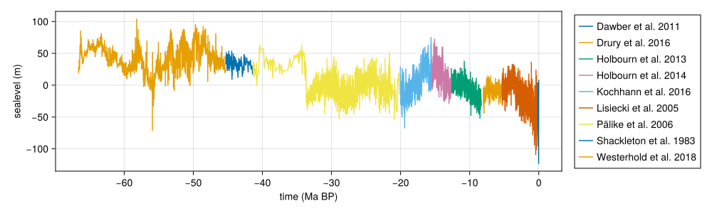

# Tabular sea levels

In CarboKitten, the sea-level curve is given as a function of time. This means you can generate sea levels automatically, or if you like interpolate them on a table. In this demo, we show how we can read values from a file and interpolate those for input into the CarboKitten ALCAP model.

``` {.julia #tabular-sea-level}
using CarboKitten.Components.Common
using CarboKitten.Model.ALCAP2
```

CarboKitten has convenience functions for reading tabular data, both TSV and CSV are supported.

## The data

In this example we load the sea level data compilation from Miller 2020 [Miller2020Data](@cite).

``` {.julia .task file=examples/tabular-sea-level/plot-miller-data.jl}
#| creates: docs/src/_fig/miller-sea-leavel.svg
module PlotMillerData

using CarboKitten.Components.Common
using CarboKitten.DataSets: miller_2020
using CairoMakie
using DataFrames
using Unitful

function main()
    df = miller_2020()
    fig = Figure(size=(1000,300))
    ax = Axis(fig[1, 1]; xlabel="time (Ma BP)", ylabel="sealevel (m)")

    for ref in levels(df.reference)
        subset = df[df.reference .== ref,:]
        lines!(ax, subset.time |> in_units_of(u"Myr"), subset.sealevel |> in_units_of(u"m"), label=ref)
    end
    fig[1, 2] = Legend(fig, ax)

    save("docs/src/_fig/miller-sea-level.svg", fig)
    fig
end

end
```




## Loading

For this example we have a tab-separated data file, that is distributed with CarboKitten. However, you can have `filename` point to any tabular data on your filesystem. 

You can use the `readdlm` function in `DelimitedFiles` to read most text based table formats. See the [`DataFrames` documentation](https://dataframes.juliadata.org/stable/man/importing_and_exporting/) to find out how to read from most popular data file formats.

``` {.julia #tabular-sea-level}
function miller_2020()
    dir = artifact_dir()
    filename = joinpath(dir, "Miller2020", "Cenozoic_sea_level_reconstruction.tab")

    data, header = readdlm(filename, '\t', header=true)
    return DataFrame(
        time=-data[:,4] * u"kyr",
        sealevel=data[:,7] * u"m",
        reference=categorical(data[:,3]))
end
```

## Interpolating

There are many ways to interpolate the data we have. We will now stick to the package `Interpolations` and use the linear interpolator in there.

``` {.julia file=examples/tabular-sea-level.jl}
module TabularSeaLevel

using DelimitedFiles: readddlm
using DataFrames
using CarboKitten.DataSets: artifact_dir

<<tabular-sea-level>>

end

TabularSeaLevel.main()
```