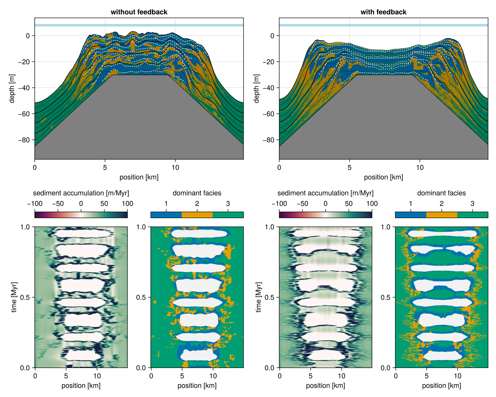

# Cellular Automata

```component-dag
CarboKitten.Components.CellularAutomaton
```

This component implements the cellular automaton as described by [Burgess2013](@cite). 

We depend on the box properties being defined. Each `Facies` should have a `viability_range` and `activation_range` defined.  The `active` property determines whether a facies is active in the cellular automaton. Two other parameters are the `ca_interval` setting how many time steps between every CA advancement, and the `ca_random_seed` setting the random seed for generating the initial noise.

``` {.julia #ca-input}
@kwdef struct Facies <: AbstractFacies
    viability_range::Tuple{Int,Int} = (4, 10)
    activation_range::Tuple{Int,Int} = (6, 10)
    active::Bool = true
end

@kwdef struct Input <: AbstractInput
    ca_interval::Int      = 1
    ca_random_seed::Int   = 0
end
```

The state of the CA is stored in `ca` and `ca_priority`.

``` {.julia #ca-state}
@kwdef mutable struct State <: AbstractState
    ca::Matrix{Int}
    ca_priority::Vector{Int}
end
```

The `rules` function computes the next value of a cell, given the configured vector of facies, the current facies priority order, and a neighbourhood around the cell.

``` {.julia #ca-step}
function rules(facies, ca_priority, neighbourhood)
    cell_facies = neighbourhood[3, 3]
    neighbour_count(f) = sum(neighbourhood .== f)
    if cell_facies == 0
        for f in ca_priority
            n = neighbour_count(f)
            (a, b) = facies[f].activation_range
            if a <= n && n <= b
                return f
            end
        end
        0
    else
        n = neighbour_count(cell_facies) - 1
        (a, b) = facies[cell_facies].viability_range
        (a <= n && n <= b ? cell_facies : 0)
    end
end
```

The paper talks about cycling the order of preference for occupying an empty cell at each iteration. This means that the rules change slightly every iteration. We need this extra function so that we know the boundary type `BT` at compile time.

``` {.julia #ca-step}
"""
    step_ca(box, facies)

Creates a propagator for the state, updating the celullar automaton in place.

Contract: the `state` should have `ca::Matrix{Int}` and `ca_priority::Vector{Int}`
members.
"""
function step_ca(box::Box{BT}, facies) where {BT<:Boundary{2}}
    tmp = Matrix{Int}(undef, box.grid_size)
    facies_ = facies

    function (state)
        p = state.ca_priority
        stencil!(BT, Size(5, 5), tmp, state.ca) do nb
            rules(facies_, p, nb)
        end
        state.ca, tmp = tmp, state.ca
        state.ca_priority = circshift(state.ca_priority, 1)
        return state
    end
end
```

## Plot

``` {.julia .task file=examples/ca/burgess-2013.jl}
#| creates: ["docs/src/_fig/ca-long-term.svg"]
#| collect: figures
module Script
using CarboKitten
using CarboKitten.Components: CellularAutomaton as CA
using CairoMakie

function main()
  input = CA.Input(
      box = CarboKitten.Box{Periodic{2}}(
        grid_size=(50, 50), phys_scale=1.0u"m"),
      facies = fill(CA.Facies(), 3)
  )

  state = CA.initial_state(input)
  step! = CA.step!(input)

  for _ in 1:1000
    step!(state)
  end

  fig = Figure(size=(1000, 500))
  axes_indices = Iterators.flatten(eachrow(CartesianIndices((2, 4))))
  xaxis, yaxis = box_axes(input.box)
  i = 1000
  for row in 1:2
    for col in 1:4
      ax = Axis(fig[row, col], aspect=AxisAspect(1), title="step $(i)")

      if row == 2
        ax.xlabel = "x [m]"
      end
      if col == 1
        ax.ylabel = "y [m]"
      end

      heatmap!(ax, xaxis/u"m", yaxis/u"m", state.ca)
      step!(state)
      i += 1
    end
    for _ in 1:996
      step!(state)
      i += 1
    end
  end
  save("docs/src/_fig/ca-long-term.svg", fig)
end

end

Script.main()
```


## Production feedback

It can be interesting to model feedback on the CA state due to environmental factors. For example, we can kill off facies if it turns out they're not able to produce.

``` {.julia file=src/Components/CAFeedback.jl}
@compose module CAFeedback
using ..Common

@kwdef struct Facies
    minimum_production::Union{typeof(0.0u"m/Myr"),Nothing} = nothing
end

function ca_feedback(input::AbstractInput)
    production_limit = [f.minimum_production for f in input.facies]
    dt = input.time.Δt

    function (ca, production)
        for i in eachindex(IndexCartesian(), ca)
            f = ca[i]
            if f != 0 && production_limit[f] !== nothing &&
                production[f, i[1], i[2]] / dt < production_limit[f]
                ca[i] = 0
            end
        end
    end
end

end
```

### Test run



``` {.julia .task file=examples/model/alcap/ca-feedback.jl}
#| creates:
#|   - data/output/ca-wo-feedback.h5
#|   - data/output/ca-feedback.h5
module Script
    using CarboKitten
    using CarboKitten.Production
    using CarboKitten.Models: ALCAP as M

    initial_topography(x, y) =
        min(0.0u"m", - sqrt((x - 7.5u"km")^2 + (y - 7.5u"km")^2) / 100.0 + 20.0u"m")

    function main()
        res = 100
        steps = 5000
        phys_scale = 15.0u"km" / res

        output = Dict(
            :topography => OutputSpec(write_interval = max(1, div(steps, 50))),
            :profile    => OutputSpec(slice = (:, div(res, 2)+1)))

        facies(feedback) = [
            M.Facies(
                name="euphotic",
                activation_range=(4, 10),
                viability_range=(1, 10),
                production=Production.EXAMPLE[:euphotic],
                diffusion_coefficient=10.0u"m/yr",
                minimum_production=feedback ? 0.01u"m/Myr" : nothing),
            M.Facies(
                name="oligophotic",
                production=BenthicProduction(
                    maximum_growth_rate=200.0u"m/Myr",
                    extinction_coefficient=0.1u"m^-1",
                    saturation_intensity=60u"W/m^2"
                ),
                diffusion_coefficient=5.0u"m/yr",
                minimum_production=feedback ? 5.0u"m/Myr" : nothing),
            M.Facies(
                name="pelagic",
                active=false,
                production=PelagicProduction(
                    maximum_growth_rate=1.0u"1/Myr",
                    extinction_coefficient=0.1u"m^-1",
                    saturation_intensity=60u"W/m^2"
                ),
                diffusion_coefficient=20.0u"m/yr",
                # minimum_production=10.0u"m/Myr"
            )
        ]

        box = CarboKitten.Box{Periodic{2}}(grid_size=(res, res), phys_scale=phys_scale)

        time_param = TimeProperties(Δt=1.0u"Myr"/steps, steps=steps)

        sea_level(t) =
            10.0u"m" * sin(2π * t / 123456.0u"yr") +
             5.0u"m" * sin(2π * t /  80456.0u"yr")

        input(feedback) = M.Input(
            time = time_param,
            box = box,
            facies = facies(feedback),
            output = output,

            sea_level = sea_level,
            initial_topography = initial_topography,
            ca_interval = 10,

            insolation = 400.0u"W/m^2",
            subsidence_rate = 30.0u"m/Myr",
            disintegration_rate = 20.0u"m/Myr",
            lithification_time = 100.0u"yr",

            sediment_buffer_size=50,
            depositional_resolution=0.5u"m",

            # diagnostics=true
        )

        run_model(Model{M}, input(false), "data/output/ca-wo-feedback.h5")
        run_model(Model{M}, input(true), "data/output/ca-feedback.h5")
    end
end

Script.main()
```

``` {.julia .task file=examples/model/alcap/feedback-plot.jl}
#| requires: 
#|   - data/output/ca-wo-feedback.h5
#|   - data/output/ca-feedback.h5
#| creates:
#|   - docs/src/_fig/ca-feedback.png
module PlotFeedback
    using GLMakie
    using CarboKitten.Visualization
    using CarboKitten.Export: read_volume, read_slice

    function main()
        GLMakie.activate!()
        fig = Figure(size=(1000, 800))

        header, topography = read_volume("data/output/ca-wo-feedback.h5", :topography)
        _, profile = read_slice("data/output/ca-wo-feedback.h5", :profile)

        ax1 = Axis(fig[1, 1:2])
        sediment_profile!(ax1, header, profile)
        ax1.title = "without feedback"
        
        ax1_wh1 = Axis(fig[3, 1])
        ax1_wh2 = Axis(fig[3, 2])
        sa, ft = wheeler_diagram!(ax1_wh1, ax1_wh2, header, profile)
        Colorbar(fig[2, 1], sa; vertical=false, label="sediment accumulation [m/Myr]")
        Colorbar(fig[2, 2], ft; vertical=false, ticks=1:3, label="dominant facies")

        header, topography = read_volume("data/output/ca-feedback.h5", :topography)
        _, profile = read_slice("data/output/ca-feedback.h5", :profile)

        ax2 = Axis(fig[1, 3:4])
        sediment_profile!(ax2, header, profile)
        ax2.title = "with feedback"
        
        ax2_wh1 = Axis(fig[3, 3])
        ax2_wh2 = Axis(fig[3, 4])
        sa, ft = wheeler_diagram!(ax2_wh1, ax2_wh2, header, profile)

        Colorbar(fig[2, 3], sa; vertical=false, label="sediment accumulation [m/Myr]")
        Colorbar(fig[2, 4], ft; vertical=false, ticks=1:3, label="dominant facies")
        fig
    end
end

save("docs/src/_fig/ca-feedback.png", PlotFeedback.main())
```

## Tests

``` {.julia file=test/Components/CellularAutomatonSpec.jl}
module CellularAutomatonSpec

using Test
using CarboKitten.Components.Common
using CarboKitten.Components: CellularAutomaton as CA

@testset "Components/CellularAutomaton" begin
    let facies = fill(CA.Facies(
            viability_range=(4, 10),
            activation_range=(6, 10),
            active=true), 3),
        input1 = CA.Input(
            box=Box{Periodic{2}}(grid_size=(50, 50), phys_scale=1.0u"m"),
            facies=facies),
        input2 = CA.Input(
            box=Box{Periodic{2}}(grid_size=(50, 50), phys_scale=1.0u"m"),
            facies=facies,
            ca_random_seed=1)

        state1 = CA.initial_state(input1)
        state2 = CA.initial_state(input2)
        state3 = CA.initial_state(input2)

        @test CA.initial_state(input1).ca == CA.initial_state(input1).ca
        @test state1.ca != state2.ca

        step! = CA.step!(input1)  # inputs have same rules
        for i in 1:20
            step!(state1)
            step!(state2)
            step!(state3)
        end

        @test state1.ca != state2.ca
        @test state2.ca == state3.ca
    end

    @testset "inactive facies" begin
        let facies = [CA.Facies(active=true),
                      CA.Facies(active=false),
                      CA.Facies(active=true),
                      CA.Facies(active=false)],
            input = CA.Input(
                box=Box{Periodic{2}}(grid_size=(10, 10), phys_scale=1.0u"m"),
                facies=facies)

            state = CA.initial_state(input)
            @test state.ca_priority == [1,3]

            # inactive facies shouldn't appear in the ca
            @test all(state.ca .!= 2)
            @test all(state.ca .!= 4)

        end
    end
end

end
```

## Component

``` {.julia file=src/Components/CellularAutomaton.jl}
@compose module CellularAutomaton
    @mixin Boxes, FaciesBase
    using ..Common
    using ...Stencil: stencil!
    using Random

    <<ca-input>>
    <<ca-state>>
    <<ca-step>>

    function initial_state(input::AbstractInput)
        n_facies = length(input.facies)
        active_facies = 1:n_facies |> filter(f->input.facies[f].active==true)
        ca = rand(MersenneTwister(input.ca_random_seed), [0; active_facies], input.box.grid_size...)
        return State(ca, active_facies |> collect)
    end

    function step!(input::AbstractInput)
        return step_ca(input.box, input.facies)
    end
end
```
