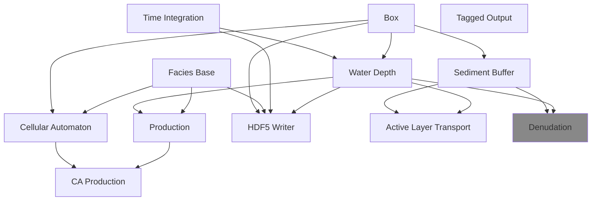

# Model Components

Each model in CarboKitten is composed out of elementary parts. These form a hierarchy of modules that inherit from each other.

<!-- FIXME: auto-generate this graph -->



Not all of these are equally important. The `H5Writer` implements the core simulation loop and writing a simulation to HDF5 files. For a `Model` to work with `H5Writer` it needs to have `initial_state`, `step!`, and `write_header` functions implemented. Each component can have its own `write_header` implementation. Those are joined together with a special `@for_each(P->P.write_header(fid, input), PARENTS)` call.

## Contents

```@contents
Pages = ["tag.md", "boxes.md", "time.md", "facies.md",
         "production.md", "cellular-automata.md", "waterdepth.md", "hdf5.md",
         "sediment_buffer.md"]
Depth = 1
```

## Common Definitions

``` {.julia file=src/Components/Common.jl}
module Common
export @u_str, Amount, Time, Location, Rate, Intensity, Height
export AbstractFacies, AbstractInput, AbstractState, AbstractFrame
export Box, box_axes, Boundary, Coast, Periodic, Reflected, TimeProperties
export in_units_of
export Model
export @for_each

using ModuleMixins
using Unitful
using ...CarboKitten: Model
using ...BoundaryTrait
using ...Config: TimeProperties
using ...Boxes: Box, box_axes
using ...Utility: in_units_of

const Amount = typeof(1.0u"m")
const Time = typeof(1.0u"Myr")
const Height = typeof(1.0u"m")
const Location = typeof(1.0u"m")
const Rate = typeof(1.0u"m/Myr")
const Intensity = typeof(1.0u"W/m^2")

abstract type AbstractFacies end
abstract type AbstractInput end
abstract type AbstractState end
abstract type AbstractFrame end

end
```

``` {.julia file=src/Components.jl}
module Components

export Tag, TimeIntegration, Boxes, WaterDepth, FaciesBase, Production,
    CAProduction, CellularAutomaton, H5Writer, ActiveLayer, SedimentBuffer, Denudation

using ModuleMixins: @compose

include("Components/Common.jl")
include("Components/Tag.jl")
include("Components/TimeIntegration.jl")
include("Components/Boxes.jl")
include("Components/WaterDepth.jl")
include("Components/FaciesBase.jl")
include("Components/Production.jl")
include("Components/CellularAutomaton.jl")
include("Components/CAProduction.jl")

include("Components/SedimentBuffer.jl")
include("Components/ActiveLayer.jl")
include("Components/Denudation.jl")

include("Components/H5Writer.jl")

list_components() = filter(
    c->:AST in names(c, all=true),
    map(eval, names(Components)))

end
```

