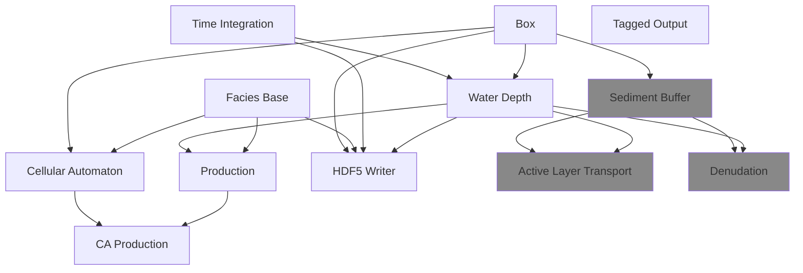

# Model Components

Each model in CarboKitten is composed out of elementary parts. These form a hierarchy of modules that inherit from each other.



## Contents

```@contents
Pages = ["boxes.md", "time.md", "facies.md",
         "production.md", "cellular-automata.md", "waterdepth.md"]
Depth = 1
```

## Common Definitions

``` {.julia file=src/Components/Common.jl}
module Common
export @u_str, Amount, Time, Location, Rate, Intensity, Height
export AbstractFacies, AbstractInput, AbstractState, AbstractFrame
export Box, axes, Boundary, Shelf, Periodic, Reflected, TimeProperties
export in_units_of
export Model
export @for_each

using ModuleMixins
using Unitful
using CarboKitten.BoundaryTrait
using CarboKitten.Config: Box, axes, TimeProperties
using CarboKitten.Utility: in_units_of

const Amount = typeof(1.0u"m")
const Time = typeof(1.0u"Myr")
const Height = typeof(1.0u"m")
const Location = typeof(1.0u"m")
const Rate = typeof(1.0u"m/Myr")
const Intensity = typeof(1.0u"W/m^2")

abstract type AbstractFacies end
abstract type AbstractInput end
abstract type AbstractState end
abstract type AbstractFrame end

struct Model{M} end

end
```

``` {.julia file=src/Components.jl}
module Components

export Tag, TimeIntegration, Boxes, WaterDepth, FaciesBase, Production,
    CAProduction, CellularAutomaton, H5Writer, ActiveLayer, SedimentBuffer

using ModuleMixins: @compose

include("Components/Common.jl")
include("Components/Tag.jl")
include("Components/TimeIntegration.jl")
include("Components/Boxes.jl")
include("Components/WaterDepth.jl")
include("Components/FaciesBase.jl")
include("Components/Production.jl")
include("Components/CellularAutomaton.jl")
include("Components/CAProduction.jl")

include("Components/SedimentBuffer.jl")
include("Components/ActiveLayer.jl")

include("Components/H5Writer.jl")

end
```

