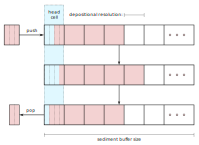

# Sediment Buffers

```component-dag
CarboKitten.Components.SedimentBuffer
```

For our models of transport and denudation it is important to remember the facies of the sediment for some time into the past. One way to do this, is to remember all contributions of sediment in a stack. Every time we transport or erode sediment, we can pop parcels from this stack. In a three-dimensional model, we need a 2d grid of stacks. Each stack would have its own memory management (which is computationally expensive), and most resources are spent on areas with very little accretion. (In fact, this is what CarboCAT does. We believe this design choice is the main contributor to the difference in run-time between CarboCAT and CarboKitten).

Instead, we choose a fixed size sediment buffer. Each cell in the buffer represents a parcel of sediment, where we store the relative fractions of each contributing facies. This buffer is only used to determine the facies of disintegrated sediment. The output of the overal model is still the amount of sediment for each iteration.

We can't stress this enough: any inaccuracy in using a fixed size buffer with a chosen granularity only impacts the precision of the composition of transported sediment. Even then, the schema is conservative: no sediment is lost unless erosion is so rampant that it eats through the entire sediment stack. In that case, a simulation should be run with a larger buffer.

## Data structure

While the sediment buffer is allocated as a single 4-dimensional array (depth, facies, $x$, $y$), it is best to explain its functioning from the perspective of a single cell in our model. We are left with two dimensions: depth (rows) and facies (columns).

We choose to have the head of our sediment stack always be at the first row. When sediment out-grows the buffer, the deepenst layers are dropped from memory. The head can contain an incomplete amount of sediment, while all rows below the head are either full or empty. When sediment is pushed to the stack and the head row overflows, all rows are copied down one row and the surplus is assigned to the now empty head row. The inverse happens when removing (popping) material from the stack (in computer science stacks are pushed on and popped from). This process is illustrated below.



Above we see a buffer. First we push a parcel of size $3/4$, then we pop an amount of $1/2$. This popped parcel will have different fractions from the pushed one, since it also draws from the half filled row that was in the stack before pushing. In this sense, a small amount of facies mixing will take place, depending on the depositional resolution chosen.

Our implementation is such that each cell in the buffer is contiguous in memory. Thus, copying rows of unstrided memory should be very efficient, although the performance remains to be tested.

## Implementation

We define two functions `push_sediment!` and `pop_sediment!`. Given a $s \times n$ matrix, where $n$ is the number of facies types and $s$ is the depth of the stack, we can grow and shrink sediment. These functions are unit-free, setting $\Delta z$ to be equal to 1.

``` {.julia file=test/SedimentStackSpec.jl}
@testset "SedimentStack" begin
  using CarboKitten.SedimentStack: push_sediment!, pop_sediment!
  stack = zeros(Float64, 10, 3)
  @test pop_sediment!(stack, 0.0) == [0.0, 0.0, 0.0]
  push_sediment!(stack, [5.0, 0, 0])
  @test pop_sediment!(stack, 1.5) == [1.5, 0.0, 0.0]
  push_sediment!(stack, [0.0, 2.0, 0.0])   # (0 0.5) (0 1) (0.5 0.5) (1 0) ...
  @test pop_sediment!(stack, 2.0) == [0.25, 1.75, 0.0]
  @test pop_sediment!(stack, 1.5) == [1.25, 0.25, 0.0]
  @test pop_sediment!(stack, 0.0) == [0.0, 0.0, 0.0]
end

@testset "SedimentArray" begin
  using CarboKitten.SedimentStack: push_sediment!, peek_sediment
  sediment = zeros(Float64, 10, 3, 5, 5)
  for x in 1:10
    production = rand(3, 5, 5)
    push_sediment!(sediment, production)
  end
  a = peek_sediment(sediment, 1.0)
  @test all(sum(a; dims=1) .≈ 1.0)
end
```

### Pushing sediment

The single-cell version of `push_sediment!` takes as argument `col` a column (physically speaking a column of sediment) represented by a $s \times n$-matrix and a parcel a $n$-vector.

``` {.julia #sediment-stack-impl}
function push_sediment!(col::AbstractMatrix{F}, parcel::AbstractVector{F}) where F <: Real
  <<push-sediment>>
end
```

First we determine the total sediment amount $\Delta$, being the sum of the parcel, as well as the amount of sediment in our *bucket*, the head row.

``` {.julia #push-sediment}
Δ = sum(parcel)
bucket = sum(col[1, :])
```

If the bucket has enough space left for the parcel, we can just add the parcel to the bucket and return.

``` {.julia #push-sediment}
if bucket + Δ < 1.0
  col[1,:] .+= parcel
  return
end
```

Otherwise, we compute the normalized fractions `frac` of facies in the parcel. We add as much sediment as we can to fill the bucket and copy rows down as far as needed.

``` {.julia #push-sediment}
frac = parcel ./ Δ
col[1,:] .+= frac .* (1.0 - bucket)
Δ -= (1.0 - bucket)
n = floor(Int64, Δ)
if n > size(col)[1] ÷ 2
  @warn "pushing a too large parcel of sediment: Δ = $Δ"
end
if n > size(col)[1] - 2
  @error "pushing a way too large parcel of sediment: Δ = $Δ"
end
col[n+2:end,:] = col[1:end-n-1,:]
```

If the parcel has enough material left to fill more rows, those are all filled with the fractions in `frac`. The head row is assigned whatever is left.

``` {.julia #push-sediment}
na = [CartesianIndex()]
col[2:n+1,:] .= frac[na,:]
Δ -= n
col[1,:] .= frac .* Δ
```

### Popping sediment

Similar to `push_sediment!` we have `pop_sediment!`. We give `pop_sediment!` the sedimentary column `col` and the total amount of sediment we require. There is a bit that we will reuse called `pop_fraction`, which only works if the amount of popped sediment is lower than the contents of the bucket.

``` {.julia #sediment-stack-impl}
@inline function pop_fraction(col::AbstractMatrix{F}, Δ::F) where F <: Real
  bucket = sum(col[1,:])
  if Δ == 0 || bucket == 0
    return zeros(F, size(col)[2])
  end

  @assert Δ < bucket "pop_fraction can only pop from the top cell: $(col), $(Δ)"
  parcel = (Δ / bucket) .* col[1,:]
  col[1,:] .-= parcel
  return parcel
end

function pop_sediment!(col::AbstractMatrix{F}, Δ::F) where F <: Real  # -> Vector{F}
  <<pop-sediment>>
end
```

We start by computing the bucket size again. If it is greater than the required amount, we call `pop_fraction`.

``` {.julia #pop-sediment}
bucket = sum(col[1,:])
if Δ < bucket
  return pop_fraction(col, Δ)
end
```

Otherwise, we start a parcel with the contents of the bucket. Add to that the remaining material in rows below. Now we copy rows from below, setting the bottom $n$ rows to 0. The last step is to call `pop_fraction` one more time with the remaining required amount.

``` {.julia #pop-sediment}
parcel = copy(col[1,:])
Δ -= bucket
n = floor(Int64, Δ)

parcel .+= sum(col[2:n+1,:]; dims=1)'
col[1:end-n-1, :] = col[n+2:end, :]
col[end-n-1:end, :] .= 0
Δ -= n

parcel .+= pop_fraction(col, Δ)
return parcel
```

### Peeking

Instead of popping sediment, we can also *peek* at the stack with `peek_sediment!`, which is a non-destructive way to inspect what the returned parcel would be if we were to call `pop_sediment!` with the same arguments.

```@raw html
<details><summary>SedimentStack impl</summary>
```

``` {.julia file=src/SedimentStack.jl}
module SedimentStack

export push_sediment!, pop_sediment!, peek_sediment

<<sediment-stack-impl>>

function push_sediment!(sediment::AbstractArray{F, 4}, p::AbstractArray{F, 3}) where F <: Real
  _, x, y = size(p)
  @views for i in CartesianIndices((x, y))
    push_sediment!(sediment[:, :, i[1], i[2]], p[:, i[1], i[2]])
  end
end


function peek_sediment(col::AbstractMatrix{F}, Δ::F) where F <: Real  # -> Vector{F}
  if Δ == 0
      return zeros(F, size(col)[2])
  end

  bucket = sum(col[1,:])
  if Δ < bucket
    parcel = (Δ / bucket) .* col[1,:]
    return parcel
  end

  parcel = copy(col[1,:])
  Δ -= bucket
  n = floor(Int64, Δ)

  parcel .+= sum(col[2:n+1,:]; dims=1)'
  Δ -= n

  last_bit = (Δ / sum(col[n+2,:])) .* col[n+2,:]
  parcel .+= last_bit

  return parcel
end

function peek_sediment(sediment::AbstractArray{F,4}, Δ::F) where F <: Real
  _, f, x, y = size(sediment)
  out = Array{F, 3}(undef, f, x, y)
  for i in CartesianIndices((x, y))
    out[:, i[1], i[2]] = peek_sediment(@view(sediment[:, :, i[1], i[2]]), Δ)
  end
  return out
end

function pop_sediment!(cols::AbstractArray{F, 4}, amount::AbstractArray{F, 2}, out::AbstractArray{F, 3}) where F <: Real
  @views for i in CartesianIndices(amount)
      out[:, i[1], i[2]] = pop_sediment!(cols[:, :, i[1], i[2]], amount[i[1], i[2]])
  end
end

end # module
```

```@raw html
</details>
```

## Component

``` {.julia file=src/Components/SedimentBuffer.jl}
@compose module SedimentBuffer
@mixin Boxes

using ..Common
using CarboKitten.SedimentStack: pop_sediment!, push_sediment!, peek_sediment

export pop_sediment!, push_sediment!, peek_sediment

@kwdef struct Input <: AbstractInput
    sediment_buffer_size::Int = 50
    depositional_resolution::Amount = 0.5u"m"
end

@kwdef mutable struct State <: AbstractState
    sediment_buffer::Array{Float64,4}
end

end
```

