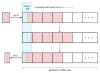

# Sediment Buffers

```component-dag
CarboKitten.Components.SedimentBuffer
```

For our models of transport and denudation it is important to remember the facies of the sediment for some time into the past. One way to do this, is to remember all contributions of sediment in a stack. Every time we transport or erode sediment, we can pop parcels from this stack. In a three-dimensional model, we need a 2d grid of stacks. Each stack would have its own memory management (which is computationally expensive), and most resources are spent on areas with very little accretion. (In fact, this is what CarboCAT does. We believe this design choice is the main contributor to the difference in run-time between CarboCAT and CarboKitten).

Instead, we choose a fixed size sediment buffer. Each cell in the buffer represents a parcel of sediment, where we store the relative fractions of each contributing facies. This buffer is only used to determine the facies of disintegrated sediment. The output of the overal model is still the amount of sediment for each iteration.

We can't stress this enough: any inaccuracy in using a fixed size buffer with a chosen granularity only impacts the precision of the composition of transported sediment. Even then, the schema is conservative: no sediment is lost unless erosion is so rampant that it eats through the entire sediment stack. In that case, a simulation should be run with a larger buffer.

## Data structure

While the sediment buffer is allocated as a single 4-dimensional array (depth, facies, $x$, $y$), it is best to explain its functioning from the perspective of a single cell in our model. We are left with two dimensions: depth (rows) and facies (columns).

We choose to have the head of our sediment stack always be at the first row. When sediment out-grows the buffer, the deepenst layers are dropped from memory. The head can contain an incomplete amount of sediment, while all rows below the head are either full or empty. When sediment is pushed to the stack and the head row overflows, all rows are copied down one row and the surplus is assigned to the now empty head row. The inverse happens when removing (popping) material from the stack (in computer science stacks are pushed on and popped from). This process is illustrated below.



Above we see a buffer. First we push a parcel of size $3/4$, then we pop an amount of $1/2$. This popped parcel will have different fractions from the pushed one, since it also draws from the half filled row that was in the stack before pushing. In this sense, a small amount of facies mixing will take place, depending on the depositional resolution chosen.

Our implementation is such that each cell in the buffer is contiguous in memory. Thus, copying rows of unstrided memory should be very efficient, although the performance remains to be tested.


## Component

``` {.julia file=src/Components/SedimentBuffer.jl}
@compose module SedimentBuffer
@mixin Boxes

using ..Common
using ...Algorithms.CircularBuffers: CircularBufferHost
using ...Interfaces.SedimentBuffers: pop_sediment!, push_sediment!, peek_sediment

@kwdef struct Input <: AbstractInput
    sediment_buffer_size::Int = 50
    depositional_resolution::Amount = 0.5u"m"
end

@kwdef mutable struct State{D, N} <: AbstractState
    sediment_buffer::CircularBufferHost{D, N}
end

end
```

## Implementation as Circular Buffer

``` {.julia file=src/Components/CircularSedimentBuffer.jl}
@compose module CircularSedimentBuffer
@mixin Boxes

using ..Common
using CarboKitten.Algorithms.CircularBuffer: push_sediment!, pop_sediment!

export pop_sediment!, push_sediment!

@kwdef struct Input <: AbstractInput
    sediment_buffer_size::Int = 50
    depositional_resolution::Amount = 0.5u"m"
end

@kwdef mutable struct State <: AbstractState
    sediment_buffer::Array{Float64,4}
end

end
```
