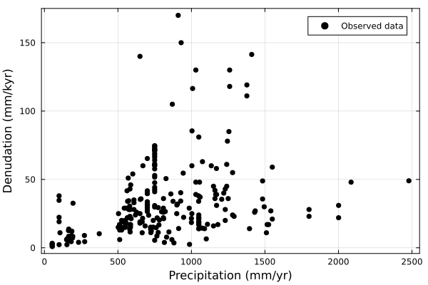
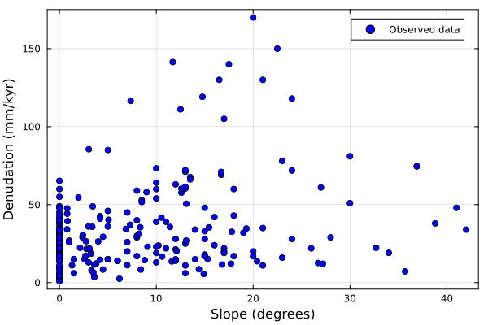

# Emperical denudation

Chlorine(Cl) isotopes are an emerging tool to decipher the denudation rates (chemical dissolution + physical erosion) in carbonate-dominated area.

Research based on the karst region and carbonate platform terrace suggested that the denudation rates are mainly controlled by precipitation and slopes, although the debates about which factor is more important is still ongoing ([yang_combined_2020](@cite), [thomas_limited_2018](@cite)). In general, the precipitation mainly controls the chemical dissolution while the slopes mainly controls the physical ersions. In addition, the type of carbonates may also play an important role ([krklec_long-term_2022](@cite)), but given this feature is studied poorly so we will ditch it for now. We have checked and compiled the denudation rates (mm/kyr) along with precipitation and slopes serve as a starting point to create a function relates denudation rates (mm/kyr) to precipitation and slopes. The compiled data could be found in OSFdatabase. This is an empirical relationship and have a relatively large uncertainty in terms of fitting.



*Fig 1. The relationship between MAP (mean precipitation per year, mm/y) and denudation rates (mm/ky)*



*Fig 2. The relationship between the slope and the denudation rates (mm/ky)*

We can see that both the slope and precipitation could increase the denudation rates, and reaches a 'steady state' after a certain point.

Therefore, we could use the function form of $D = P * S$, where $D$ means denudation rates, $P$ means effects of precipitation while $S$ means effects of Slope. By doing so, we can consider both effects. Such formula structure is similar to RUSLE (Revised Universal Soil Loss Equation) model, a widely used Landscape Evolution Model (LEM) (e.g., [thapa_spatial_2020](@cite)). We use [sigmoidal function](https://en.wikipedia.org/wiki/Sigmoid_function) to approximate the influence of $P$ or $S$ on $D$, by fitting the function with the observed data and rendering parameter `a`, `b`, `c`, `d`, `e`, `f`. These are impleted as `empirical_denudation`. For more information please refer to the methodology section in the associated preprint.

``` {.julia #empirical-denudation}
function empirical_denudation(precip::Float64, slope::Any)
    local a = 9.1363
    local b = -0.008519
    local c = 580.51
    local d = 9.0156
    local e = -0.1245
    local f = 4.91086
    (a ./ (1 .+ exp.(b .* (precip .* 1000 .- c)))) .* (d ./ (1 .+ exp.(e .* (slope .- f)))) .* u"m/Myr"
end
```

This function needs two inputs: precipitation and slopes. The precipitation is defined as an input parameters in `EmpiricalDenudation`.

``` {.julia #empirical-denudation}
@kwdef struct EmpiricalDenudation <: DenudationType
    precip::typeof(1.0u"m")
end
```

While the slope for each cell is calculated by comparing the height (or water-depth) with the neighboring 8 cells, and is implemented in function `slope_kernel` . The slope is returned in degrees of inclination. This approach has been widely used in industry and [ArcGis: how slope works](https://pro.arcgis.com/en/pro-app/latest/tool-reference/spatial-analyst/how-slope-works.htm) is an example.

``` {.julia #empirical-denudation}
function slope_kernel(w::Any, cellsize::Float64)
    dzdx = (-w[1, 1] - 2 * w[2, 1] - w[3, 1] + w[1, 3] + 2 * w[2, 3] + w[3, 3]) / (8 * cellsize)
    dzdy = (-w[1, 1] - 2 * w[1, 2] - w[1, 3] + w[3, 1] + 2 * w[3, 2] + w[1, 1]) / (8 * cellsize)

    if abs(w[2, 2]) <= min.(abs.(w)...)
        return 0.0
    else
        atan(sqrt(dzdx^2 + dzdy^2)) * (180 / π)
    end
end
```

This mode would only consider the destruction of mass, and will not take the redistribution of mass into account.

``` {.julia file=src/Denudation/EmpiricalDenudationMod.jl}
module EmpiricalDenudationMod

import ..Abstract: DenudationType, denudation, redistribution
using ...Boxes: Box
using Unitful
export slope_kernel
<<empirical-denudation>>

function denudation(::Box, p::EmpiricalDenudation, water_depth, slope, facies, state)
    precip = p.precip ./ u"m"
    denudation_rate = zeros(typeof(1.0u"m/Myr"), length(facies), size(slope)...)

    for idx in CartesianIndices(state.ca)
        f = state.ca[idx]
        if f == 0
            continue
        end
        if water_depth[idx] <= 0
            denudation_rate[f,idx] = empirical_denudation.(precip, slope[idx])
        end
    end
    return denudation_rate
end

function redistribution(::Box, p::EmpiricalDenudation, denudation_mass, water_depth)
    return nothing
end

end
```
