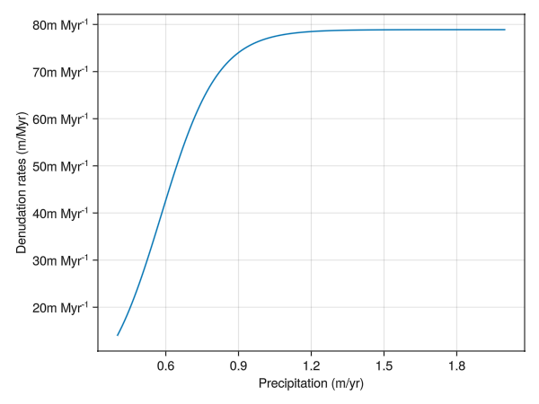

# Emperical denudation

Chlorine (Cl) isotopes are an emerging tool to decipher the denudation rates (chemical dissolution + physical erosion) in carbonate-dominated areas.

Research based on the karst region and carbonate platform terrace suggested that the denudation rates are mainly controlled by precipitation and slopes, although the debates about which factor is more important is still ongoing ([yang_combined_2020](@cite), [thomas_limited_2018](@cite)). In general, the precipitation mainly controls the chemical dissolution while the slope mainly controls the physical erosion. In addition, the type of carbonates may also play an important role ([krklec_long-term_2022](@cite)), but given this feature is studied poorly so we will ditch it for now. We have checked and compiled the denudation rates (mm/kyr), and along with precipitation and slopes these serve as a starting point to create a function relating denudation rates (mm/kyr) to precipitation and slopes. The compiled data can be found in OSF database. This is an empirical relationship and has a relatively large uncertainty in terms of fitting.


*Fig 1. The relationship between MAP (mean precipitation per year, mm/y) and denudation rates (mm/ky)*


*Fig 2. The relationship between the slope and the denudation rates (mm/ky)*

We can see that both the slope and precipitation increase the denudation rates, and that it reaches a 'steady state' after a certain point.

Therefore, we could use the function form of $D = P * S$, where $D$ is the denudation rate, $P$ parameterizes the effects of precipitation and $S$ the effects of slope. By doing so, we can consider both effects. Such formula structure is similar to RUSLE (Revised Universal Soil Loss Equation) model, a widely used Landscape Evolution Model (LEM) (e.g., [thapa_spatial_2020](@cite)). We use [sigmoidal function](https://en.wikipedia.org/wiki/Sigmoid_function) to approximate the influence of $P$ or $S$ on $D$, by fitting the function with the observed data and rendering parameters `a`, `b`, `c`, `d`, `e`, `f`. These are impleted as `empirical_denudation`. 

``` {.julia #empirical-denudation}
function empirical_denudation(precip::Float64, slope::Any)
    local a = 9.1363
    local b = -0.008519
    local c = 580.51
    local d = 9.0156
    local e = -0.1245
    local f = 4.91086
    (a ./ (1 .+ exp.(b .* (precip .* 1000 .- c)))) .* (d ./ (1 .+ exp.(e .* (slope .- f)))) .* u"m/Myr"
end
```
This produces the following curve for denudation rate as a function of precipitation

*Fig 3. An instance of the function showing denudation rates increases with precipitation.*

```@raw html
<details><summary>Plotting code</summary>
```

``` {.julia file=examples/denudation/empirical-test.jl}
#| requires: examples/denudation/empirical-test.jl
#| creates: docs/src/_fig/EmpiricalPrecipitation.png
#| collect: figures

module EmpiricalSpec
using CairoMakie

using CarboKitten
using Unitful

using CarboKitten.Denudation.EmpiricalDenudationMod: empirical_denudation, slope_kernel

const slope = 30

function main()
    precip = collect(0.4:0.01:2.0)

    result = Vector{typeof(1.0u"m/Myr")}(undef,size(precip))

    for i in eachindex(precip)
        result[i] = empirical_denudation(precip[i],slope)
    end

    fig = Figure()
    ax = Axis(fig[1,1],xlabel="Precipitation (m/yr)", ylabel="Denudation rates (m/Myr)")
    lines!(ax,precip,result)
    save("docs/src/_fig/EmpiricalPrecipitation.png",fig)
end

end

EmpiricalSpec.main()
```
```@raw html
</details>
```

This function needs two inputs: precipitation and slope. The precipitation is defined as an input parameter in `EmpiricalDenudation`.

``` {.julia #empirical-denudation}
@kwdef struct EmpiricalDenudation <: DenudationType
    precip::typeof(1.0u"m")
end
```

The slope for each cell is calculated by comparing the height (or water-depth) with the neighboring 8 cells, and is implemented in function `slope_kernel` . The slope is returned in degrees of inclination. This approach has been widely used in industry and [ArcGis: how slope works](https://pro.arcgis.com/en/pro-app/latest/tool-reference/spatial-analyst/how-slope-works.htm) is an example.

``` {.julia #empirical-denudation}
function slope_kernel(w::Any, cellsize::Float64)
    dzdx = (-w[1, 1] - 2 * w[2, 1] - w[3, 1] + w[1, 3] + 2 * w[2, 3] + w[3, 3]) / (8 * cellsize)
    dzdy = (-w[1, 1] - 2 * w[1, 2] - w[1, 3] + w[3, 1] + 2 * w[3, 2] + w[1, 1]) / (8 * cellsize)

    if abs(w[2, 2]) <= min.(abs.(w)...)
        return 0.0
    else
        atan(sqrt(dzdx^2 + dzdy^2)) * (180 / π)
    end
end
```

Note that this mode only considers the destruction of mass, and does not apply any redistribution of mass.

``` {.julia file=src/Denudation/EmpiricalDenudationMod.jl}
module EmpiricalDenudationMod

import ..Abstract: DenudationType, denudation, redistribution
using ...Boxes: Box
using Unitful
export slope_kernel
<<empirical-denudation>>

function denudation(::Box, p::EmpiricalDenudation, water_depth, slope, facies, state)
    precip = p.precip ./ u"m"
    denudation_rate = zeros(typeof(1.0u"m/Myr"), length(facies), size(slope)...)

    for idx in CartesianIndices(state.ca)
        f = state.ca[idx]
        if f == 0
            continue
        end
        if water_depth[idx] <= 0
            denudation_rate[f,idx] = empirical_denudation.(precip, slope[idx])
        end
    end
    return denudation_rate
end

function redistribution(::Box, p::EmpiricalDenudation, denudation_mass, water_depth)
    return nothing
end

end
```
