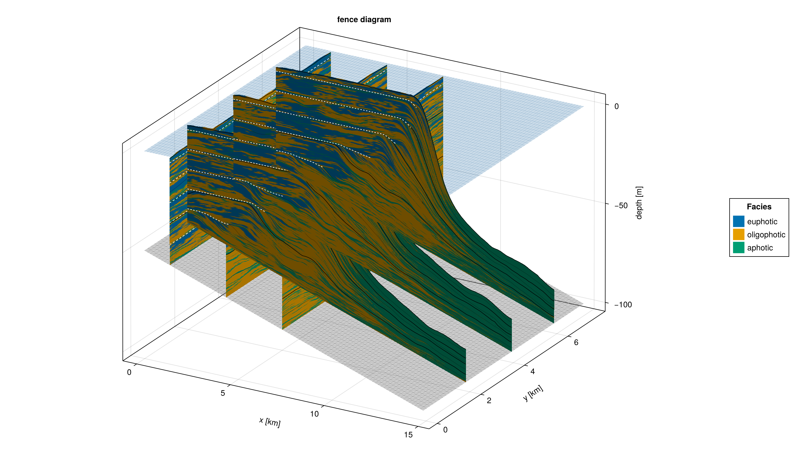
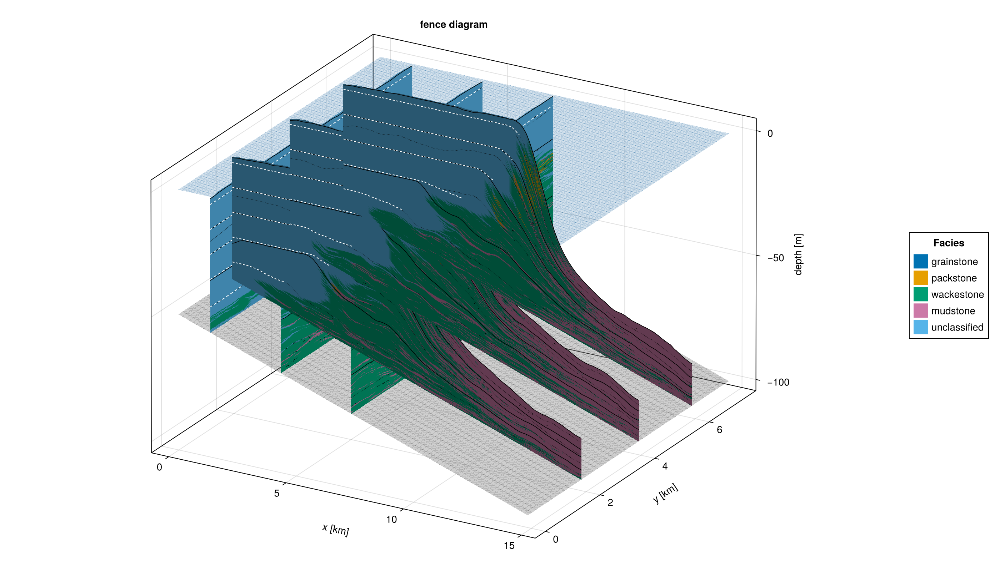

# Post-Deposition Facies Classification

CarboKitten models record deposition in terms of **production facies** that reflect the biological or abiotic source of the sediment (e.g. euphotic, oligophotic, aphotic carbonate).  In practice, stratigraphers classify sediment packages into **depositional facies** (wackestone, packstone,
grainstone, …) based on observable proxies: sediment composition, palaeo-water depth, and wave energy.




The `FaciesClassification` module provides a lightweight, non-invasive workflow
that performs this second classification step entirely in post-processing, on
the `Data` objects returned by the standard read routines.  No model, component,
or output writer is modified. 

Wave energy is computed using the physically consistent Airy wave theory
formulation provided by the `WaveField` module (see [Wave Field](wavefield.md)).
The same `AiryWaveField` used to drive sediment transport during the run is
passed to `reclassify_data` at classification time.

## Design overview

```
                        ┌──────────────────────────────┐
  run_model  ──────────▶│  Data  (production facies)    │
                        │  data.water_depth  (optional) │
                        └────────────┬─────────────────┘
                                     │ reclassify_data(rules; wave_field)
                        ┌────────────▼─────────────────┐
                        │  Data  (classified facies)    │──▶ fence_diagram
                        └──────────────────────────────┘     sediment_profile …
```

The input `Data` object carries `n_prod` production facies; the output carries
`n_class = length(rules) + 1` classified facies (the last slot is always the
fallback for blocks matching no rule).  Because the return type is the same
`Data{F,D}` struct, **all existing visualisation routines work without
modification**.

### Water depth

`reclassify_data` obtains water depth through
`Output.Abstract.water_depth(header, data)`, which has two paths:

1. **Stored field** (`data.water_depth !== nothing`): returned directly.
   Required when subsidence is spatially variable.  Enable with
   `save_water_depth = true` in the model input.
2. **Reconstructed from header** (fallback): `sl(t) - h₀ - Δh(t) + D·t`,
   exact for spatially uniform subsidence.

### Wave energy

Wave energy flux at each cell is computed as `WaveField.energy_flux(wave_field,
wd)` in W/m.  This is the same quantity as in the `WaveField` module —
`(1/8) ρ g H_eff² c_g` summed over all wave components — with depth-limited
breaking applied.  If no wave field is supplied, wave energy is `0 W/m`
everywhere and `wave_energy_range` rules never fire.

## FaciesRule

``` {.julia #facies-rule}
"""
    FaciesRule(; name, sediment_fractions, depth_range, wave_energy_range)

A single rule for post-depositional facies classification.

## Fields
- `name::String` — label assigned to blocks that match this rule.
- `sediment_fractions::Union{Nothing, Dict{Int,NTuple{2,Float64}}}` —
  optional per-production-facies fraction constraints.  Keys are 1-based
  production-facies indices; values are `(lo, hi)` with `0 ≤ lo ≤ hi ≤ 1`.
  All listed constraints must be satisfied simultaneously.  `nothing` means
  no constraint on sediment proportion.
- `depth_range::NTuple{2,<:Quantity}` — `(min_depth, max_depth)` water-depth
  window in metres.  Bounds are inclusive.  Use `(-Inf*u"m", Inf*u"m")` to
  leave depth unconstrained.
- `wave_energy_range::NTuple{2,<:Quantity}` — `(lo, hi)` for Airy wave energy
  flux in W/m, from `WaveField.energy_flux`.  Use `(0.0u"W/m", Inf*u"W/m")`
  to leave wave energy unconstrained.

Rules are evaluated in order; first match wins.  Unmatched blocks go to the
fallback class at index `length(rules) + 1`.
"""
@kwdef struct FaciesRule
    name::String
    sediment_fractions::Union{Nothing,Dict{Int,NTuple{2,Float64}}} = nothing
    depth_range::NTuple{2,<:Quantity}       = (-Inf * u"m",   Inf * u"m")
    wave_energy_range::NTuple{2,<:Quantity} = (0.0  * u"W/m", Inf * u"W/m")
end
```

## classify_block

``` {.julia #classify-block}
"""
    classify_block(rules, fractions, depth, wave_energy) -> Int

Classify a single deposited block against an ordered list of `FaciesRule`s.

Returns the 1-based index of the first matching rule, or `length(rules) + 1`
(fallback) when no rule matches.
"""
function classify_block(rules::AbstractVector{FaciesRule},
                        fractions::AbstractVector{<:Real},
                        depth::Quantity,
                        wave_energy::Quantity)::Int
    for (i, rule) in enumerate(rules)
        depth < rule.depth_range[1] && continue
        depth > rule.depth_range[2] && continue
        wave_energy < rule.wave_energy_range[1] && continue
        wave_energy > rule.wave_energy_range[2] && continue
        if rule.sediment_fractions !== nothing
            ok = true
            for (fid, (lo, hi)) in rule.sediment_fractions
                frac = length(fractions) >= fid ? fractions[fid] : 0.0
                if !(lo <= frac <= hi)
                    ok = false
                    break
                end
            end
            ok || continue
        end
        return i
    end
    return length(rules) + 1
end
```

## reclassify_data

``` {.julia #reclassify-data}
"""
    reclassify_data(header, data, rules; wave_field=nothing) -> (Header, Data)

Reclassify a CarboKitten `Data` object using an ordered vector of `FaciesRule`s.

`wave_field::Union{AiryWaveField, Nothing}` — the same wave field used during
the model run.  `WaveField.energy_flux(wave_field, wd)` is called at each cell
to obtain the wave energy in W/m.  When `nothing`, wave energy is `0 W/m`
everywhere.

Water depth is read from `data.water_depth` when stored (run with
`save_water_depth=true`), otherwise reconstructed from the header.

Returns `(new_header, new_data)` with the same `Data{F,D}` type, fully
compatible with all existing visualisation routines.
"""
function reclassify_data(header::Header,
                         data::Data{F,D},
                         rules::AbstractVector{FaciesRule};
                         wave_field::Union{AiryWaveField,Nothing}=nothing) where {F,D}
    n_prod  = size(data.deposition, 1)    # original production-facies count
    n_class = length(rules) + 1           # classified facies + fallback
    dep_sz  = size(data.deposition)
    sp_size = dep_sz[2:end-1]             # (): column, (nx,): slice, (nx,ny): volume
    n_t     = dep_sz[end]

    # --- allocate output arrays (same element type / units as input) ---
    zero_like(a) = zeros(eltype(a), n_class, sp_size..., n_t)
    dep_out  = zero_like(data.deposition)
    prod_out = zero_like(data.production)
    dis_out  = zero_like(data.disintegration)

    # --- water depth: stored field preferred, fallback to header reconstruction ---
    wd_array = water_depth(header, data)   # shape (spatial..., n_t)

    _wd(sp_idx::CartesianIndex{0}, t) = wd_array[t]
    _wd(sp_idx, t)                    = wd_array[sp_idx, t]

    zero_energy = 0.0u"W/m"

    # --- iterate over every spatial cell and time step ---
    for t_idx in 1:n_t
        for sp_idx in CartesianIndices(sp_size)
            wd_val = _wd(sp_idx, t_idx)

            dep_col  = @view data.deposition[:,     sp_idx, t_idx]
            prod_col = @view data.production[:,     sp_idx, t_idx]
            dis_col  = @view data.disintegration[:, sp_idx, t_idx]

            total_dep = sum(dep_col)
            fractions = if total_dep > zero(eltype(dep_col))
                ustrip.(dep_col ./ total_dep)
            else
                zeros(Float64, n_prod)
            end

            we  = wave_field !== nothing ? energy_flux(wave_field, wd_val) : zero_energy
            cls = classify_block(rules, fractions, wd_val, we)

            dep_out[cls,  sp_idx, t_idx] += total_dep
            prod_out[cls, sp_idx, t_idx] += sum(prod_col)
            dis_out[cls,  sp_idx, t_idx] += sum(dis_col)
        end
    end

    # --- build new header ---
    new_header = Header(
        tag                = header.tag,
        axes               = header.axes,
        Δt                 = header.Δt,
        time_steps         = header.time_steps,
        grid_size          = header.grid_size,
        n_facies           = n_class,
        initial_topography = header.initial_topography,
        sea_level          = header.sea_level,
        subsidence_rate    = header.subsidence_rate,
        data_sets          = header.data_sets,
        attributes         = merge(header.attributes,
                                   Dict("facies_classification" => true,
                                        "classified_facies" =>
                                            [[r.name for r in rules]; "fallback"])))

    new_data = Data{F,D}(
        slice              = data.slice,
        write_interval     = data.write_interval,
        disintegration     = dis_out,
        production         = prod_out,
        deposition         = dep_out,
        sediment_thickness = data.sediment_thickness,
        active_layer       = nothing,
        water_depth        = data.water_depth)

    return new_header, new_data
end
```

## User-facing example

```julia
using CarboKitten
using CarboKitten.Export: read_volume
using CarboKitten.WaveField: AiryWaveField, AiryWaveComponent, energy_flux
using CarboKitten.FaciesClassification: FaciesRule, reclassify_data
using Unitful

# ── 1. Define wave field (same as used in the model run) ─────────────────────
wf = AiryWaveField(components=[
    AiryWaveComponent(amplitude=1.5u"m", period=8.0u"s", direction=0.0),
    AiryWaveComponent(amplitude=0.5u"m", period=5.0u"s", direction=π/4),
])

# Inspect thresholds: energy at candidate depth boundaries
for d in [5.0, 10.0, 20.0, 50.0]
    @info "E at $(d)m = $(energy_flux(wf, d*u\"m\"))"
end

# ── 2. Run model (with water depth stored for variable-subsidence safety) ────
input = ALCAP.Input(
    # ... existing fields ...
    save_water_depth = true,
    facies = [ALCAP.Facies(..., wave_velocity=wf), ...])

run_model(Model{ALCAP}, input, "output/run.h5")

# ── 3. Read output ────────────────────────────────────────────────────────────
header, vol = read_volume("output/run.h5", :topography)

# ── 4. Define classification rules ───────────────────────────────────────────
# Production facies: 1 = euphotic, 2 = oligophotic, 3 = aphotic
# Energy thresholds chosen from the inspection above.

rules = [
    # Grainstone: shallow, high wave energy, euphotic-dominated
    FaciesRule(
        name               = "grainstone",
        sediment_fractions = Dict(1 => (0.5, 1.0)),
        depth_range        = (0.0u"m",  20.0u"m"),
        wave_energy_range  = (500.0u"W/m", Inf*u"W/m")),

    # Packstone: moderate energy, mixed euphotic/oligophotic
    FaciesRule(
        name               = "packstone",
        sediment_fractions = Dict(1 => (0.2, 0.8)),
        depth_range        = (0.0u"m",  40.0u"m")),

    # Wackestone: low energy, oligophotic-dominated
    FaciesRule(
        name               = "wackestone",
        sediment_fractions = Dict(2 => (0.3, 1.0)),
        depth_range        = (5.0u"m",  80.0u"m")),

    # Mudstone: deep, aphotic-dominated
    FaciesRule(
        name        = "mudstone",
        depth_range = (10.0u"m", Inf*u"m")),
    # Index 5 = fallback (unclassified)
]

# ── 5. Classify ───────────────────────────────────────────────────────────────
new_header, new_vol = reclassify_data(header, vol, rules; wave_field=wf)

# new_header.attributes["classified_facies"]
# => ["grainstone", "packstone", "wackestone", "mudstone", "fallback"]

# ── 6. Visualise (unchanged routines) ────────────────────────────────────────
using CairoMakie, CarboKitten.Visualization
fig = fence_diagram(new_header, new_vol;
    x_slices=[10, 30, 50], y_slices=[2.0u"km", 4.0u"km"])
save("fence_classified.png", fig)
```

## Setting wave energy thresholds

Unlike depth, wave energy thresholds are not immediately intuitive.  The
suggested workflow is to call `energy_flux(wf, d*u"m")` for a range of depths
before setting rules, as shown in the example above.  For the default ALCAP
example wave field (1.5 m / 8 s swell):

| Depth | Energy flux |
|-------|-------------|
| 5 m   | ~3 000 W/m  |
| 10 m  | ~1 500 W/m  |
| 20 m  | ~600 W/m    |
| 50 m  | ~200 W/m    |

These values scale with `H²`, so a 3 m wave has roughly 4× the flux of a 1.5 m
wave at the same depth.

## API reference

```@docs
CarboKitten.FaciesClassification
CarboKitten.FaciesClassification.FaciesRule
CarboKitten.FaciesClassification.classify_block
CarboKitten.FaciesClassification.reclassify_data
```

## Limitations

- All production at one cell in one time step is collapsed to a single
  classified-facies bucket.  Intra-timestep mixing is not resolved.
- `active_layer` is not reclassified (set to `nothing`): it represents
  pre-lithification mobile sediment, not a deposited block.
- Wave energy is evaluated at the *palaeo-water depth* of the deposited block,
  not at present-day depth.  This is the intended behaviour.
- When `save_water_depth = false` and subsidence is spatially variable,
  classification results will be incorrect.

## Source file

``` {.julia file=src/FaciesClassification.jl}
# ~/~ begin <<docs/src/facies-classification.md#src/FaciesClassification.jl>>[init]
"""
    FaciesClassification
...
"""
module FaciesClassification

using Unitful
using ..Output.Abstract: Data, Header, water_depth
using ..WaveField: AiryWaveField, energy_flux

export FaciesRule, classify_block, reclassify_data

<<facies-rule>>

<<classify-block>>

<<reclassify-data>>

end  # module FaciesClassification
# ~/~ end
```

## Test specification

``` {.julia file=test/FaciesClassificationSpec.jl}
module FaciesClassificationSpec

using Test
using Unitful
using CarboKitten
using CarboKitten.FaciesClassification: FaciesRule, classify_block, reclassify_data
using CarboKitten.WaveField: AiryWaveField, AiryWaveComponent, energy_flux
using CarboKitten.Output.Abstract: Header, Axes, Data, DataSlice, water_depth

# ---------------------------------------------------------------------------
# Helpers
# ---------------------------------------------------------------------------

function _make_header(n_facies::Int; nx=4, n_t=3,
                      sea_level_m=10.0, subsidence=0.0u"m/Myr")
    t = collect(0.0:0.2:n_t*0.2) * u"Myr"
    Header(
        tag                = "test",
        axes               = Axes(
            x = collect(0.0:150.0:(nx-1)*150.0) * u"m",
            y = [0.0u"m"],
            t = t),
        Δt                 = 0.2u"Myr",
        time_steps         = n_t,
        grid_size          = (nx, 1),
        n_facies           = n_facies,
        initial_topography = zeros(typeof(1.0u"m"), nx, 1),
        sea_level          = fill(sea_level_m * u"m", n_t + 1),
        subsidence_rate    = subsidence,
        data_sets          = Dict(),
        attributes         = Dict())
end

function _make_slice(n_f, nx, n_t;
                     deposition         = zeros(typeof(1.0u"m"), n_f, nx, n_t),
                     sediment_thickness = zeros(typeof(1.0u"m"), nx, n_t),
                     water_depth_arr    = nothing)
    DataSlice(
        slice              = (:, 1),
        write_interval     = 1,
        disintegration     = zeros(typeof(1.0u"m"), n_f, nx, n_t),
        production         = zeros(typeof(1.0u"m"), n_f, nx, n_t),
        deposition         = deposition,
        sediment_thickness = sediment_thickness,
        water_depth        = water_depth_arr)
end

# Minimal single-component wave field used across tests
const TEST_WAVE = AiryWaveField(components=[
    AiryWaveComponent(amplitude=1.5u"m", period=8.0u"s", direction=0.0)])

# ---------------------------------------------------------------------------
# 1.  energy_flux from WaveField — sanity checks
# ---------------------------------------------------------------------------
@testset "FaciesClassification/energy_flux sanity" begin
    # Flux must decrease with depth (energy dissipates toward deep water)
    E_shallow = energy_flux(TEST_WAVE, 5.0u"m")
    E_deep    = energy_flux(TEST_WAVE, 50.0u"m")
    @test E_shallow > E_deep

    # Units must be W/m
    @test unit(E_shallow) == u"W/m"

    # Zero or negative depth: no energy reaches the bed
    @test energy_flux(TEST_WAVE, 0.0u"m") == 0.0u"W/m"
end

# ---------------------------------------------------------------------------
# 2.  classify_block — depth gate
# ---------------------------------------------------------------------------
@testset "FaciesClassification/classify_block — depth gate" begin
    rules = [
        FaciesRule(name="shallow", depth_range=(0.0u"m",  5.0u"m")),
        FaciesRule(name="mid",     depth_range=(5.0u"m",  30.0u"m")),
        FaciesRule(name="deep",    depth_range=(30.0u"m", 200.0u"m")),
    ]
    we = 0.0u"W/m"
    @test classify_block(rules, [1.0], 2.0u"m",   we) == 1   # shallow
    @test classify_block(rules, [1.0], 5.0u"m",   we) == 1   # boundary: inclusive
    @test classify_block(rules, [1.0], 15.0u"m",  we) == 2   # mid
    @test classify_block(rules, [1.0], 100.0u"m", we) == 3   # deep
    @test classify_block(rules, [1.0], 500.0u"m", we) == 4   # fallback
end

# ---------------------------------------------------------------------------
# 3.  classify_block — sediment fraction gate
# ---------------------------------------------------------------------------
@testset "FaciesClassification/classify_block — fraction gate" begin
    rules = [
        FaciesRule(name="euphotic_dom",
                   sediment_fractions = Dict(1 => (0.6, 1.0)),
                   depth_range = (-Inf*u"m", Inf*u"m")),
        FaciesRule(name="mixed",
                   depth_range = (-Inf*u"m", Inf*u"m")),
    ]
    we = 0.0u"W/m"
    @test classify_block(rules, [0.8, 0.2], 5.0u"m", we) == 1
    @test classify_block(rules, [0.3, 0.7], 5.0u"m", we) == 2
    @test classify_block(rules, [0.0, 0.0], 5.0u"m", we) == 2  # empty block
end

# ---------------------------------------------------------------------------
# 4.  classify_block — wave energy gate (W/m)
# ---------------------------------------------------------------------------
@testset "FaciesClassification/classify_block — wave energy gate" begin
    # Get a realistic high-energy and low-energy value from the test wave field
    E_high = energy_flux(TEST_WAVE, 3.0u"m")    # shallow → high flux
    E_low  = energy_flux(TEST_WAVE, 80.0u"m")   # deep    → low flux
    threshold = (E_high + E_low) / 2

    rules = [
        FaciesRule(name="high_energy", wave_energy_range=(threshold, Inf*u"W/m")),
        FaciesRule(name="low_energy",  wave_energy_range=(0.0u"W/m", threshold)),
    ]
    @test classify_block(rules, [1.0], 5.0u"m", E_high) == 1
    @test classify_block(rules, [1.0], 5.0u"m", E_low)  == 2
end

# ---------------------------------------------------------------------------
# 5.  classify_block — combined gates (grainstone scenario)
# ---------------------------------------------------------------------------
@testset "FaciesClassification/classify_block — combined gates" begin
    E_ref = energy_flux(TEST_WAVE, 10.0u"m")
    rules = [
        FaciesRule(name="grainstone",
                   sediment_fractions = Dict(1 => (0.5, 1.0)),
                   depth_range        = (0.0u"m", 15.0u"m"),
                   wave_energy_range  = (E_ref, Inf*u"W/m")),
        FaciesRule(name="wackestone",
                   depth_range = (0.0u"m", Inf*u"m")),
    ]
    E_hi = energy_flux(TEST_WAVE, 5.0u"m")
    E_lo = energy_flux(TEST_WAVE, 80.0u"m")
    @test classify_block(rules, [0.7, 0.3], 5.0u"m",  E_hi) == 1   # all pass
    @test classify_block(rules, [0.7, 0.3], 25.0u"m", E_hi) == 2   # depth fails
    @test classify_block(rules, [0.7, 0.3], 5.0u"m",  E_lo) == 2   # energy fails
    @test classify_block(rules, [0.3, 0.7], 5.0u"m",  E_hi) == 2   # fraction fails
end

# ---------------------------------------------------------------------------
# 6.  reclassify_data — output shape
# ---------------------------------------------------------------------------
@testset "FaciesClassification/reclassify_data — shape" begin
    n_f, nx, n_t = 3, 4, 5
    header = _make_header(n_f; nx=nx, n_t=n_t)
    data   = _make_slice(n_f, nx, n_t)
    rules  = [
        FaciesRule(name="A", depth_range=(-Inf*u"m", Inf*u"m")),
        FaciesRule(name="B", depth_range=(-Inf*u"m", Inf*u"m")),
    ]
    new_header, new_data = reclassify_data(header, data, rules)

    @test new_header.n_facies == 3
    @test size(new_data.deposition,     1) == 3
    @test size(new_data.production,     1) == 3
    @test size(new_data.disintegration, 1) == 3
    @test size(new_data.deposition, 2) == nx
    @test size(new_data.deposition, 3) == n_t
    @test new_data.sediment_thickness === data.sediment_thickness
    @test new_header.attributes["classified_facies"] == ["A", "B", "fallback"]
end

# ---------------------------------------------------------------------------
# 7.  reclassify_data — bucket routing
# ---------------------------------------------------------------------------
@testset "FaciesClassification/reclassify_data — bucket routing" begin
    n_f, nx, n_t = 2, 2, 2
    header = _make_header(n_f; nx=nx, n_t=n_t)
    dep = zeros(typeof(1.0u"m"), n_f, nx, n_t)
    dep[1, 1, :] .= 1.0u"m"   # cell 1: 100% prod-facies 1
    dep[2, 2, :] .= 1.0u"m"   # cell 2: 100% prod-facies 2
    data = _make_slice(n_f, nx, n_t; deposition=dep)

    rules = [
        FaciesRule(name="f1_dom",
                   sediment_fractions = Dict(1 => (0.9, 1.0)),
                   depth_range = (-Inf*u"m", Inf*u"m")),
        FaciesRule(name="f2_dom",
                   sediment_fractions = Dict(2 => (0.9, 1.0)),
                   depth_range = (-Inf*u"m", Inf*u"m")),
    ]
    _, new_data = reclassify_data(header, data, rules)

    @test all(new_data.deposition[1, 1, :] .≈ 1.0u"m")
    @test all(new_data.deposition[2, 1, :] .≈ 0.0u"m")
    @test all(new_data.deposition[3, 1, :] .≈ 0.0u"m")
    @test all(new_data.deposition[1, 2, :] .≈ 0.0u"m")
    @test all(new_data.deposition[2, 2, :] .≈ 1.0u"m")
    @test all(new_data.deposition[3, 2, :] .≈ 0.0u"m")
end

# ---------------------------------------------------------------------------
# 8.  reclassify_data — mass conservation
# ---------------------------------------------------------------------------
@testset "FaciesClassification/reclassify_data — mass conservation" begin
    n_f, nx, n_t = 3, 3, 4
    header = _make_header(n_f; nx=nx, n_t=n_t)
    dep  = rand(typeof(1.0u"m"), n_f, nx, n_t) .* 0.5u"m"
    data = _make_slice(n_f, nx, n_t; deposition=dep)
    rules = [FaciesRule(name="all", depth_range=(-Inf*u"m", Inf*u"m"))]
    _, new_data = reclassify_data(header, data, rules)
    orig_total = dropdims(sum(dep,                 dims=1), dims=1)
    new_total  = dropdims(sum(new_data.deposition, dims=1), dims=1)
    @test all(new_total .≈ orig_total)
    @test all(new_data.deposition[2, :, :] .≈ 0.0u"m")
end

# ---------------------------------------------------------------------------
# 9.  Wave field routing: shallow cell goes to high-energy class
# ---------------------------------------------------------------------------
@testset "FaciesClassification/reclassify_data — AiryWaveField routing" begin
    # Sea level 10 m, zero topo, zero sed → water depth ≈ 10 m everywhere.
    # energy_flux at 10 m is above energy_flux at 50 m.
    n_f, nx, n_t = 1, 1, 1
    header = _make_header(n_f; nx=nx, n_t=n_t, sea_level_m=10.0)
    dep  = fill(1.0u"m", n_f, nx, n_t)
    data = _make_slice(n_f, nx, n_t; deposition=dep)

    E_at_10 = energy_flux(TEST_WAVE, 10.0u"m")
    # Rule fires if energy > half the value at 10 m (guaranteed to match)
    threshold = E_at_10 / 2

    rules = [
        FaciesRule(name="wave_active",
                   wave_energy_range = (threshold, Inf*u"W/m"),
                   depth_range = (-Inf*u"m", Inf*u"m")),
        FaciesRule(name="wave_quiet",
                   depth_range = (-Inf*u"m", Inf*u"m")),
    ]
    _, new_data = reclassify_data(header, data, rules; wave_field=TEST_WAVE)
    @test all(new_data.deposition[1, :, :] .≈ 1.0u"m")   # wave_active
    @test all(new_data.deposition[2, :, :] .≈ 0.0u"m")   # wave_quiet
    @test all(new_data.deposition[3, :, :] .≈ 0.0u"m")   # fallback
end

# ---------------------------------------------------------------------------
# 10.  No wave field: wave_energy_range rules never fire
# ---------------------------------------------------------------------------
@testset "FaciesClassification/reclassify_data — no wave field fallthrough" begin
    n_f, nx, n_t = 1, 1, 1
    header = _make_header(n_f; nx=nx, n_t=n_t)
    dep  = fill(1.0u"m", n_f, nx, n_t)
    data = _make_slice(n_f, nx, n_t; deposition=dep)

    rules = [
        # Requires wave energy > 0; impossible when no wave field supplied
        FaciesRule(name="wave_only",
                   wave_energy_range = (1.0u"W/m", Inf*u"W/m"),
                   depth_range = (-Inf*u"m", Inf*u"m")),
        FaciesRule(name="catch_all", depth_range=(-Inf*u"m", Inf*u"m")),
    ]
    _, new_data = reclassify_data(header, data, rules)   # no wave_field kwarg
    @test all(new_data.deposition[1, :, :] .≈ 0.0u"m")   # wave_only: never fires
    @test all(new_data.deposition[2, :, :] .≈ 1.0u"m")   # catch_all
end

# ---------------------------------------------------------------------------
# 11.  water_depth — stored field takes priority
# ---------------------------------------------------------------------------
@testset "FaciesClassification/water_depth — stored field" begin
    n_f, nx, n_t = 1, 3, 2
    header    = _make_header(n_f; nx=nx, n_t=n_t, sea_level_m=10.0)
    wd_stored = fill(7.0u"m", nx, n_t)
    data_with  = _make_slice(n_f, nx, n_t; water_depth_arr=wd_stored)
    data_plain = _make_slice(n_f, nx, n_t)
    @test water_depth(header, data_with)  === wd_stored
    @test all(water_depth(header, data_plain) .≈ 10.0u"m")
end

@testset "FaciesClassification/reclassify_data — stored depth overrides header" begin
    n_f, nx, n_t = 1, 1, 1
    # Header says sea level = 10 m, but we store depth = 3 m
    header = _make_header(n_f; nx=nx, n_t=n_t, sea_level_m=10.0)
    dep    = fill(1.0u"m", n_f, nx, n_t)
    data   = _make_slice(n_f, nx, n_t;
                         deposition      = dep,
                         water_depth_arr = fill(3.0u"m", nx, n_t))
    rules = [
        FaciesRule(name="shallow", depth_range=(0.0u"m",  5.0u"m")),
        FaciesRule(name="deep",    depth_range=(5.0u"m",  Inf*u"m")),
    ]
    _, new_data = reclassify_data(header, data, rules)
    @test all(new_data.deposition[1, :, :] .≈ 1.0u"m")   # shallow wins
    @test all(new_data.deposition[2, :, :] .≈ 0.0u"m")
end

# ---------------------------------------------------------------------------
# 12.  Fallback class
# ---------------------------------------------------------------------------
@testset "FaciesClassification/reclassify_data — fallback" begin
    n_f, nx, n_t = 1, 2, 1
    header = _make_header(n_f; nx=nx, n_t=n_t)
    dep    = fill(1.0u"m", n_f, nx, n_t)
    data   = _make_slice(n_f, nx, n_t; deposition=dep)
    rules  = [FaciesRule(name="impossible", depth_range=(-100.0u"m", -50.0u"m"))]
    _, new_data = reclassify_data(header, data, rules)
    @test all(new_data.deposition[1, :, :] .≈ 0.0u"m")
    @test all(new_data.deposition[2, :, :] .≈ 1.0u"m")
end

# ---------------------------------------------------------------------------
# 13.  Backward compatibility
# ---------------------------------------------------------------------------
@testset "FaciesClassification/backward-compatibility" begin
    @test !hasfield(CarboKitten.Components.FaciesBase.Facies, :classification_rules)
    @test !hasfield(CarboKitten.Models.ALCAP.Input,           :classification_rules)
    @test !hasfield(CarboKitten.Models.ALCAP.Input,           :save_water_depth)
end

end  # module FaciesClassificationSpec
```
