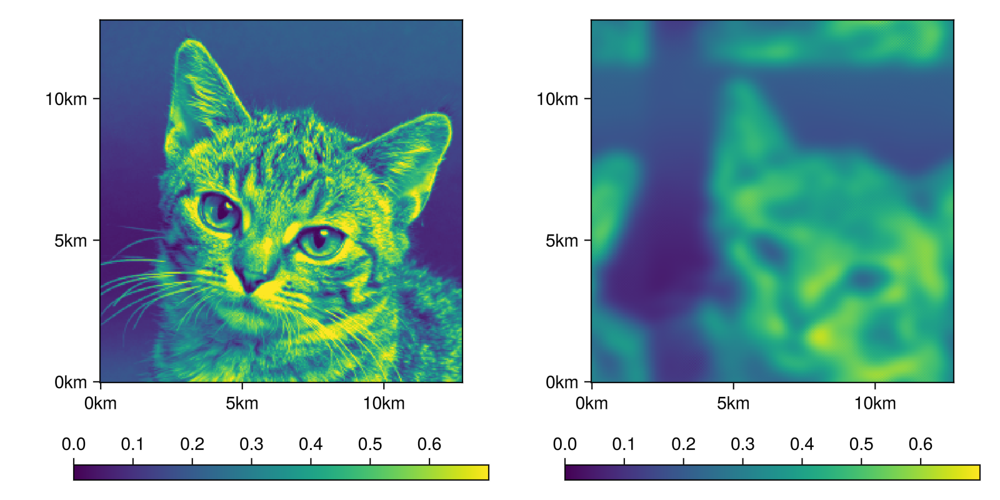
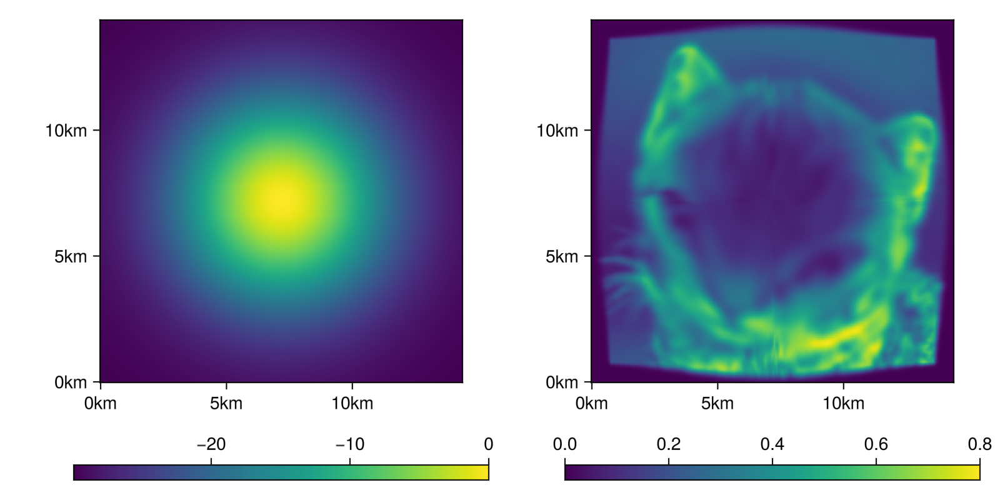

# Finite Difference Methods for Transport


## Spacial Finite Differences

``` {.julia file=src/Transport/DifferentialOperators.jl}
module DifferentialOperators

<<differential-operators>>

end
```

To solve the above equations we use three differential operators: `central_difference`, `upwind` and `laplacian`, defined in the context of a 2-d stencil operation.

**Central differences** approximates the derivative on a grid by,

$$dy_i = \frac{y_{i+1} - y_{i-1}}{2\Delta x}.$$

We define two variants for directions on the grid.

``` {.julia #differential-operators}
central_difference(::Type{Val{1}}, a::AbstractMatrix, dx) =
    (a[3, 2] - a[1, 2]) / (2dx)

central_difference(::Type{Val{2}}, a::AbstractMatrix, dx) =
    (a[2, 3] - a[2, 1]) / (2dx)
```

**Upwind** can be used when we know the derivative is being used in an advective context. If we are modeling flow, we better use the value in the direction where the flow is coming from,

$$dy_i = \begin{cases}
\frac{y_{i+1} - y_{i}}{\Delta x} & \textrm{if} v < 0,\\
\frac{y_{i} - y_{i-1}}{\Delta x} & \textrm{if} v > 0
\end{cases}$$

In our implementation we also multiply with the velocity $v$ to prevent code duplication when expressing advective terms.

``` {.julia #differential-operators}
upwind(v::T, a1, a2, a3, dx) where {T} =
    if v < zero(T)
        v * (a3 - a2) / dx
    else
        v * (a2 - a1) / dx
    end

upwind(::Type{Val{1}}, v, a::AbstractMatrix, dx) =
    upwind(v, a[:, 2]..., dx)

upwind(::Type{Val{2}}, v, a::AbstractMatrix, dx) =
    upwind(v, a[2, :]..., dx)
```

**Laplacian** is an approximation for the second derivative. Since we differentiate twice we no longer have the annoying situation that the derivative lives "between" our spatial discretization,

$$\nabla^2 y_{i, j} = \frac{y_{i-1,j} + y_{i,j-1} + y_{i+1,j} + y_{i,j+1} - 4y_{i,j}}{\Delta x^2}.$$

``` {.julia #differential-operators}
laplacian(a::AbstractMatrix, dx) =
    (a[1, 2] + a[2, 1] + a[3, 2] + a[2, 3] - 4 * a[2, 2]) / dx^2
```

## Solvers

Since we're trying to prevent complications, we use only explicit solvers for our PDE. We have **forward Euler** and **Runge-Kutta 4** methods in place.

If you want better solvers, it should be possible (and relatively straight-forward) to implement this transport model using `MethodOfLines.jl`, but we haven't yet felt the need for that.

These methods modify the given input $y$ in-place.

``` {.julia file=src/Transport/Solvers.jl}
module Solvers

using Unitful

function runge_kutta_4(::Type{T}, box) where {T}
    U = typeof(1.0 * unit(T) / u"Myr")
    k1 = Array{U}(undef, box.grid_size...)
    k2 = Array{U}(undef, box.grid_size...)
    k3 = Array{U}(undef, box.grid_size...)
    k4 = Array{U}(undef, box.grid_size...)
    function (df, y, t, dt)
        k1 .= df(y, t)
        k2 .= df(y .+ dt/2 .* k1, t + dt/2)
        k3 .= df(y .+ dt/2 .* k2, t + dt/2)
        k4 .= df(y .+ dt .* k3, t + dt)
        y .+= (k1 .+ 2 .* k2 .+ 2 .* k3 .+ k4) .* (dt/6)
    end
end

function forward_euler(df, y, t, dt)
    y .+= dt .* df(y, t)
end

end
```

## Advection

We are solving sediment transport using finite difference methods. Our active layer approach to transport can be written as an equation in terms of the sediment concentration,

$$\partial_t C = - d \nabla (C \nabla w),$$

where $C$ is the sediment concentration, $d$ the diffusion coefficient and $w$ the water depth. Similarly, we can set the transport equation when we enable wave transport,

$$\partial_t C = - d \nabla (C \nabla w) - v \nabla C + s C \nabla w,$$

where $v(w)$ is the wave transport velocity and $s(w)$ the wave transport shear. This is now no longer a diffusion equation per se, rather an advective system. When we solve the equations, the first term is expanded, so we get,

$$\partial_t C = -d \nabla^2 w C - d \nabla w \nabla C - v \nabla C + s \nabla w C,$$

collecting terms:

$$\partial_t C = - (d \nabla w + v) \nabla C + (s \nabla w - d \nabla^2 w) C.$$

Note that $\partial_t C$ is a component of $\partial_t \eta$, and $\nabla \eta = - \nabla w$. So in that context this advection equation enacts diffusion.

``` {.julia #advection-transport}
d = diffusivity
v, s = wave_velocity(w[2, 2])

dw = (central_difference(Val{1}, w, dx), central_difference(Val{2}, w, dx))
adv = upwind(Val{1}, d * dw[1] + v[1], C, dx) + 
      upwind(Val{2}, d * dw[2] + v[2], C, dx)
rct = (s[1] * dw[1] + s[2] * dw[2] - d * laplacian(w, dx)) * C[2, 2]
return rct - adv
```

``` {.julia file=src/Transport/Advection.jl}
module Advection

using ....CarboKitten: Box
using ...Stencil: stencil!, Size
using ...BoundaryTrait: get_bounded
using ..DifferentialOperators: central_difference, upwind, laplacian
using Unitful
using GeometryBasics
using LinearAlgebra: dot

function advection_coef!(box::Box{BT}, diffusivity, wave_velocity, w, adv, rct) where {BT}
    d = diffusivity
    dx = box.phys_scale
    di = (CartesianIndex(1, 0), CartesianIndex(0, 1))
    for i = eachindex(IndexCartesian(), w)
        v, s = wave_velocity(w[i])

        wx1 = get_bounded(BT, w, i - di[1])
        wx2 = get_bounded(BT, w, i + di[1])
        wy1 = get_bounded(BT, w, i - di[2])
        wy2 = get_bounded(BT, w, i + di[2])

        dw = Vec2((wx2 - wx1) / (2dx), (wy2 - wy1) / (2dx))
        ddw = (wx1 + wx2 + wy1 + wy2 - 4*w[i]) / dx^2

        adv[i] = d * dw + v
        rct[i] = dot(s, dw) - d * ddw
    end
end

function transport_dC!(box::Box{BT}, adv, rct, C, dC) where {BT}
    dx = box.phys_scale
    di = (CartesianIndex(1, 0), CartesianIndex(0, 1))

    @inline upwind(v::T, a, i, di) where {T} =
        if v < zero(T)
            v * (get_bounded(BT, a, i+di) - a[i]) / dx
        else
            v * (a[i] - get_bounded(BT, a, i-di)) / dx
        end

    for i = eachindex(IndexCartesian(), dC)
        dC[i] = rct[i] *  C[i] - upwind(adv[i][1], C, i, di[1]) - upwind(adv[i][2], C, i, di[2]) 
    end

    return dC
end

function max_dt(adv, dx, courant_max)
    u(a) = abs(a[1]) + abs(a[2])
    return courant_max / maximum(u.(adv) ./ dx)
end

"""
    transport!(box, diffusivity, wave_velocity,
               C, w, dC)

Computes `dC` given a `box`, `diffusivity` constant in units of m/Myr,
`wave_velocity` is a function of water depth, returning both velocity in units
of m/Myr, and shear in units of 1/Myr, which should be the derivative of the
velocity w.r.t. water depth. `C` is the concentration of entrained sediment,
`w` the water depth, and `dC` the output derivative of `C`.
"""
function transport!(box::Box{BT}, diffusivity, wave_velocity, C, w, dC) where {BT}
    dx = box.phys_scale
    stencil!(BT, Size(3, 3), dC, C, w) do C, w
        <<advection-transport>>
    end
end

"""
    transport(box, diffusivity, wave_velocity, wave_shear,
               C, w)

Non-mutating version of [`transport!`](@ref). Allocates and returns `dC`.
"""
function transport(box::Box{BT}, diffusivity, wave_velocity, C::AbstractArray{T}, w) where {BT, T}
	dC = Array{typeof(1.0 * Unitful.unit(T) / u"Myr")}(undef, box.grid_size...)
    transport!(box, diffusivity, wave_velocity, C, w, dC)
    return dC
end

end
```

## Tests

The following set of tests all involve mutilating a picture of a kitten. The default settings for `TestModel` have zero wave velocity and diffusivity. We'll enable them one by one. Note again, that what we call diffusivity, in the context of these tests doesn't necessarily behave like diffusion.

``` {.julia file=examples/transport/runner.jl}
module Runner
using CarboKitten
using ProgressLogging

n_steps(input) = input.time.steps

function run_model(f, ::Type{Model{M}}, input) where {M}
    state = M.initial_state(input)
    f(0, state)

    @progress for i = 1:n_steps(input)
        M.step!(input, state)
        f(i, state)
    end

    return state
end

do_nothing(_i, _s) = ()

run_model(::Type{Model{M}}, input) where {M} = run_model(do_nothing, Model{M}, input)
end
```

``` {.julia file=examples/transport/test_model.jl}
module TestModel

using CarboKitten
using CarboKitten.Transport.Advection: transport
using Unitful

@kwdef struct Input
    box::Box
    time::TimeProperties
    initial_state::Array{Float64}
    topography::Array{typeof(1.0u"m")}

    diffusivity = 0.0u"m/Myr"
    wave_velocity = _ -> ((0.0u"m/Myr", 0.0u"m/Myr"), (0.0u"1/Myr", 0.0u"1/Myr"))

    solver
end

@kwdef mutable struct State
    time::typeof(1.0u"Myr")
    value::Array{Float64}
end

initial_state(input) = State(
    time = input.time.t0,
    value = copy(input.initial_state))

function step!(input, state)
    input.solver(
        (a, t) -> transport(
            input.box, input.diffusivity, input.wave_velocity,
            a, .-input.topography),
        state.value, state.time, input.time.Δt)
    state.time += input.time.Δt
end

end
```

### Wave induced advection

With only wave induced advection enabled, we should see a clear translation of the picture of the kitten. The additional diffusion is so called *false diffusion*, a numerical artifact of the upwind differencing scheme.



``` {.julia .task file=examples/transport/flying_cat.jl}
#| creates: docs/src/_fig/flying_cat.png
#| collect: figures

module FlyingCat

include("runner.jl")
include("test_model.jl")

using CarboKitten
using FileIO
using GLMakie

using CarboKitten.Transport.Solvers: forward_euler, runge_kutta_4

GLMakie.activate!()

const BOX = CarboKitten.Box{Periodic{2}}(
    grid_size=(256, 256), phys_scale=0.05u"km")

const INPUT = TestModel.Input(
    box = BOX,
    time = TimeProperties(Δt=100u"yr", steps=50),
    topography = zeros(typeof(1.0u"m"), BOX.grid_size),
    initial_state = load("data/cat256.pgm")'[:, end:-1:1] .|> Float64,
    wave_velocity = _ -> ((0.4u"m/yr", -0.3u"m/yr"), (0.0u"1/yr", 0.0u"1/yr")),
    solver = runge_kutta_4(Float64, BOX)
)

function run()
    x, y = box_axes(INPUT.box)

    fig = Figure(size=(800, 400))
    ax1 = Axis(fig[1, 1], aspect=1)
    hm1 = heatmap!(ax1, x, y, INPUT.initial_state, colorrange=(0.0,0.7))
    Colorbar(fig[2, 1], hm1, vertical=false)

    out = Runner.run_model(Model{TestModel}, INPUT)
    ax2 = Axis(fig[1, 2], aspect=1)
    hm2 = heatmap!(ax2, x, y, out.value, colorrange=(0.0,0.7))
    Colorbar(fig[2, 2], hm2, vertical=false)

    save("docs/src/_fig/flying_cat.png", fig)
end

end

FlyingCat.run()
```

### Diffusion

Next, we only enable the diffusivity term. We set a topography of a single Gaussian peak in the center of the box. Sediment is dispersed down slope.



``` {.julia .task file=examples/transport/exploding_kitten.jl}
#| creates: docs/src/_fig/exploding_kitten.png
#| collect: figures

module ExplodingKitten

include("runner.jl")
include("test_model.jl")

using CarboKitten
using FileIO
using GLMakie

using CarboKitten.Transport.Solvers: runge_kutta_4

GLMakie.activate!()

const N = 288

function load_cat()
    b = div(N - 256, 2)
    cat = zeros(Float64, N, N)
    cat[b+1:256+b, b+1:256+b] .= (load("data/cat256.pgm")'[:, end:-1:1] .|> Float64)
    return cat
end

const BOX = CarboKitten.Box{Reflected{2}}(grid_size=(N, N), phys_scale=0.05u"km")
const X, Y = box_axes(BOX)
const INPUT = TestModel.Input(
    box = BOX, 
    time = TimeProperties(Δt=100u"yr", steps=100),
    initial_state = load_cat(),
    topography = ((x, y) -> 30.0u"m" * exp(-((x-7.2u"km")^2 + (y-7.2u"km")^2)/(2*(3.0u"km")^2)) - 30.0u"m").(X, Y'),
    diffusivity = 30.0u"m/yr",
    solver = runge_kutta_4(Float64, BOX)
)

function run()
    x, y = box_axes(INPUT.box)

    fig = Figure(size=(800, 400))
    ax1 = Axis(fig[1, 1], aspect=1)
    hm1 = heatmap!(ax1, x, y, INPUT.topography / u"m")
    Colorbar(fig[2,1], hm1, vertical=false)

    out = Runner.run_model(Model{TestModel}, INPUT)
    ax2 = Axis(fig[1, 2], aspect=1)
    hm2 = heatmap!(ax2, x, y, out.value, colorrange=(0.0,0.8))
    Colorbar(fig[2,2], hm2, vertical=false)

    save("docs/src/_fig/exploding_kitten.png", fig)
end

end

ExplodingKitten.run()
```

## Scale invariance

From the conception  of the transport model, it should be evident that the solution to the transport equations should be scale invariant, in the sense that  we can multiply $C$ by any constant, solve the equations, then divide by the same constant and arrive at the same result.

``` {.julia file=test/Transport/AdvectionSpec.jl}
@testset "CarboKitten.Transport.Advection.scale-invariance" begin

using CarboKitten
using CarboKitten.Transport.Solvers: runge_kutta_4
using CarboKitten.Transport.Advection: transport
using Unitful

let box = Box{Periodic{2}}(grid_size=(32, 32), phys_scale=1.0u"m")
    solver = runge_kutta_4(Float64, box)
    wave_velocity = _ -> ((0.5u"m/s", 0.0u"m/s"), (0.0u"1/s", 0.0u"1/s"))
    diffusivity = 5.0u"m/s"
    w = randn(box.grid_size...) * u"m"
    C1 = randn(box.grid_size...)
    C2 = C1 .* 10.0
    dt = 1.0u"s"
    df(C, _) = transport(box, diffusivity, wave_velocity, C, w)

    for i = 1:10
        solver(df, C1, 0.0u"s", dt)
        solver(df, C2, 0.0u"s", dt)
    end

    @test isapprox(C1 .* 10.0, C2)
end

end
```
