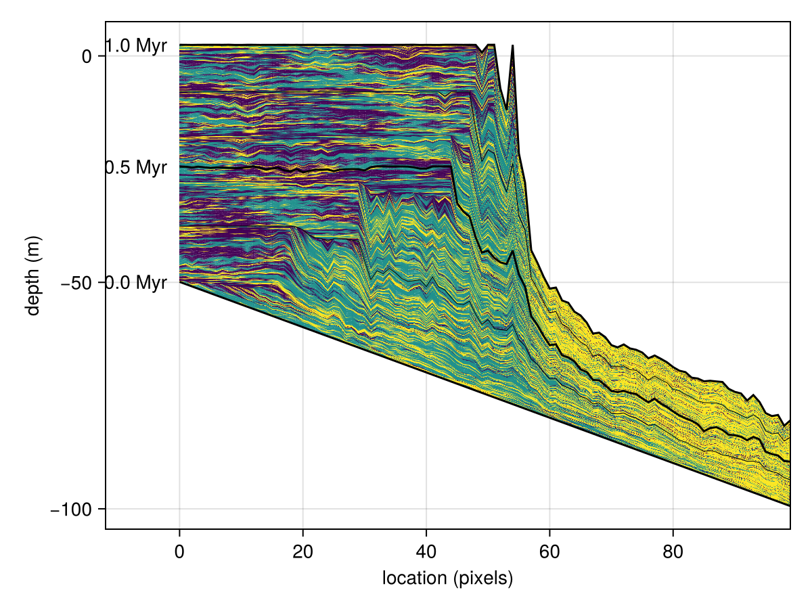

# CarboKitten
**Modeling Carbonate Platforms in Julia**

[](https://entangled.github.io/)

## About
CarboKitten is a clone of Peter Burgess' CarboCAT, a model for growing carbonate platforms.



## Julia Quickstarter

This code is written in [Julia](https://julia-lang.org/). You may want to check out the following references:

- [Julia Documentation](https://docs.julialang.org/en/v1/)
- [Tutorial on Julia for Science and Engineering](https://www.matecdev.com/posts/julia-tutorial-science-engineering.html)

There are several ways to work with Julia that may be a bit different from what you're used to, if that is Matlab, Python or R.

### Installing Julia
The best way to install Julia is to use `juliaup` at [github.com/JuliaLang/juliaup](https://github.com/JuliaLang/juliaup).

### REPL
The most basic way to work in Julia, is to start the REPL (Read Eval Print Loop).

```shell
$ julia
               _
   _       _ _(_)_     |  Documentation: https://docs.julialang.org
  (_)     | (_) (_)    |
   _ _   _| |_  __ _   |  Type "?" for help, "]?" for Pkg help.
  | | | | | | |/ _` |  |
  | | |_| | | | (_| |  |  Version 1.9.3 (2023-08-24)
 _/ |\__'_|_|_|\__'_|  |  Official https://julialang.org/ release
|__/                   |

julia> 
```

From here you may use CarboKitten `using CarboKitten` and run any of the code inside. To work with CarboKitten efficiently, you may want to load `Revise`. Revise auto-detects changes to loaded code and makes it easy to rerun.

Additionally you should learn how to work with Julia packages. If you want to experiment with things, try to create a new environment in an empty folder and add CarboKitten as a `dev` dependency:

```
pkg> dev <path to CarboKitten>
```

### VS Code
VSCode has very good support for working with Julia. Install the official Julia plugin and you should be good to go. Explore options by pressing `Ctrl+Shift+P` and type Julia to see what you can do. For example: start a REPL, run current script etc.

### Jupyter
You can run Julia code from Jupyter if you install the Julia kernel. Press `]` in the REPL to get into Pkg-mode, the prompt will change

```shell
(CarboKitten) pkg>
```

You may install the `IJulia` kernel with `add IJulia`.

### Pluto
An alternative notebook interface is called `Pluto`.

- Pluto is **reactive**: changes to code cells automatically update downstream dependencies.
- Pluto notebooks are written to regular Julia files and can be run independent from Pluto.
- The user interface of Pluto is slightly less mature than Jupyter

In Pkg-mode say `add Pluto`.

```shell
julia> using Pluto

julia> Pluto.run()
[ Info: Loading...
┌ Info: 
└ Opening http://localhost:1234/?secret=xyzxyzzy in your default browser... ~ have fun!
┌ Info: 
│ Press Ctrl+C in this terminal to stop Pluto
└ 
```

### Plotting
The most used library to do plotting in Julia is called `Plots`. However, this library comes with a fair share of problems: there are a number of back-ends for which the generated plots may look slightly different. Here "back-end" means some plotting library written in a different language than Julia.

A nicer plotting library that also happens to be a bit more versatile is `Makie`. This has three back-ends that are `CairoMakie`, `GLMakie` and `WGLMakie`. These are all written in Julia, but they focus on different kinds of results. `CairoMakie` is usually slow but results in publication quality vector graphics: `SVG` or `PDF`. `GLMakie` is very fast, renders on your graphics card, but only produces raster images, say `PNG`. Then `WGLMakie` does a similar thing, but through the web-browser.

## Entangled
If you plan to make a contribution to the core of CarboKitten, you should be aware of Entangled.

The documentation for CarboKitten is using [Entangled](https://entangled.github.io) for Literate Programming. This means that code blocks in the documentation contribute to the actual functioning code in the library. When you develop the library code, you should have the Entangled daemon running to keep the documentation synchronized. Included in the `CarboKitten` repository is a `pyproject.toml` that manages the Entangled installation for you through [Poetry](https://python-poetry.org); alternatively, you may install Entangled through `pip install entangled-cli`.

To install, run `poetry install` in the project root, then:

```shell
poetry run entangled watch
```

Entangled is still under development and it may occur that the daemon complains about not knowing wether to `tangle` or `stitch`, for example when you've accidentally written both markdown and source code. If this happens you may manually `entangled tangle` or `entangled stitch` with the `--force` argument to decide the issue. It may be worth saving your work in version control before doing so.

### Building Documentation
To recreate the plots in the documentation run

```
poetry run brei figures
```

The documentation can be rendered with `Documenter.jl`.

```shell
julia --workenv=docs docs/make.jl
```

## Project structure

```
.
├── data                # data files
├── docs                # documentation
│   ├── make.jl         # docs build script
│   ├── Manifest.toml   # 
│   ├── Project.toml    # dependencies for building docs
│   └── src             # markdown source for docs
├── entangled.toml      # entangled config
├── examples            # example scripts
├── Makefile            # command-line short hands
├── Manifest.toml       #
├── Project.toml        # project dependencies
├── pyproject.toml      # dependencies for running Entangled
├── README.md           # 
├── src                 # tangled library source
└── test                # unit tests
```

## Authors

Lead engineer: __Johan Hidding__  
Netherlands eScience Center  
email: j.hidding [at] esciencecenter.nl   
Web page: [www.esciencecenter.nl/team/johan-hidding-msc/](https://www.esciencecenter.nl/team/johan-hidding-msc/)  
ORCID: [0000-0002-7550-1796](https://orcid.org/0000-0002-7550-1796)

Original author: __Peter Burgess__  
University of Liverpool  
Web page: [www.liverpool.ac.uk/environmental-sciences/staff/peter-burgess](https://www.liverpool.ac.uk/environmental-sciences/staff/peter-burgess/)

Project lead: __Emilia Jarochowska__  
Utrecht University  
email: e.b.jarochowska [at] uu.nl  
Web page: [www.uu.nl/staff/EBJarochowska](https://www.uu.nl/staff/EBJarochowska)  
ORCID: [0000-0001-8937-9405](https://orcid.org/0000-0001-8937-9405)

**Other team members:**

__Niklas Hohmann__  
Utrecht University  
email: n.h.hohmann [at] uu.nl  
Web page: [www.uu.nl/staff/NHohmann](https://www.uu.nl/staff/NHHohmann)  
ORCID: [0000-0003-1559-1838](https://orcid.org/0000-0003-1559-1838)

__Xianyi Liu__  
Utrecht University  
email: x.liu6 [at] uu.nl  
Web page: [www.uu.nl/staff/XLiu6](https://www.uu.nl/staff/XLiu6)  
ORCID: 

__Hanno Spreeuw__  
Netherlands eScience Center  
email: h.spreeuw [at] esciencecenter.nl  
Web page: [www.esciencecenter.nl/team/dr-hanno-spreeuw/](https://www.esciencecenter.nl/team/dr-hanno-spreeuw)  
ORCID: [0000-0002-5057-0322](https://orcid.org/0000-0002-5057-0322)

__David De Vleeschouwer__  
Westfälische Wilhelms-Universität Münster  
Web page: [www.uni-muenster.de/GeoPalaeontologie/erdsystemforschung/staff/DeVleeschouwer](https://www.uni-muenster.de/GeoPalaeontologie/erdsystemforschung/staff/DeVleeschouwer.html)  
ORCID: [0000-0002-3323-807X](https://orcid.org/0000-0002-3323-807X)

## Copyright

Copyright 2023 Netherlands eScience Center and Utrecht University

## License

Apache 2.0 License, see LICENSE file for license text.

## Funding information

Funded by the European Union (ERC, MindTheGap, StG project no 101041077). Views and opinions expressed are however those of the author(s) only and do not necessarily reflect those of the European Union or the European Research Council. Neither the European Union nor the granting authority can be held responsible for them.

## Contents

```@contents
```

## Bibliography

```@bibliography
```