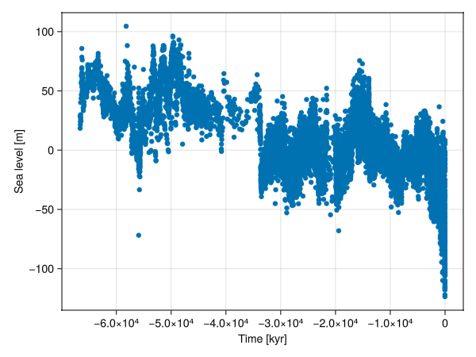

# Input Methods

Every model in CarboKitten has its own specific needs in terms of input. However, there are many common idioms used here.

## Sea level 
The sea level curve is probably the input parameter that is most often of interest. CarboKitten expects the sea level to be passed on as a function of time. So time must also be defined. In the tutorial you find the following example:

```julia
time = TimeProperties(
	Δt = 500u"yr",
	steps = 2000
)
```
To retrieve the range of times which will be written as the model output, one can use the [time_axis()](@ref) function.

### Sea level from file

Reading a single vector of numbers from a `example.txt` file in the `data` folder (it will be similar for other formats):

```julia
dir = "data"
filename = joinpath(dir, "example.txt")
sea_level = readdlm(filename, '\t', header=false) * u"m"
```

Remember that the topmost value in the file will be the first one to be read. In geological datasets this is often the **youngest** value, but because CarboKitten is a **forward** model, the first value in the vector of sea level values will be the one used first, so effectively the oldest. Sort your sea level values in the order of decreasing age, or oldest first, for CarboKitten to read them correctly.

Consider several situations involving the file with the values of sea level and the model run:

#### 1. The file has regularly spaced (equidistant) observations

Whether the temporal resolution is lower, the same or higher than the model step, we recommend using `linear_interpolation` from the package `Interpolations.jl` or an equivalent function.
You will have to interpolate the values to the density determined by Δt. 

##### Running a model at a resolution higher than the resolution of the sea level data

The model may give nicer results at lower Δt than the resolution of the empirical sea level data. This will require "making up" data by interpolation. Keep in mind that scientifically you **don't know** what happened at the interpolated points, so the sea level curve and the carbonate platform generated will be smoother than they would have been if the sea level had been measured at this resolution. You may use the parameter `write_times` from the component `TimeIntegration` to model at a higher temporal resolution, but save the results only at a resolution of the input data.

```julia
using Interpolations

SL  = linear_interpolation(time_axis(time), sea_level)
```
#### 2. The file has irregularly (not equidistant) observations

##### 2.1. Interpolation on irregular grid

Take the example from the [tutorial](https://mindthegap-erc.github.io/CarboKitten.jl/dev/first_tutorial/):

```{julia}
using CarboKitten.DataSets: miller_2020
miller_df = miller_2020()

using Interpolations
sort!(miller_df, [:time])
miller_sea_level = linear_interpolation(miller_df.time, miller_df.sealevel)
```

This works even though `miller_df.time` is not equally spaced, which is why this function is very safe if you change your input data a lot. But what happens under the hood is that [extrapolation](https://juliamath.github.io/Interpolations.jl/latest/api/#Interpolations.linear_interpolation) according to the method that is default for `linear_interpolation`. It may not be the best method for your data, so we recommend checking that and reporting on the type of interpolation used.

##### 2.2. Local regression (loess)

Loess, or "Locally Estimated Scatterplot Smoothing", is very popular among geoscientists. The `Smoothers.jl` package needs to be installed for this to work (`Pkg.add("Smoothers")`). 



It should work as follows:

```{julia file=examples/tabular-sea-level/loess.jl}
#| requires: examples/tabular-sea-level/loess.jl
#| creates: docs/src/_fig/loess.png
#| collect: figures

using CarboKitten

using Unitful
using CarboKitten.Components

using CarboKitten.DataSets: miller_2020
using Smoothers
using GLMakie

function main()

    miller_df = miller_2020()
    sort!(miller_df, [:time])

    sl = miller_df.sealevel / u"m" .|> NoUnits
    ti = miller_df.time / u"kyr" .|> NoUnits

fig = Figure()
    ax = Axis(fig[1,1], xlabel="Time [kyr]", ylabel="Sea level [m]")
    scatter!(ax, ti, sl)
    lines!(ax, ti, Smoothers.loess(ti, sl, q = 1000)(ti); color = :tomato)
    save("docs/src/_fig/loess.png",fig)
end
```

Choosing the `q` parameter proves difficult. Although the package `Smoothers.jl` indicates the default value will be estimated, in practice it seems to often result in `NaN`s. So always plot the result of smoothing to check it has been done correctly.

### Inline functions

If the function is very simple, you can enter it as an inline anonymous function (also known as a lambda). The following would generate a sinusoid with an amplitude of 10m and a period of 100,000 years.

```julia
const INPUT = Input(
    ...
    sea_level = t -> 10.0u"m" * sin(2pi / 100.0u"kyr")
    ...)
```

#### Stochastic functions

Functions can capture pre-generated data, so you can generate a stochastic sea-level curve for use in CarboKitten. There are multiple stochastic processes available in `DiffEqNoiseProcess.jl` and some of them may be relevant for modeling sea level. This example uses `OrnsteinUhlenbeckProcess`, which is a continuous time equivalent of an AR(1), but here calculated for specific positions determined based on the temporal resolution of the model, set in `TIME_PROPERTIES`.

The outcome looks like an AR(1) process:


```@example
using CarboKitten

using Unitful
using CarboKitten.Components
using GLMakie
using Random

const TIME_PROPERTIES = TimeProperties(
	Δt = 500u"yr",
	steps = 2000
)

function generate_ar1(mean, n, drift, variance)
"""
Arguments
- `mean`: Mean of the process
- `length`: Length of the process (number of steps)
- `drift`: Drift parameter
- `variance`: Variance of the process 
"""
    ar1 = Vector{Float64}(undef, n)
    ar1[1] = mean  # start with the mean for simplicity

    for i in 2:n
        ar1[i] = drift * ar1[i-1] + (1 - drift) * mean + randn() * sqrt(variance)
    end

    return ar1
end

function main()

const θ = 0.4 # drift
const μ = 2.0 # mean
const σ = 20 # variance

OU = generate_ar1(μ, length(time_axis(TIME_PROPERTIES)), θ, σ)

fig, ax = lines(time_axis(TIME_PROPERTIES) |> in_units_of(u"Myr"), collect(OU) .* u"m")
    ax.xlabel = "time [Myr]"
	ax.ylabel = "sea level [m]"
    save("docs/src/_fig/OU.png",fig)

end
```