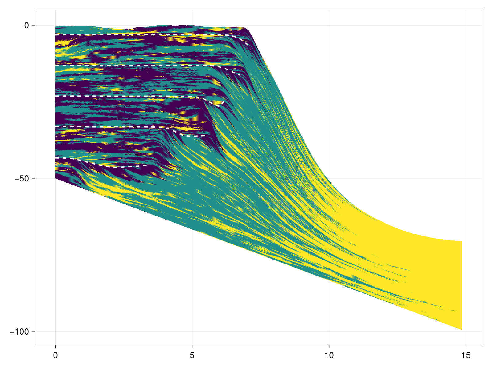
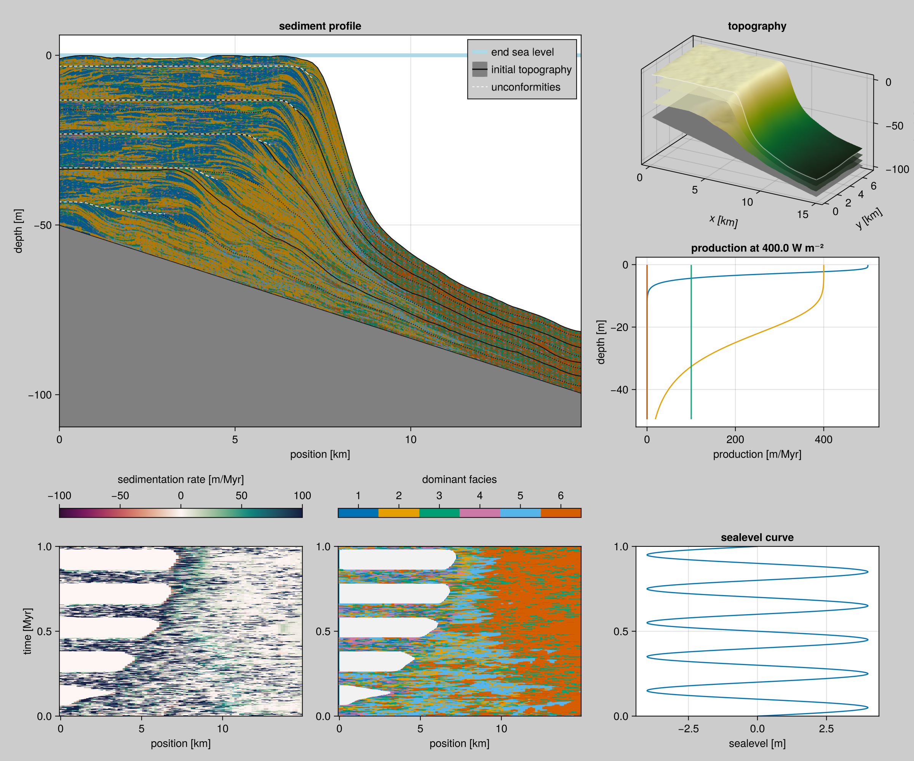

# Model with CA, Production and Active Layer transport (ALCAPS)

The following **S**edimentation model includes the Burgess 2013 **C**ellular **A**utomaton, Bosscher & Schlager 1992 **P**roduction curves and an **A**ctive **L**ayer transport model, based on Paola 1992, henceforth ALCAPS.



```@raw html
<details><summary>Default ALCAPS code</summary>
```

``` {.julia .task file=examples/alcaps/defaults.jl}
#| requires: src/Model/ALCAPS.jl
#| creates: data/alcaps_default.h5

using CarboKitten.Model.ALCAPS

ALCAPS.main(ALCAPS.Input(), "data/alcaps_default.h5")
```

``` {.julia .task file=examples/alcaps/plot-defaults.jl}
#| requires: ext/VisualizationExt.jl data/alcaps_default.h5
#| creates: docs/src/_fig/alcaps_default_profile.png
#| collect: figures

using CairoMakie
using Statistics
using GeometryBasics
using CarboKitten.Visualization

function main()
  fig = Visualization.sediment_profile("data/alcaps_default.h5", 25)
  save("docs/src/_fig/alcaps_default_profile.png", fig)
end

main()
```

```@raw html
</details>
```

## Example Input

The following is a complete example input.


``` {.julia .task file=examples/alcaps/alternative.jl}
#| requires: src/Model/ALCAPS.jl
#| creates: data/alcaps2.h5

using Unitful
using CarboKitten.BoundaryTrait: Shelf
using CarboKitten.Config: Box, TimeProperties
using CarboKitten.Model.ALCAPS: Facies, Input, main

const m = u"m"
const Myr = u"Myr"

const FACIES = [
    Facies(viability_range = (4, 10),
           activation_range = (6, 10),
           maximum_growth_rate = 500u"m/Myr",
           extinction_coefficient = 0.8u"m^-1",
           saturation_intensity = 60u"W/m^2",
           diffusion_coefficient = 10000u"m"),

    Facies(viability_range = (4, 10),
           activation_range = (6, 10),
           maximum_growth_rate = 400u"m/Myr",
           extinction_coefficient = 0.1u"m^-1",
           saturation_intensity = 60u"W/m^2",
           diffusion_coefficient = 5000u"m"),

    Facies(viability_range = (4, 10),
           activation_range = (6, 10),
           maximum_growth_rate = 100u"m/Myr",
           extinction_coefficient = 0.005u"m^-1",
           saturation_intensity = 60u"W/m^2",
           diffusion_coefficient = 7000u"m")
]

const PERIOD = 0.2Myr
const AMPLITUDE = 4.0m

const INPUT = Input(
    box = Box{Shelf}(grid_size=(100, 50), phys_scale=150.0m),
    time = TimeProperties(
        Δt=0.0002Myr,
        steps=5000,
        write_interval=1),
    ca_interval           = 1,

    bedrock_elevation        = (x, y) -> -x / 300.0 ,
    sea_level                = t -> AMPLITUDE * sin(2π * t / PERIOD),
    subsidence_rate          = 50.0m/Myr,
    disintegration_rate      = 500.0m/Myr,
    insolation               = 400.0u"W/m^2",
    sediment_buffer_size     = 50,
    depositional_resolution  = 0.5m,
    facies                   = FACIES)

main(INPUT, "data/alcaps2.h5")
```



```@raw html
<details><summary>Plotting code</summary>
```

``` {.julia .task file=examples/alcaps/plot-alternative.jl}
#| creates: docs/src/_fig/alcaps-alternative.png
#| requires: data/alcaps2.h5
#| collect: figures

using CairoMakie
using Statistics
using GeometryBasics
using CarboKitten.Visualization

function main()
  fig = Visualization.sediment_profile("data/alcaps2.h5", 25)
  save("docs/src/_fig/alcaps-alternative.png", fig)
end

main()
```

```@raw html
</details>
```

## ALCAPS Module

```@raw html
<details><summary>Module code</summary>
```

``` {.julia file=src/Model/ALCAPS.jl}
module ALCAPS

using Unitful
using HDF5
using ProgressBars

using ...BoundaryTrait: Shelf
using ...Config: Box, TimeProperties, axes
using ...SedimentStack: push_sediment!, pop_sediment!
using ...Burgess2013.CA: step_ca
using ...Burgess2013.Production: production_rate
using ...Transport.ActiveLayer: pde_stencil, Rate, Amount
using ...Utility: in_units_of

<<alcaps>>

end
```

```@raw html
</details>
```

## Input

FIXME: Layout of this section

We'll go through the input options top-down.

``` {.julia #alcaps}
const Myr = u"Myr"
const m = u"m"

<<alcaps-facies>>
<<alcaps-sealevel>>

@kwdef struct Input
    <<alcaps-input>>
    facies::Vector{Facies}    = FACIES
end
```

- `box`, default 100x50 with `Shelf` boundaries

  ``` {.julia #alcaps-input}
  box::Box              = Box{Shelf}(grid_size=(100, 50), phys_scale=150.0m)
  ```

- `time`, default steps of 200yr over a period of 1Myr

  ``` {.julia #alcaps-input}
  time::TimeProperties  = TimeProperties(
      Δt=0.0002Myr,
      steps=5000,
      write_interval=1)
  ```

- `ca_interval`, how many steps between advancing the CA

  ``` {.julia #alcaps-input}
  ca_interval::Int      = 1
  ```

- `bedrock_elevation`, elevation of bedrock (unerodable initial material)

  ``` {.julia #alcaps-input}
  bedrock_elevation     = (x, y) -> -x / 300.0  # (m, m) -> m
  ```

- `sea_level`, sea level as a function of time

  ``` {.julia #alcaps-sealevel}
  const PERIOD = 0.2Myr
  const AMPLITUDE = 4.0m
  ```

  ``` {.julia #alcaps-input}
  sea_level             = t -> AMPLITUDE * sin(2π * t / PERIOD)
  ```

- `subsidence_rate`, how fast the plate is dropping

  ``` {.julia #alcaps-input}
  subsidence_rate::Rate = 50.0m/Myr
  ```

- `disintegration_rate`, rate at which the top layer sediment is repurposed into the active layer

  ``` {.julia #alcaps-input}
  disintegration_rate::Rate = 500.0m/Myr   # same as maximum production rate
  ```

- `insolation`

  ``` {.julia #alcaps-input}
  insolation::typeof(1.0u"W/m^2") = 400.0u"W/m^2"
  ```

- `sediment_buffer_size`, the depth in pixels of the sediment buffer

  ``` {.julia #alcaps-input}
  sediment_buffer_size::Int     = 50
  ```

- `depositional_resolution`, amount of sediment per pixel in the sediment buffer

  ``` {.julia #alcaps-input}
  depositional_resolution::Amount = 0.5m
  ```

### Facies

The facies types, similar to values in Burgess 2013: viability range between 4 and 10 and activation range between 6 and 10 live cells. Each facies also has an associated `diffusion_coefficient` in units of meters.

``` {.julia #alcaps-facies}
@kwdef struct Facies
    viability_range::Tuple{Int,Int}
    activation_range::Tuple{Int,Int}

    maximum_growth_rate::Rate
    extinction_coefficient::typeof(1.0u"m^-1")
    saturation_intensity::typeof(1.0u"W/m^2")

    # though units are in m, this in not an amount.
    # TODO: figure out what this unit means
    # values should be picked rather large, say 10km.
    diffusion_coefficient::typeof(1.0m)
end

const FACIES = [
    Facies(viability_range = (4, 10),
           activation_range = (6, 10),
           maximum_growth_rate = 500u"m/Myr",
           extinction_coefficient = 0.8u"m^-1",
           saturation_intensity = 60u"W/m^2",
           diffusion_coefficient = 1000u"m"),

    Facies(viability_range = (4, 10),
           activation_range = (6, 10),
           maximum_growth_rate = 400u"m/Myr",
           extinction_coefficient = 0.1u"m^-1",
           saturation_intensity = 60u"W/m^2",
           diffusion_coefficient = 5000u"m"),

    Facies(viability_range = (4, 10),
           activation_range = (6, 10),
           maximum_growth_rate = 100u"m/Myr",
           extinction_coefficient = 0.005u"m^-1",
           saturation_intensity = 60u"W/m^2",
           diffusion_coefficient = 10000u"m")
]
```

## Logic

The ALCAPS model tracks the CA state, sediment height and keeps a sediment buffer (see [section on sediment buffers](sediment-buffer.md)).

``` {.julia #alcaps}
mutable struct State
    time::typeof(1.0u"Myr")

    ca::Array{Int}
    ca_priority::Vector{Int}

    sediment_height::Array{Amount,2}   # x, y
    # sediment_buffer stores fractions, so no units
    sediment_buffer::Array{Float64,4}  # z, facies, x, y
end
```

### Initial state

To construct the initial state, we forward the CA by 20 generations before starting the simulation proper.

``` {.julia #alcaps}
function initial_state(input)
    sediment_height = zeros(Float64, input.box.grid_size...) * u"m"
    n_facies = length(input.facies)
    sediment_buffer = zeros(Float64, input.sediment_buffer_size, n_facies, input.box.grid_size...)

    ca = rand(0:n_facies, input.box.grid_size...)
    state = State(0.0u"Myr", ca, 1:n_facies, sediment_height, sediment_buffer)

    for _ = 1:20
        step_ca(input.box, input.facies)(state)
    end

    return state
end
```

### Disintegration

``` {.julia #alcaps}
function disintegration(input)
    n_facies = length(input.facies)
    max_h = input.disintegration_rate * input.time.Δt
    output = Array{Float64, 3}(undef, n_facies, input.box.grid_size...)

    return function(state)
        h = min.(max_h, state.sediment_height)
        state.sediment_height .-= h
        pop_sediment!(state.sediment_buffer, h ./ input.depositional_resolution .|> NoUnits, output)
        return output .* input.depositional_resolution
    end
end
```

### Production

Uses production rate function from Bosscher & Schlager 1992.

``` {.julia #alcaps}
function production(input)
    n_facies = length(input.facies)
    x, y = axes(input.box)
    p(f, w) = production_rate(input.insolation, input.facies[f], w) .* input.time.Δt

    w0 = .- input.bedrock_elevation.(x, y')
    output = Array{Amount, 3}(undef, n_facies, input.box.grid_size...)

    return function(state)
        water_depth = w0 .+ input.sea_level(state.time) .-
            state.sediment_height .+ input.subsidence_rate * state.time
        for f = 1:n_facies
            output[f, :, :] = ifelse.(state.ca .== f, p.(f, water_depth), 0.0m)
        end
        return output
    end
end
```

### Transportation

Applies the [Active-Layer transport method](active-layer-transport.md) separately for each facies.

``` {.julia #alcaps}
function transportation(input)
    n_facies = length(input.facies)
    x, y = axes(input.box)
    μ0 = input.bedrock_elevation.(x, y')
    # We always return this array
    transported_output = Array{Amount, 3}(undef, n_facies, input.box.grid_size...)
    stencils = [
        let stc = pde_stencil(input.box, f.diffusion_coefficient)
            (μ, p) -> @views stc(tuple.(μ, p[i,:,:]), transported_output[i,:,:])
        end for (i, f) in enumerate(input.facies) ]

    return function(state, active_layer::Array{Amount, 3})
        μ = state.sediment_height .+ μ0
        for stc in stencils
            stc(μ, active_layer)
        end

        return transported_output
    end
end
```

### Main loop

Each iteration we:

1. Advance the CA (modifying CA state)
2. Produce sediment into active layer
3. Disintegrate older sediment into active layer (modifying sediment state)
4. Solve for transport in active layer
5. Deposit active layer (modifying sediment state)

``` {.julia #alcaps}
struct ModelFrame
    disintegration::Array{Amount,3}    # facies, x, y
    production::Array{Amount,3}
    deposition::Array{Amount,3}
    sediment_height::Array{Amount,2}
end

function run_model(input)
    state = initial_state(input)
    step_ca! = step_ca(input.box, input.facies)
    disintegrate! = disintegration(input)
    produce = production(input)
    transport = transportation(input)

    Channel{ModelFrame}() do ch
        for i in ProgressBar(1:input.time.steps)
            if mod(i, input.ca_interval) == 0
                step_ca!(state)
            end

            p = produce(state)
            d = disintegrate!(state)

            active_layer = p .+ d
            sediment = transport(state, active_layer)

            push_sediment!(state.sediment_buffer, sediment ./ input.depositional_resolution .|> NoUnits)
            state.sediment_height .+= sum(sediment; dims=1)[1,:,:]
            state.time += input.time.Δt

            put!(ch, ModelFrame(d, p, sediment, state.sediment_height))
        end
    end
end

function main(input::Input, output::String)
    x, y = axes(input.box)
    t = (0:input.time.steps) .* input.time.Δt

    h5open(output, "w") do fid
        gid = create_group(fid, "input")
        gid["x"] = collect(x) |> in_units_of(u"m")
        gid["y"] = collect(y) |> in_units_of(u"m")
        gid["t"] = t .|> in_units_of(u"Myr")
        gid["bedrock_elevation"] = input.bedrock_elevation.(x, y') |> in_units_of(u"m")
        gid["sea_level"] = input.sea_level.(t) .|> in_units_of(u"m")

        attr = attributes(gid)
        attr["delta_t"] = input.time.Δt |> in_units_of(u"Myr")
        attr["write_interval"] = input.time.write_interval
        attr["time_steps"] = input.time.steps
        attr["subsidence_rate"] = input.subsidence_rate |> in_units_of(u"m/Myr")
        attr["n_facies"] = length(input.facies)

        n_facies = length(input.facies)
        ds_prod = create_dataset(fid, "production", datatype(Float64),
            dataspace(n_facies, input.box.grid_size..., input.time.steps),
            chunk=(n_facies, input.box.grid_size..., 1))
        ds_disint = create_dataset(fid, "disintegration", datatype(Float64),
            dataspace(n_facies, input.box.grid_size..., input.time.steps),
            chunk=(n_facies, input.box.grid_size..., 1))
        ds_sedim = create_dataset(fid, "deposition", datatype(Float64),
            dataspace(n_facies, input.box.grid_size..., input.time.steps),
            chunk=(n_facies, input.box.grid_size..., 1))
        ds_height = create_dataset(fid, "sediment_height", datatype(Float64),
            dataspace(input.box.grid_size..., input.time.steps),
            chunk=(input.box.grid_size..., 1))

        results = run_model(input)
        for (step, frame) in enumerate(results)
            ds_prod[:, :, :, step] = frame.production |> in_units_of(u"m")
            ds_disint[:, :, :, step] = frame.disintegration |> in_units_of(u"m")
            ds_sedim[:, :, :, step] = frame.deposition |> in_units_of(u"m")
            ds_height[:, :, step] = frame.sediment_height |> in_units_of(u"m")
        end
    end
end
```
