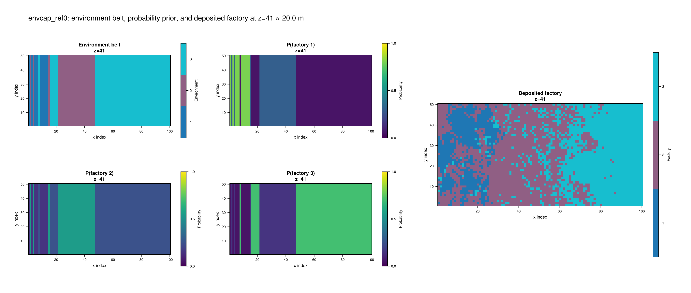
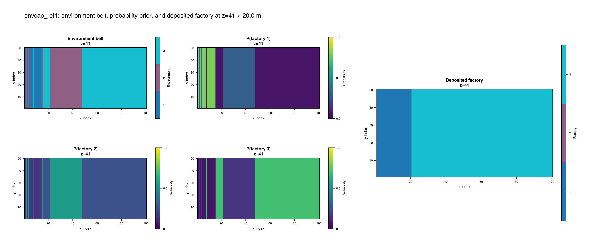

# EnvCAP — Environmentally Conditioned ALCAP

> **Interpretative model — read this section before use.**
> `EnvCAP` introduces user-supplied geological knowledge into the CA dynamics
> through an environmental conditioning field. Because that field is defined by
> the user (via the `WithoutCA` stage and the environment-to-factory mapping),
> the resulting stratigraphy is partly driven by external assumptions rather
> than purely emergent physics. Results should be described as *conditioned
> simulations*, not as direct physical predictions.

## Conceptual overview

There are **three distinct things** in the `EnvCAP` workflow:

1. **Environmental belts** — the dominant large-scale depositional environment
   at each grid cell, derived from a completed `WithoutCA` run.  These
   represent broad zones such as inner platform, shoal, or slope.  They are not
   carbonate factories.

2. **Factory-probability prior** — a per-cell probability distribution over
   factories, obtained by mapping the environmental belts through a
   user-defined `(n_envs × n_factories)` weight matrix.  This is a static
   conditioning field; it does not change during the second-stage run.

3. **Deposited factories** — the actual model output.  Factories compete and
   spread through the CA as in `ALCAP`; the prior only *biases* their
   survival, it does not dictate them.

The same environmental belts and the same factory prior can be reused across
multiple `EnvCAP` runs with different `ca_refinement` values, making it
straightforward to isolate the effect of the conditioning strength.

## Why a separate model

`EnvCAP` does not modify `ALCAP`, `CAP`, `WithoutCA`, or any other existing
model.  It is a sibling model that reuses the same mixin chain
(`CAProduction`, `CAFeedback`, `ActiveLayer`, `InitialSediment`, `Diagnostics`)
and adds exactly two inputs:

- `factory_prior::Union{Array{Float64,4},Nothing}` — the static prior array
- `ca_refinement::Float64` — the conditioning strength

When `factory_prior` is `nothing` **or** `ca_refinement == 0.0`, the model
is algebraically equivalent to `ALCAP`.

## Two-stage workflow

```
Stage 1 ─ WithoutCA
  Define environments via production curves, topography, sea level, etc.
  Run the model.
  Extract dominant_env_block() from the output deposition.

Stage 2 ─ EnvCAP
  Convert env_field + user mapping → factory_prior.
  Run EnvCAP with the same factory_prior and different ca_refinement values.
  Compare the deposited factory maps.
```

### Stage 1: generating the environmental belt

Run `WithoutCA` with facies representing broad environmental categories rather
than specific carbonate factories.  The production curves should reflect the
large-scale environmental gradient (e.g., high-energy inner platform vs.
low-energy slope) rather than exact organism groups.

Use `EnvMapping.dominant_env_block(data.deposition)` to convert the accumulated
deposition array into a `Matrix{Int}` of the same spatial dimensions as the
grid, where each cell contains the 1-based index of the environment that
contributed most sediment.

``` {.julia #dominant-env}
function dominant_env_block(deposition::AbstractArray{T,4}; dz = 0.5, min_nz = 1) where T
    n_envs, nx, ny, nt = size(deposition)

    numeric_dep = try
        ustrip.(u"m", deposition)
    catch
        Float64.(deposition)
    end

    total_thickness = dropdims(sum(numeric_dep; dims = (1, 4)), dims = (1, 4))
    nz = max(min_nz, 1, ceil(Int, maximum(total_thickness) / dz))

    belt = zeros(Int, nx, ny, nz)

    for ix in 1:nx, iy in 1:ny
        zpos = 1

        for it in 1:nt
            dep = numeric_dep[:, ix, iy, it]
            thickness = sum(dep)

            thickness <= 0.0 && continue

            env = argmax(dep)
            nvox = max(1, round(Int, thickness / dz))
            ztop = min(nz, zpos + nvox - 1)

            belt[ix, iy, zpos:ztop] .= env

            zpos = ztop + 1
            zpos > nz && break
        end
    end

    return belt
end
```

### Stage 2: converting environments to factory probabilities

Define a `(n_envs × n_factories)` weight matrix in which row `e` gives the
relative probability weight of each factory in environment `e`.  Each row is
normalised automatically.

``` {.julia #env-to-factory-prior}
function env_to_factory_prior_block(
        env_belt::Array{Int,3},
        mapping::Matrix{Float64})::Array{Float64,4}

    n_envs, n_factories = size(mapping)
    nx, ny, nz = size(env_belt)

    normalised = similar(mapping)

    for e in 1:n_envs
        row = max.(mapping[e, :], 0.0)
        s = sum(row)
        normalised[e, :] .= s > 0.0 ? row ./ s : fill(1.0 / n_factories, n_factories)
    end

    prior = zeros(Float64, n_factories, nx, ny, nz)

    for ix in 1:nx, iy in 1:ny, iz in 1:nz
        e = env_belt[ix, iy, iz]

        if e == 0 || e > n_envs
            prior[:, ix, iy, iz] .= 1.0 / n_factories
        else
            prior[:, ix, iy, iz] .= normalised[e, :]
        end
    end

    return prior
end
```

## The `ca_refinement` parameter

The prior is applied after each CA step via `apply_prior_bias!`.  For each
live cell with factory `f` at position `(ix, iy)`, the kill probability is

$$
p_\text{kill}(f, ix, iy) = \alpha \cdot (1 - \text{prior}[f, ix, iy])
$$

where $\alpha$ is `ca_refinement`.

| `ca_refinement` | Behaviour |
|---|---|
| `0.0` | `apply_prior_bias!` returns immediately — identical to ALCAP |
| `0.5` | Cells strongly favoured by the prior are rarely killed; mismatched cells are killed ≈50% of the time |
| `1.0` | Any cell whose factory has zero prior probability is killed with certainty; strongly favoured cells are never killed by the prior |

The comparison protocol is:

1. Compute `env_field` and `factory_prior` once from the stage-1 run.
2. Run `EnvCAP` three times with `ca_refinement ∈ {0.0, 0.5, 1.0}` using the
   **same** `factory_prior`.
3. Differences in the output factory maps reflect the conditioning strength,
   not differences in the prior.





``` {.julia #apply-prior-bias}
function apply_prior_bias!(
        ca::Matrix{Int},
        factory_prior::Array{Float64,4},
        sediment_height,
        depositional_resolution,
        ca_refinement::Float64,
        rng)

    ca_refinement == 0.0 && return

    _, nx, ny, nz = size(factory_prior)

    for ix in axes(ca, 1), iy in axes(ca, 2)
        f = ca[ix, iy]
        f == 0 && continue

        z = floor(Int, sediment_height[ix, iy] / depositional_resolution |> NoUnits) + 1
        z = clamp(z, 1, nz)

        p_prior = factory_prior[f, ix, iy, z]
        p_kill  = ca_refinement * (1.0 - p_prior)

        if rand(rng) < p_kill
            ca[ix, iy] = 0
        end
    end
end
```

## `EnvMapping` helper module

The three standalone functions above live in
`CarboKitten.Models.EnvCAP.EnvMapping`.  They have no dependencies on the
model loop and can be called at any point between the two stages.

``` {.julia file=src/Models/EnvCAP/EnvMapping.jl}
module EnvMapping

using Unitful
using Unitful: NoUnits

export dominant_env_block, env_to_factory_prior_block, apply_prior_bias!

<<dominant-env>>
<<env-to-factory-prior>>
<<apply-prior-bias>>

end
```

## Model source

``` {.julia file=src/Models/EnvCAP.jl}
include("EnvCAP/EnvMapping.jl")

@compose module EnvCAP
@mixin Tag, Output, CAProduction, CAFeedback, ActiveLayer, InitialSediment, Diagnostics

using ..Common
using ..CAProduction: production
using ..TimeIntegration
using ..WaterDepth: water_depth
using ...Output: Frame
using ModuleMixins: @for_each
using Random

import ..EnvMapping
using ..EnvMapping: apply_prior_bias!

export Input, Facies, BenthicProduction, PelagicProduction
export EnvMapping

<<envcap-input>>
<<envcap-initial-state>>

function initial_frame(input::Input)
    dep = stack(InitialSediment.initial_sediment(input.box, f) for f in input.facies; dims=1)
    return Frame(production      = zeros(Sediment, size(dep)),
                 disintegration  = zeros(Sediment, size(dep)),
                 deposition      = dep)
end

<<envcap-step>>

function write_header(input::AbstractInput, output::AbstractOutput)
    @for_each(P -> P.write_header(input, output), PARENTS)
end

end
```

### Input struct

``` {.julia #envcap-input}
@kwdef struct Input <: AbstractInput
    factory_prior::Union{Array{Float64,4},Nothing} = nothing
    ca_refinement::Float64                         = 0.0
    env_random_seed::Int                           = 1
end
```

### Initial state

``` {.julia #envcap-initial-state}
function initial_state(input::AbstractInput)
    ca_state = CellularAutomaton.initial_state(input)
    for _ in 1:20
        CellularAutomaton.step!(input)(ca_state)
    end

    sediment_height = zeros(Height, input.box.grid_size...)
    sediment_buffer = zeros(Float64, input.sediment_buffer_size, n_facies(input), input.box.grid_size...)
    active_layer    = zeros(Amount, n_facies(input), input.box.grid_size...)

    state = State(
        step            = 0,
        sediment_height = sediment_height,
        sediment_buffer = sediment_buffer,
        active_layer    = active_layer,
        ca              = ca_state.ca,
        ca_priority     = ca_state.ca_priority)

    InitialSediment.push_initial_sediment!(input, state)
    return state
end
```

### Step function

``` {.julia #envcap-step}
function step!(input::Input)
    step_ca!           = CellularAutomaton.step!(input)
    disintegrate!      = ActiveLayer.disintegrator(input)
    produce            = production(input)
    kill_unproductive! = CAFeedback.ca_feedback(input)
    transport!         = ActiveLayer.transporter(input)
    local_water_depth  = water_depth(input)
    pf                 = lithification_factor(input)
    dtf                = input.disintegration_transfer
    debug              = input.diagnostics

    prior     = input.factory_prior
    α         = input.ca_refinement
    @assert 0.0 <= α <= 1.0 "ca_refinement must be between 0 and 1"
    env_rng   = MersenneTwister(input.env_random_seed)
    has_prior = prior !== nothing && α > 0.0

    function (state::State)
        if debug
            @debug "envcap step: " state.step
        end

        if mod(state.step, input.ca_interval) == 0
            step_ca!(state)
            if has_prior
                apply_prior_bias!(
                    state.ca,
                    prior,
                    state.sediment_height,
                    input.depositional_resolution,
                    α,
                    env_rng,
                )
            end
        end

        wd = local_water_depth(state)
        p  = produce(state, wd)
        kill_unproductive!(state.ca, p)
        d  = disintegrate!(state)

        state.active_layer .+= p
        state.active_layer .+= dtf(d)

        if debug
            @debug "   post-production ambitus: " extrema(state.active_layer)
        end

        transport!(state)

        if debug
            @debug "   post-transport ambitus: " extrema(state.active_layer)
        end

        deposit = pf .* state.active_layer
        push_sediment!(state.sediment_buffer, deposit ./ input.depositional_resolution .|> NoUnits)
        state.active_layer  .-= deposit
        state.sediment_height .+= sum(deposit; dims=1)[1, :, :]
        state.step += 1

        return Frame(
            production     = p,
            disintegration = d,
            deposition     = deposit)
    end
end
```

## Complete example

The example below runs the full two-stage workflow and saves the
environmental belt, the factory prior, and three EnvCAP runs with different
`ca_refinement` values.

``` {.julia .task file=examples/model/envcap/run.jl}
#| creates:
#|   - data/output/envcap_stage1.h5
#|   - data/output/envcap_ref0.h5
#|   - data/output/envcap_ref05.h5
#|   - data/output/envcap_ref1.h5
#| requires: src/Models/EnvCAP.jl

module Script
using CarboKitten
using CarboKitten.Models: EnvCAP, WithoutCA
using CarboKitten.Models.EnvCAP.EnvMapping: dominant_env_block, env_to_factory_prior_block
using CarboKitten.Export: read_volume
using HDF5

# ── shared grid / time ────────────────────────────────────────────────────────
const BOX  = Box{Coast}(grid_size=(100, 50), phys_scale=150.0u"m")
const STEPS = 5000
const ΔT    = 200.0u"yr"

# ── Stage 1: WithoutCA environments ──────────────────────────────────────────
#
# Three large-scale environments defined by production curves:
#   Env 1 (inner platform) – high production, steep extinction
#   Env 2 (shoal/margin)   – medium production, moderate extinction
#   Env 3 (slope)          – low production, gentle extinction
const ENV_FACIES = [
    WithoutCA.Facies(
        name = "inner_platform",
        production = BenthicProduction(
            maximum_growth_rate    = 600u"m/Myr",
            extinction_coefficient = 0.9u"m^-1",
            saturation_intensity   = 60u"W/m^2"),
        transport_coefficient = 15.0u"m/yr"),
    WithoutCA.Facies(
        name = "shoal",
        production = BenthicProduction(
            maximum_growth_rate    = 350u"m/Myr",
            extinction_coefficient = 0.3u"m^-1",
            saturation_intensity   = 60u"W/m^2"),
        transport_coefficient = 8.0u"m/yr"),
    WithoutCA.Facies(
        name = "slope",
        production = BenthicProduction(
            maximum_growth_rate    = 120u"m/Myr",
            extinction_coefficient = 0.02u"m^-1",
            saturation_intensity   = 60u"W/m^2"),
        transport_coefficient = 4.0u"m/yr"),
]

const STAGE1_INPUT = WithoutCA.Input(
    tag                     = "envcap_stage1",
    box                     = BOX,
    time                    = TimeProperties(Δt=ΔT, steps=STEPS),
    output                  = Dict(:full => OutputSpec(write_interval=50)),
    initial_topography      = (x, y) -> -x / 300.0,
    sea_level               = t -> 4.0u"m" * sin(2π * t / 200.0u"kyr"),
    subsidence_rate         = 50.0u"m/Myr",
    insolation              = 400.0u"W/m^2",
    disintegration_rate     = 20.0u"m/Myr",
    lithification_time      = 100.0u"yr",
    sediment_buffer_size    = 50,
    depositional_resolution = 0.5u"m",
    facies = ENV_FACIES)

# ── Stage 2: EnvCAP factory facies ───────────────────────────────────────────
#
# Three carbonate factories:
#   Factory 1 (euphotic)   – shallow-water high-energy
#   Factory 2 (oligophotic)– intermediate depth
#   Factory 3 (aphotic)    – deeper, lower energy
const FACTORY_FACIES = [
    EnvCAP.Facies(
        name             = "euphotic",
        viability_range  = (4, 10),
        activation_range = (6, 10),
        production = BenthicProduction(
            maximum_growth_rate    = 500u"m/Myr",
            extinction_coefficient = 0.8u"m^-1",
            saturation_intensity   = 60u"W/m^2"),
        transport_coefficient = 50.0u"m/yr"),
    EnvCAP.Facies(
        name             = "oligophotic",
        viability_range  = (4, 10),
        activation_range = (6, 10),
        production = BenthicProduction(
            maximum_growth_rate    = 400u"m/Myr",
            extinction_coefficient = 0.1u"m^-1",
            saturation_intensity   = 60u"W/m^2"),
        transport_coefficient = 25.0u"m/yr"),
    EnvCAP.Facies(
        name             = "aphotic",
        viability_range  = (4, 10),
        activation_range = (6, 10),
        production = BenthicProduction(
            maximum_growth_rate    = 100u"m/Myr",
            extinction_coefficient = 0.005u"m^-1",
            saturation_intensity   = 60u"W/m^2"),
        transport_coefficient = 12.5u"m/yr"),
]

# Environment-to-factory mapping (3 envs × 3 factories):
#   Inner platform → mostly euphotic
#   Shoal          → euphotic / oligophotic mix
#   Slope          → mostly aphotic
const ENV_TO_FACTORY = [
    0.8  0.15  0.05;   # inner platform
    0.3  0.55  0.15;   # shoal
    0.05 0.25  0.70    # slope
]

function make_stage2_input(factory_prior, ca_refinement; tag)
    EnvCAP.Input(
        tag                     = tag,
        box                     = BOX,
        time                    = TimeProperties(Δt=ΔT, steps=STEPS),
        output                  = Dict(
            :topography => OutputSpec(write_interval=50),
            :profile    => OutputSpec(slice=(:, 25)),
            :full       => OutputSpec(write_interval=50)),
        initial_topography      = (x, y) -> -x / 300.0,
        sea_level               = t -> 4.0u"m" * sin(2π * t / 200.0u"kyr"),
        subsidence_rate         = 50.0u"m/Myr",
        insolation              = 400.0u"W/m^2",
        ca_interval             = 1,
        disintegration_rate     = 20.0u"m/Myr",
        lithification_time      = 100.0u"yr",
        sediment_buffer_size    = 50,
        depositional_resolution = 0.5u"m",
        factory_prior           = factory_prior,
        ca_refinement           = ca_refinement,
        env_random_seed         = 42,
        facies = FACTORY_FACIES)
end

function main()
    # ── Stage 1 ──
    run_model(Model{WithoutCA}, STAGE1_INPUT, "data/output/envcap_stage1.h5")

    # Extract environmental belt from stage-1 output
    header, stage1_data = read_volume("data/output/envcap_stage1.h5", :full)
        env_belt = dominant_env_block(
            stage1_data.deposition;
            dz = 0.5,
            min_nz = 41,
        )
        
        factory_prior = env_to_factory_prior_block(
            env_belt,
            ENV_TO_FACTORY,
        )

    # Save the env_field and factory_prior as attributes in each stage-2 file
    # (they are inputs, not outputs, but useful to archive alongside results)

    # ── Stage 2: three refinement levels, same prior ──
    for (α, tag, path) in [
            (0.0, "envcap_ref0",  "data/output/envcap_ref0.h5"),
            (0.5, "envcap_ref05", "data/output/envcap_ref05.h5"),
            (1.0, "envcap_ref1",  "data/output/envcap_ref1.h5")]
        input = make_stage2_input(factory_prior, α; tag=tag)
        run_model(Model{EnvCAP}, input, path)
    end
end
end

Script.main()
```

## Tests

``` {.julia file=test/Models/EnvCAPSpec.jl}
module EnvCAPSpec

using Test
using Unitful

using CarboKitten
using CarboKitten.Models: EnvCAP, WithoutCA
using CarboKitten.Models.EnvCAP.EnvMapping: dominant_env_block, env_to_factory_prior_block, apply_prior_bias!

const BOX  = Box{Coast}(grid_size=(5, 5), phys_scale=150.0u"m")
const TIME = TimeProperties(Δt=200.0u"yr", steps=10)

const ENV_FACIES = [
    WithoutCA.Facies(
        production = BenthicProduction(
            maximum_growth_rate    = 500u"m/Myr",
            extinction_coefficient = 0.8u"m^-1",
            saturation_intensity   = 60u"W/m^2"),
        transport_coefficient = 10.0u"m/yr"),
    WithoutCA.Facies(
        production = BenthicProduction(
            maximum_growth_rate    = 200u"m/Myr",
            extinction_coefficient = 0.05u"m^-1",
            saturation_intensity   = 60u"W/m^2"),
        transport_coefficient = 5.0u"m/yr"),
]

const STAGE1_INPUT = WithoutCA.Input(
    tag                     = "envcap_stage1_test",
    box                     = BOX,
    time                    = TIME,
    output                  = Dict(:full => OutputSpec(write_interval=1)),
    initial_topography      = (x, y) -> -x / 300.0,
    insolation              = 400.0u"W/m^2",
    subsidence_rate         = 50.0u"m/Myr",
    disintegration_rate     = 20.0u"m/Myr",
    lithification_time      = 100.0u"yr",
    sediment_buffer_size    = 10,
    depositional_resolution = 0.5u"m",
    facies = ENV_FACIES)

const FACTORY_FACIES = [
    EnvCAP.Facies(
        viability_range  = (4, 10),
        activation_range = (6, 10),
        production = BenthicProduction(
            maximum_growth_rate    = 500u"m/Myr",
            extinction_coefficient = 0.8u"m^-1",
            saturation_intensity   = 60u"W/m^2"),
        transport_coefficient = 10.0u"m/yr"),
    EnvCAP.Facies(
        viability_range  = (4, 10),
        activation_range = (6, 10),
        production = BenthicProduction(
            maximum_growth_rate    = 200u"m/Myr",
            extinction_coefficient = 0.05u"m^-1",
            saturation_intensity   = 60u"W/m^2"),
        transport_coefficient = 5.0u"m/yr"),
]

@testset "EnvMapping/dominant_env" begin
    dep = zeros(typeof(1.0u"m"), 2, 2, 2, 3)
    dep[1, 1, 1, :] .= 1.0u"m"
    dep[2, 2, 2, :] .= 2.0u"m"
    ef = dominant_env_block(dep)
    @test size(ef) == (2, 2)
    @test ef[1, 1] == 1
    @test ef[2, 2] == 2
    @test ef[1, 2] == 0
end

@testset "EnvMapping/env_to_factory_prior" begin
    env_field = [1 2; 0 1]
    mapping = [0.8 0.2; 0.3 0.7]
    prior = env_to_factory_prior_block(env_field, mapping)
    @test size(prior) == (2, 2, 2)
    @test prior[1, 1, 1] ≈ 0.8
    @test prior[2, 2, 1] ≈ 0.7
    @test all(prior[:, 1, 2] .≈ 0.5)
end

@testset "EnvMapping/apply_prior_bias! α=0" begin
    import Random: MersenneTwister
    ca    = [1 2; 0 1]
    prior = ones(Float64, 2, 2, 2) .* 0.5
    ca_before = copy(ca)
    apply_prior_bias!(ca, prior, 0.0, MersenneTwister(0))
    @test ca == ca_before
end

@testset "EnvMapping/apply_prior_bias! α=1 zero-prob" begin
    import Random: MersenneTwister
    ca    = ones(Int, 3, 3)
    prior = zeros(Float64, 2, 3, 3)
    prior[2, :, :] .= 1.0
    apply_prior_bias!(ca, prior, 1.0, MersenneTwister(0))
    @test all(ca .== 0)
end

const STAGE1_OUT = run_model(Model{WithoutCA}, STAGE1_INPUT, MemoryOutput(STAGE1_INPUT))

@testset "Stage-1 WithoutCA output shape" begin
    dep = STAGE1_OUT.data_volumes[:full].deposition
    @test size(dep, 1) == 2
    @test size(dep, 2) == 5
    @test size(dep, 3) == 5
end

const ENV_FIELD     = dominant_env_block(STAGE1_OUT.data_volumes[:full].deposition)
const MAPPING       = [0.9 0.1; 0.1 0.9]
const FACTORY_PRIOR = env_to_factory_prior_block(ENV_FIELD, MAPPING)

@testset "Factory prior shape and validity" begin
    @test size(FACTORY_PRIOR) == (2, 5, 5)
    @test all(0.0 .<= FACTORY_PRIOR .<= 1.0)
    col_sums = dropdims(sum(FACTORY_PRIOR; dims=1), dims=1)
    @test all(isapprox.(col_sums, 1.0; atol=1e-10))
end

function make_input(ca_refinement)
    EnvCAP.Input(
        tag                     = "envcap_test",
        box                     = BOX,
        time                    = TIME,
        output                  = Dict(:full => OutputSpec(write_interval=1)),
        initial_topography      = (x, y) -> -x / 300.0,
        insolation              = 400.0u"W/m^2",
        subsidence_rate         = 50.0u"m/Myr",
        disintegration_rate     = 20.0u"m/Myr",
        lithification_time      = 100.0u"yr",
        sediment_buffer_size    = 10,
        depositional_resolution = 0.5u"m",
        ca_interval             = 1,
        ca_refinement           = ca_refinement,
        factory_prior           = FACTORY_PRIOR,
        facies = FACTORY_FACIES)
end

const OUT_0  = run_model(Model{EnvCAP}, make_input(0.0), MemoryOutput(make_input(0.0)))
const OUT_05 = run_model(Model{EnvCAP}, make_input(0.5), MemoryOutput(make_input(0.5)))

@testset "Models/EnvCAP output shape" begin
    @test all(size(OUT_0.data_volumes[:full].sediment_thickness)  .== (5, 5, 11))
    @test all(size(OUT_05.data_volumes[:full].sediment_thickness) .== (5, 5, 11))
end

@testset "Models/EnvCAP ca_refinement=0 produces deposition" begin
    @test any(OUT_0.data_volumes[:full].deposition .> 0.0u"m")
end

@testset "Models/EnvCAP factory_prior=nothing behaves like ALCAP" begin
    input_no_prior = EnvCAP.Input(
        tag                     = "envcap_no_prior",
        box                     = BOX,
        time                    = TIME,
        output                  = Dict(:full => OutputSpec(write_interval=1)),
        initial_topography      = (x, y) -> -x / 300.0,
        insolation              = 400.0u"W/m^2",
        subsidence_rate         = 50.0u"m/Myr",
        disintegration_rate     = 20.0u"m/Myr",
        lithification_time      = 100.0u"yr",
        sediment_buffer_size    = 10,
        depositional_resolution = 0.5u"m",
        ca_interval             = 1,
        factory_prior           = nothing,
        ca_refinement           = 1.0,
        facies = FACTORY_FACIES)
    out = run_model(Model{EnvCAP}, input_no_prior, MemoryOutput(input_no_prior))
    @test any(out.data_volumes[:full].deposition .> 0.0u"m")
end

end
```
