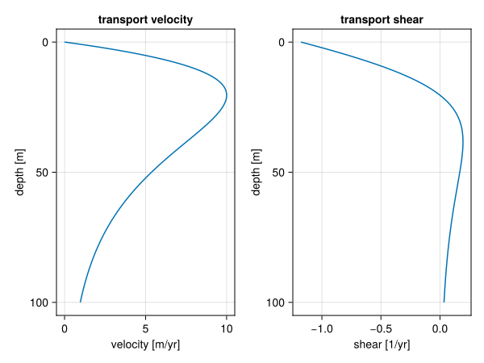

# Onshore transport

In the Active Layer approach, we derived a diffusion equation for our transport model starting with a proposition for the sediment flux as,

$$q_f = -\nu_f P_f \nabla \eta,$$

where $\nu_f$ is the diffusion coefficient, $P_f$ the production and $\eta$ the sediment height.
Then inserting that into the mass balance equation,

$$\partial_t \eta_f = -\nabla \cdot q_f + P_f.$$

Now we'll add a vector component $P_f w_f(\eta)$ to the flux:

$$q_f = -\nu_f P_f \nabla \eta + P_f w_f(\eta).$$

This leads to the modified advection-diffusion equation:

$$\partial_t \eta_f = \nu_f (P_f \nabla^2 \eta + \nabla P_f \cdot \nabla \eta) - \nabla \cdot (P_f w_f(\eta)) + P_f.$$

Using the chain-rule $\nabla \cdot (P_f w_f(\eta)) = P_f (w_f' \cdot \nabla \eta) + \nabla P_f \cdot w_f$, we arrive at:

$$\partial_t \eta_f = \nu_f P_f \nabla^2 \eta + (\nu_f \nabla P_f - P_f w_f') \cdot \nabla \eta - \nabla P_f \cdot w_f + P_f.$$

So we modify the advection component in the active layer approach with $P_f w_f'$, the derivative of the wave induced flux with respect to water depth and add a new term $\nabla P_f \cdot w_f$.

## Xi & Burgess 2022

Xi & Burgess use the following equation for the phase velocity of waves as a function of depth:

$$v(w) = \sqrt{\frac{\lambda g}k} {\rm tanh} (k w),$$

where $k = 2\pi/\lambda$ and $g$ is the gravitational acceleration. It could be that the square root should be extended over the ${\rm tanh}$ function, following the derivation on **Airy wave theory** on Wikipedia. It should be noted that this velocity is the phase-velocity of surface waves, given the total depth of the water. To evaluate the transport velocity at deeper levels, we need to look at the **Stokes drift**. This will effectively multiply the phase velocity with a factor $\exp(-kw)$. We'll leave the proportionality as an input parameter.

$$v(w) \propto \tanh{k w} \exp{-kw}$$

Derivative of $\tanh$ is $1 - \tanh^2$, so:

$$v(w) = A \tanh(k w) \exp(- k w)$$
$$\begin{aligned}
v'(w) &= A k [(1 - \tanh^2(k w)) \exp(- k w) - \tanh(k w) \exp(-k w)]\\
      &= A k \exp(-k w) [1 - \tanh^2(k w) - \tanh(k w)]
\end{aligned}$$

``` {.julia #wave-transport-magnitude}
v_prof(v_max, max_depth, w) = 
  	let k = sqrt(0.5) / max_depth,
		    A = 3.331 * v_max,
		    α = tanh(k * w),
		    β = exp(-k * w)
		    (A * α * β, -A * k * β * (1 - α - α^2))
	  end
```



``` {.julia .task}
#| creates: docs/src/_fig/wave-transport-magnitude.svg
#| collect: figures
module PlotWaveTransportMagnitude
using CairoMakie
using Unitful

<<wave-transport-magnitude>>

function main()
  w = LinRange(0, 100.0, 1000)u"m"
	f = v_prof.(10.0u"m/yr", 20.0u"m", w)

	v = first.(f)
	s = last.(f)

	fig = Figure()
	ax1 = Axis(fig[1, 1], title="transport velocity", yreversed=true, xlabel="velocity [m/yr]", ylabel="depth [m]")
	ax2 = Axis(fig[1, 2], title="transport shear", yreversed=true, xlabel="shear [1/yr]", ylabel="depth [m]")
	lines!(ax1, v / u"m/yr", w / u"m")
	lines!(ax2, s / u"1/yr", w / u"m")
	save("docs/src/_fig/wave-transport-magnitude.svg", fig)
end

end

PlotWaveTransportMagnitude.main()
```

## 
