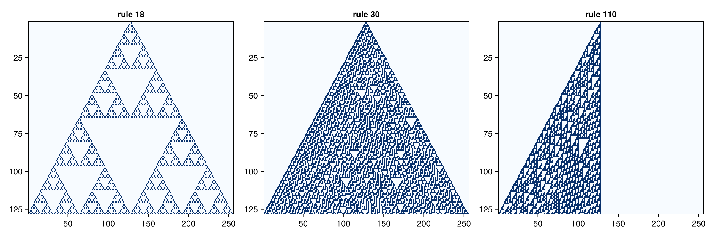
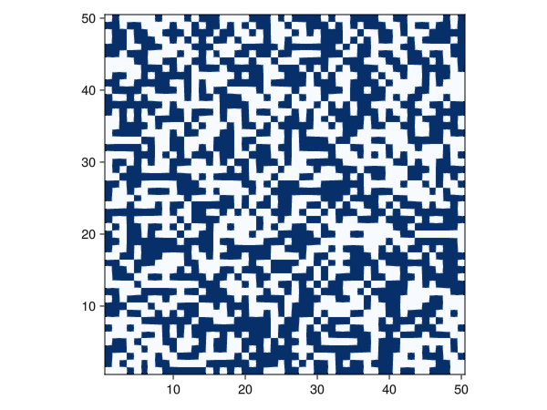
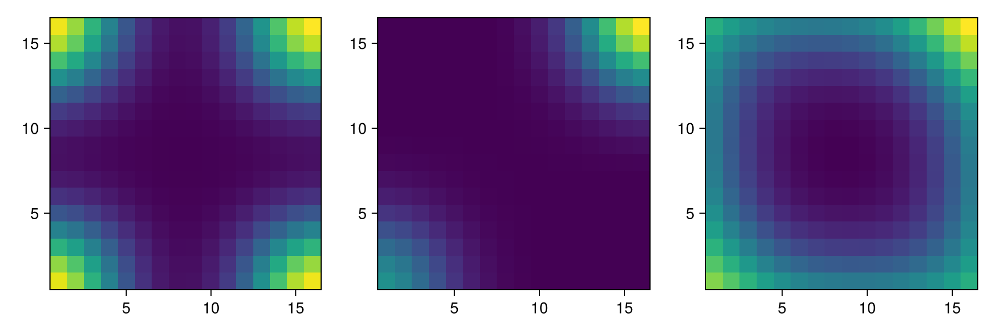

# Stencil operations
A *stencil* is the common term for computing many-to-one operations on grids. Examples of applications are:

- Finite difference schemes
- Finite Impulse Response (FIR) filters
- Convolutions (encompassing the previous two)
- Cellular Automata

Note that for larger convolution kernels, it is often more efficient to perform convolutions in the Fourier domain. On the matter of performance: stencil operations are the textbook example for computations that perform really well on GPUs.

## Implementation
Using these helper functions we can now define a *stencil* operation. Given the boundary trait, a stencil size and a response function, we can transform an array to a next generation.

``` {.julia #stencil-operation}
"""
    stencil!(f, Boundary, Size, out, inp...)

Performs stencil operation. The function `f` should take a number of
abstract arrays (same as the number of `inp` values),
and return a single value of the same type as elements in `out`.
The `Size` parameter should be a type parameter size of the stencil,
e.g. `Size(3, 3)` to get a 3 by 3 stencil.

Prefer to use this version over the older implementations.
"""
function stencil!(f::F, ::Type{BT}, ::Size{sz}, out, inp...) where {F, dim, sz, BT <: Boundary{dim}}
    stencil_multi!(f, BT, Size(sz), out, inp)
end

function stencil_multi!(f::F, ::Type{BT}, ::Size{sz}, out, inp) where {F, dim, sz, BT <: Boundary{dim}}
    @assert(
        all(size(a) == size(out) for a in inp),
        "inputs have wrong shape: $([size(a) for a in inp]), should be $(size(out))")

    center = CartesianIndex((div.(sz, 2) .+ 1)...)
    for i in eachindex(IndexCartesian(), out)
        nb = (SArray{Tuple{sz...}}(
                get_bounded(BT, a, i + j - center)
                for j in CartesianIndices(sz))
              for a in inp)
        out[i] = f(nb...)
    end
    return out
end


function stencil(::Type{TIn}, ::Type{TOut}, ::Type{BT}, n::NTuple{dim,Int}, f::Function) where {TIn, TOut, dim, BT <: Boundary{dim}}
    m = n .÷ 2
    stencil_shape = range.(.-m, m)
    stencil = Array{TIn, dim}(undef, n...)

    function(z_in::AbstractArray{TIn, dim}, z_out::AbstractArray{TOut, dim}, args...)
        @assert (size(z_in) == size(z_out)) "sizes of arrays need to be equal"
        shape = size(z_in)
        for i in CartesianIndices(shape)
            for (k, Δi) in enumerate(CartesianIndices(stencil_shape))
                stencil[k] = offset_value(BT, z_in, i, Δi)
            end
            z_out[i] = f(stencil, args...)
        end
    end
end

stencil(::Type{T}, ::Type{BT}, n::NTuple{dim, Int}, f::Function) where {T, dim, BT <: Boundary{dim}} =
    stencil(T, T, BT, n, f)

convolution(::Type{TIn}, ::Type{TOut}, ::Type{B}, kernel::AbstractArray{U, dim}) where { dim, TIn, TOut, U, B <: Boundary{dim} } =
    stencil(TIn, TOut, B, size(kernel), s -> sum(s .* kernel))

convolution(::Type{B}, kernel::AbstractArray{T, dim}) where {dim, T, B <: Boundary{dim}} =
    stencil(T, T, B, size(kernel), s -> sum(s .* kernel))
```

More efficient implementations are imaginable. For instance we could use normal unchecked indexing for most of the array, and only use the `offset_value` function when we really need it. Another optimisation could be to generate parts of the inner loop, and/or do the outer loop in parallel.

We will now test this function first on an Elementary CA (ECA), Conway's Game of Life, and a convolution.

```@raw html
<details><summary>Stencil module</summary>
```

``` {.julia file=src/Stencil.jl}
module Stencil

using StaticArrays

using ..Boxes: AbstractBox
using ..BoundaryTrait

export stencil, convolution

<<stencil-operation>>

end
```

```@raw html
</details>
```

## Examples
### Elementary Cellular Automata
An Elementary Cellular Automata is a one-dimensional CA with two states. Every next generation depends on the direct neighbourhood of three cells. Since there are $2^3 = 8$ patterns and two outcomes for every pattern, there are $2^8 = 256$ possible ECA.

``` {.julia .task file=examples/ca/eca.jl}
#| creates: docs/src/_fig/eca.png
#| requires: src/Stencil.jl
#| collect: figures

module ECA
    using CarboKitten.BoundaryTrait
    using CarboKitten.Stencil
    using CairoMakie

    rule(i::Int) = function (foo::AbstractVector{T}) where T <: Integer
        d = foo[1]*4 + foo[2]*2 + foo[3]
        i & (1 << d) == 0 ? 0 : 1
    end

    function eca(r::Int, n::Int, iter::Int)
        y = Array{Int}(undef, n, iter)
        y[:, 1] = zeros(Int, n)
        y[div(n, 2), 1] = 1
        stencil_op = stencil(Int, Periodic{1}, (3,), rule(r))
        for i in 2:iter
            stencil_op(view(y, :, i-1), view(y, :, i))
        end
        y
    end

    function plot()
        fig = Figure(size=(1200,400))
        for (idx, r) in enumerate([18, 30, 110])
            ax = Axis(fig[1,idx]; title="rule $(r)", yreversed=true, limits=((1, 256), (1, 128)))
            heatmap!(ax, eca(r, 256, 128); colormap=:Blues)
        end
        save("docs/src/_fig/eca.png", fig)
    end
end

ECA.plot()
```



Even these one-dimensional CA show highly complex behaviour. For instance, it has been shown that rule 110 is Turing complete.

### Game of Life
Perhaps the most famous CA is Conway's Game of Life. This is a two-dimensional two-state (dead/alive) CA, with the following rules: a cell is alive in the next generation if it is alive and has two neighbours or if it has three neighbours; in all other cases the cell is dead.

``` {.julia .task file=examples/ca/life.jl}
#| creates: docs/src/_fig/life.gif
#| requires: src/Stencil.jl
#| collect: figures

module Life
    using CarboKitten.BoundaryTrait
    using CarboKitten.Stencil
    using CairoMakie
    using .Iterators: take

    "x is a 3x3 region around the cell at x[2,2]."
    rules(x) = let c = x[2, 2], s = sum(x) - c
        c && s == 2 || s == 3
    end

    function game_of_life(w, h)
        y1 = rand(Bool, (w, h))
        y2 = Array{Bool}(undef, w, h)

        op = stencil(Bool, Periodic{2}, (3, 3), rules)
        Channel() do ch
            put!(ch, y1)
            while true
                op(y1, y2)
                (y1, y2) = (y2, y1)
                put!(ch, y1)
            end
        end
    end

    function plot()
        life = take(game_of_life(50, 50), 150)
        fig = Figure()
        ax = Axis(fig[1,1], aspect=1)
        record(fig, "docs/src/_fig/life.gif", life; framerate=10) do frame
            heatmap!(ax, frame; colormap=:Blues)
        end
    end
end

Life.plot()
```



### Testing boundaries with a convolution
To test the different boundary types, lets try the following setup. We take a 16x16 image with all zeros except the bottom left gets a value of 1 and the top right pixel gets a value of 2. Now convolve with a Gaussian and see what happens. For the constant boundary, I've set the value to 0.1, to see the effect.



Notice, that for the periodic boundaries, the bottom left and top right are neighbouring. So there the two pixels appear as a single peak. In the reflected case we see a clear distinction between the two corners.

``` {.julia .task}
#| creates: docs/src/_fig/boundary_types.png
#| requires: src/Stencil.jl
#| collect: figures

module Script

using CarboKitten.BoundaryTrait
using CarboKitten.Stencil
using CairoMakie

function plot_boundary_types()
    n = 16
    y0 = zeros(Float64, n, n)
    y0[1, 1] = 1
    y0[n, n] = 2
    x = collect(-2:0.25:2)
    k = exp.(-(x.^2 .+ x'.^2))
    k ./= sum(k)

    y_periodic = Array{Float64}(undef, n, n)
    convolution(Periodic{2}, k)(y0, y_periodic)
    y_reflected = Array{Float64}(undef, n, n)
    convolution(Reflected{2}, k)(y0, y_reflected)
    y_constant = Array{Float64}(undef, n, n)
    convolution(Constant{2, 0.1}, k)(y0, y_constant)

    fig = Figure(size=(900, 300))
    for (i, y) in enumerate([y_periodic, y_reflected, y_constant])
        ax = Axis(fig[1,i]; aspect=1)
        heatmap!(ax, y; colormap=:viridis)
    end
    save("docs/src/_fig/boundary_types.png", fig)
end
end 

Script.plot_boundary_types()
```

## Tests

``` {.julia file=test/StencilSpec.jl}
@testset "CarboKitten.Stencil" begin

using StaticArrays
using CarboKitten
using CarboKitten.Stencil: stencil!

let a = ones(Float64, 10, 10),
    b = zeros(Float64, 10, 10)

    stencil!(Periodic{2}, Size(3, 3), b, a) do a
        sum(a)
    end

    @test all(b .== 9)
end

end
```
