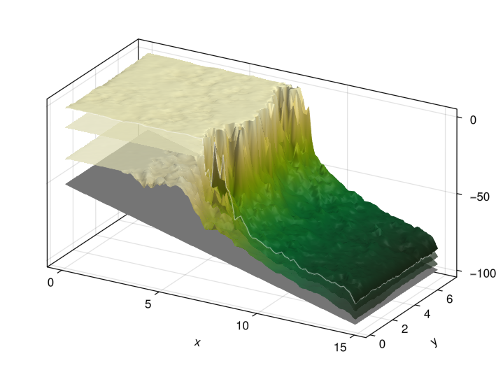

# Visualization

The visualization of CarboKitten output is implemented in a Julia [package extension](https://pkgdocs.julialang.org/v1/creating-packages/#Conditional-loading-of-code-in-packages-(Extensions)). This is done so that `CarboKitten.jl` itself doesn't have to depend on `Makie.jl` (our main visualization tool), which has a large transient dependency stack. To make the `Visualization` extension of CarboKitten available, make sure to activate a Julia project where `Makie` is installed.

## Makie primer

`Makie.jl` is a visualization package that creates exceptionally good looking (publication quality) plots in both 2D and 3D. There are three back-ends for Makie:

- `CairoMakie` for publication quality vector graphics, writing to `SVG`, `PDF` or `PNG`.
- `GLMakie` has better run-time performance than `CairoMakie`, especially when dealing with larger datasets and/or 3D visualizations. However, `GLMakie` can only produce rasterized images, so `PNG`, `JPEG` or directly to screen for interactive use.
- `WGLMakie` for online publication using WebGL. If you want interactive plots, like 3D plots that you can rotate in the browser, this is the one to use. Fair warning: this is also the least stable back-end for Makie.

To work with Makie, you need to import one of the three back-end packages. In general, every plot available in Makie has two variants. One is a direct function for plotting:

```julia
using CairoMakie

x = randn(10)
y = randn(10)

scatter(x, y)
```

The other requires a bit more prep, but gives you more control.

```julia
fig = Figure()
ax = Axis(fig[1,1])
scatter!(ax, x, y)
```

Here, we create a figure explicitly, then create a new set of axes somewhere on the grid in the figure, and then plot on that set of axes. The plotting functions accepting an `Axis` argument actually modify an existing context, which is why these functions always end with an exclamation mark, in this case `scatter!`.

If you like to know more about Makie, their ["Getting started"](https://docs.makie.org/stable/tutorials/getting-started) is a good place to start.

## Colours

We like to use colorblind safe pallete of colours as described on [Paul Tol's website](https://personal.sron.nl/~pault/): '#4477AA', '#EE6677', '#228833', '#CCBB44', '#66CCEE', '#AA3377', '#BBBBBB'.

## Project Extension

The Project Extension requires a front-end where the available methods are exposed.

``` {.julia file=src/Visualization.jl}
module Visualization
export sediment_profile!, sediment_profile, wheeler_diagram!, wheeler_diagram, production_curve!,
       production_curve, glamour_view!, summary_plot

function print_instructions(func_name, args)
    println("Called `$(func_name)` with args `$(typeof.(args))`")
    println("This is an extension and only becomes available when you import {Cairo,GL,WGL}Makie before using this.")
end

sediment_profile!(args...) = print_instructions("sediment_profile!", args)
sediment_profile(args...) = print_instructions("sediment_profile", args)
wheeler_diagram!(args...) = print_instructions("wheeler_diagram!", args)
wheeler_diagram(args...) = print_instructions("wheeler_diagram", args)
production_curve(args...) = print_instructions("production_curve", args)
production_curve!(args...) = print_instructions("production_curve!", args)
stratigraphic_column!(args...) = print_instructions("production_curve!", args)
age_depth_model!(args...) = print_instructions("age_depth_model!", args)
glamour_view!(args...) = print_instructions("glamour_view!", args)
summary_plot(args...) = print_instructions("summary_plot", args)

end  # module
```

``` {.julia file=ext/VisualizationExt.jl}
module VisualizationExt

include("WheelerDiagram.jl")
include("ProductionCurve.jl")
include("StratigraphicColumn.jl")
include("AgeDepthModel.jl")
include("SedimentProfile.jl")
include("GlamourView.jl")
include("SummaryPlot.jl")

end
```

## Summary collage


``` {.julia file=ext/SummaryPlot.jl}
module SummaryPlot

using CarboKitten.Visualization
import CarboKitten.Visualization: summary_plot
using CarboKitten.Export: read_header, read_slice
using CarboKitten.Utility: in_units_of
using HDF5
using Unitful
using Makie

summary_plot(filename::AbstractString; kwargs...) = h5open(fid->summary_plot(fid; kwargs...), filename, "r")

function summary_plot(fid::HDF5.File; wheeler_smooth=(1, 1))
	header = read_header(fid)
    y_slice = div(length(header.axes.y), 2) + 1
    max_depth = minimum(header.initial_topography)
	data = read_slice(fid, :, y_slice)

	n_facies = size(data.production)[1]
	fig = Figure(size=(1200, 1000), backgroundcolor=:gray80)

	ax1 = Axis(fig[1:2,1:2])
	sediment_profile!(ax1, header, data)

	ax2 = Axis(fig[4,1])
	ax3 = Axis(fig[4,2])
	sm, df = wheeler_diagram!(ax2, ax3, header, data; smooth_size=wheeler_smooth)
	Colorbar(fig[3,1], sm; vertical=false, label="sediment accumulation [m/Myr]")
	Colorbar(fig[3,2], df; vertical=false, label="dominant facies", ticks=1:n_facies)

	ax4 = Axis(fig[4,3], title="sealevel curve", xlabel="sealevel [m]",
        limits=(nothing, (header.axes.t[1] |> in_units_of(u"Myr"),
						  header.axes.t[end] |> in_units_of(u"Myr"))))
	lines!(ax4, header.sea_level |> in_units_of(u"m"), header.axes.t |> in_units_of(u"Myr"))

	ax5 = Axis(fig[2,3])
	production_curve!(ax5, fid["input"], max_depth=max_depth)

	linkyaxes!(ax2, ax3, ax4)

	ax = Axis3(fig[1, 3]; zlabel="depth [m]", xlabel="x [km]", ylabel="y [km]")
	glamour_view!(ax, fid)

	fig
end

end
```

## Wheeler diagram


``` {.julia .task file=examples/visualization/wheeler_diagram.jl}
#| creates: docs/src/_fig/wheeler_diagram.png
#| requires: data/output/alcap-example.h5
#| collect: figures

module Script

using CairoMakie
using CarboKitten.Export: read_slice
using CarboKitten.Visualization: wheeler_diagram

function main()
  header, data = read_slice("data/output/alcap-example.h5", :, 25)
  fig = wheeler_diagram(header, data)
  save("docs/src/_fig/wheeler_diagram.png", fig)
end

end

Script.main()
```

``` {.julia file=ext/WheelerDiagram.jl}
module WheelerDiagram

import CarboKitten.Visualization: wheeler_diagram, wheeler_diagram!
using CarboKitten.Export: Header, Data, DataSlice, read_data, read_slice
using CarboKitten.Utility: in_units_of
using Makie
using Unitful
using CarboKitten.BoundaryTrait
using CarboKitten.Stencil: convolution


const na = [CartesianIndex()]

elevation(h::Header, d::DataSlice) =
    let bl = h.initial_topography[d.slice..., na],
        sr = h.axes.t[end] * h.subsidence_rate

        bl .+ d.sediment_elevation .- sr
    end

water_depth(header::Header, data::DataSlice) =
    let h = elevation(header, data),
        s = header.subsidence_rate .* (header.axes.t .- header.axes.t[end]),
        l = header.sea_level

        h .- (s.+l)[na, :]
    end

const Rate = typeof(1.0u"m/Myr")

function sediment_accumulation!(ax::Axis, header::Header, data::DataSlice;
    smooth_size::NTuple{2,Int}=(3, 11),
    colormap=Reverse(:curl),
    range::NTuple{2,Rate}=(-100.0u"m/Myr", 100.0u"m/Myr"))
    magnitude = sum(data.deposition .- data.disintegration; dims=1)[1, :, :] ./ (header.Δt * header.write_interval)
    blur = convolution(Shelf, ones(Float64, smooth_size...) ./ *(smooth_size...))
    wd = zeros(Float64, length(header.axes.x), length(header.axes.t))
    blur(water_depth(header, data) / u"m", wd)
    mag = zeros(Float64, length(header.axes.x), length(header.axes.t) - 1)
    blur(magnitude / u"m/Myr", mag)

    ax.ylabel = "time [Myr]"
    ax.xlabel = "position [km]"

    sa = heatmap!(ax, header.axes.x / u"km", header.axes.t / u"Myr", mag;
        colormap=colormap, colorrange=range ./ u"m/Myr")
    contour!(ax, header.axes.x / u"km", header.axes.t / u"Myr", wd;
        levels=[0], color=:red, linewidth=2, linestyle=:dash)
    return sa
end

function dominant_facies!(ax::Axis, header::Header, data::DataSlice;
    smooth_size::NTuple{2,Int}=(3, 11),
    colors=Makie.wong_colors())
    n_facies = size(data.production)[1]
    colormax(d) = getindex.(argmax(d; dims=1)[1, :, :], 1)

    dominant_facies = colormax(data.deposition)
    blur = convolution(Shelf, ones(Float64, smooth_size...) ./ *(smooth_size...))
    wd = zeros(Float64, length(header.axes.x), length(header.axes.t))
    blur(water_depth(header, data) / u"m", wd)

    ax.ylabel = "time [Myr]"
    ax.xlabel = "position [km]"

    ft = heatmap!(ax, header.axes.x / u"km", header.axes.t / u"Myr", dominant_facies;
        colormap=cgrad(colors[1:n_facies], n_facies, categorical=true),
        colorrange=(0.5, n_facies + 0.5))
    contourf!(ax, header.axes.x / u"km", header.axes.t / u"Myr", wd;
        levels=[0.0, 10000.0], colormap=Reverse(:grays))
    contour!(ax, header.axes.x / u"km", header.axes.t / u"Myr", wd;
        levels=[0], color=:black, linewidth=2)
    return ft
end

function wheeler_diagram!(ax1::Axis, ax2::Axis, header::Header, data::DataSlice;
    smooth_size::NTuple{2,Int}=(3, 11),
    range::NTuple{2,Rate}=(-100.0u"m/Myr", 100.0u"m/Myr"))

    linkyaxes!(ax1, ax2)
    sa = sediment_accumulation!(ax1, header, data; smooth_size=smooth_size, range=range)
    ft = dominant_facies!(ax2, header, data; smooth_size=smooth_size)
    ax2.ylabel = ""

    return sa, ft
end

function wheeler_diagram(header::Header, data::DataSlice;
    smooth_size::NTuple{2,Int}=(3, 11),
    range::NTuple{2,Rate}=(-100.0u"m/Myr", 100.0u"m/Myr"))

    fig = Figure(size=(1000, 600))
    ax1 = Axis(fig[2, 1])
    ax2 = Axis(fig[2, 2])

    sa, ft = wheeler_diagram!(ax1, ax2, header, data; smooth_size=smooth_size, range=range)

    Colorbar(fig[1, 1], sa; vertical=false, label="sediment accumulation [m/Myr]")
    Colorbar(fig[1, 2], ft; vertical=false, ticks=1:3, label="dominant facies")
    fig
end

end
```

## Production curve


``` {.julia .task file=examples/visualization/production_curve.jl}
#| creates: docs/src/_fig/production_curve.svg
#| requires: data/output/alcap-example.h5
#| collect: figures

using CairoMakie
using CarboKitten.Visualization: production_curve

save("docs/src/_fig/production_curve.svg", production_curve("data/output/alcap-example.h5"))
```

``` {.julia file=ext/ProductionCurve.jl}
module ProductionCurve

using Makie
using Unitful
using HDF5

import CarboKitten.Components.Common: AbstractInput
import CarboKitten.Visualization: production_curve!, production_curve
using CarboKitten.Components.Production: Facies, production_rate

function production_curve!(ax, input::I) where I <: AbstractInput
    ax.title = "production at $(sprint(show, input.insolation; context=:fancy_exponent=>true))"
    ax.xlabel = "production [m/Myr]"
    ax.ylabel = "depth [m]"
    ax.yreversed = true

    for f in input.facies
        depth = (0.1:0.1:50.0)u"m"
        prod = [production_rate(input.insolation, f, d) for d in depth]
        lines!(ax, prod / u"m/Myr", depth / u"m")
    end
end

function production_curve(input::I) where I <: AbstractInput
    fig = Figure()
    ax = Axis(fig[1, 1])
    production_curve!(ax, input)
    fig
end

function production_curve(filename::AbstractString)
    h5open(filename, "r") do fid
        fig = Figure()
        ax = Axis(fig[1, 1])
        production_curve!(ax, fid["input"])
        fig
    end
end

function production_curve!(ax, g::HDF5.Group; max_depth=-50.0u"m")
    a = HDF5.attributes(g)
    insolation = a["insolation"][] * u"W/m^2"

    ax.title = "production at $(sprint(show, insolation; context=:fancy_exponent=>true))"
    ax.xlabel = "production [m/Myr]"
    ax.ylabel = "depth [m]"

    for i in 1:a["n_facies"][]
        fa = HDF5.attributes(g["facies$(i)"])
        f = Facies(
            fa["maximum_growth_rate"][] * u"m/Myr",
            fa["extinction_coefficient"][] * u"m^-1",
            fa["saturation_intensity"][] * u"W/m^2")
        depth = (0.1u"m":0.1u"m":-max_depth)
        prod = [production_rate(insolation, f, d) for d in depth]
        lines!(ax, prod / u"m/Myr", - depth / u"m")
    end
end

end
```

## Sediment profile


``` {.julia .task file=examples/visualization/sediment_profile.jl}
#| creates: docs/src/_fig/sediment_profile.png
#| requires: data/output/alcap-example.h5
#| collect: figures

using CairoMakie
using CarboKitten.Export: read_slice
using CarboKitten.Visualization: sediment_profile

save("docs/src/_fig/sediment_profile.png",
    sediment_profile(read_slice("data/output/alcap-example.h5", :, 25)...))
```

```{.julia file=ext/SedimentProfile.jl}
module SedimentProfile

import CarboKitten.Visualization: sediment_profile, sediment_profile!

using CarboKitten.Visualization
using CarboKitten.Utility: in_units_of
using CarboKitten.Export: Header, Data, DataSlice, read_data, read_slice
using CarboKitten.Skeleton: skeleton

using Makie
using GeometryBasics
using Unitful

using Statistics: mean

const Rate = typeof(1.0u"m/Myr")
const Amount = typeof(1.0u"m")
const Length = typeof(1.0u"m")
const Time = typeof(1.0u"Myr")

const na = [CartesianIndex()]

elevation(h::Header, d::Data) =
    let bl = h.initial_topography[:, :, na],
        sr = h.axes.t[end] * h.subsidence_rate

        bl .+ d.sediment_elevation .- sr
    end

elevation(h::Header, d::DataSlice) =
    let bl = h.initial_topography[d.slice..., na],
        sr = h.axes.t[end] * h.subsidence_rate

        bl .+ d.sediment_elevation .- sr
    end

colormax(d::Data) = getindex.(argmax(d.deposition; dims=1)[1, :, :, :], 1)
colormax(d::DataSlice) = getindex.(argmax(d.deposition; dims=1)[1, :, :], 1)

"""
    explode_quad_vertices(v)

Takes a three dimensional array representing a grid of vertices. This function duplicates these
vertices in the vertical direction, so that an amount of sediment can be given a single color.

Returns a tuple of vertices and faces (triangles), suitable for plotting with Makie's `mesh`
function.
"""
function explode_quad_vertices(v::Array{Float64,3})
    w, h, d = size(v)
    points = zeros(Float64, w, h - 1, 2, d)
    n_vertices = 2 * w * (h - 1)
    n_quads = (w - 1) * (h - 1)
    @views points[:, :, 1, :] = v[1:end, 1:end-1, :]
    @views points[:, :, 2, :] = v[1:end, 2:end, :]
    idx = reshape(1:n_vertices, w, (h - 1), 2)
    vtx1 = reshape(idx[1:end-1, :, 1], n_quads)
    vtx2 = reshape(idx[2:end, :, 1], n_quads)
    vtx3 = reshape(idx[2:end, :, 2], n_quads)
    vtx4 = reshape(idx[1:end-1, :, 2], n_quads)
    return reshape(points, n_vertices, d),
    vcat(hcat(vtx1, vtx2, vtx3), hcat(vtx1, vtx3, vtx4))
end

function sediment_profile!(ax::Axis, header::Header, data::DataSlice)
    x = header.axes.x |> in_units_of(u"km")
    t = header.axes.t |> in_units_of(u"Myr")
    n_facies = size(data.production)[1]
    ξ = elevation(header, data)  # |> in_units_of(u"m")

    verts = zeros(Float64, length(x), length(t), 2)
    @views verts[:, :, 1] .= x
    @views verts[:, :, 2] .= ξ |> in_units_of(u"m")
    v, f = explode_quad_vertices(verts)

    water_depth = ξ .- (header.subsidence_rate.*(header.axes.t.-header.axes.t[end]).+header.sea_level)[na, :]
    hiatus = skeleton(water_depth .> 0.0u"m")

    total_subsidence = header.subsidence_rate * header.axes.t[end]
    bedrock = (header.initial_topography[data.slice...] .- total_subsidence) |> in_units_of(u"m")
    lower_limit = minimum(bedrock) - 20
    band!(ax, x, lower_limit, bedrock; color=:gray)
    lines!(ax, x, bedrock; color=:black)
    ylims!(ax, lower_limit + 10, nothing)
    xlims!(ax, x[1], x[end])
    ax.xlabel = "position [km]"
    ax.ylabel = "depth [m]"
    ax.title = "sediment profile"

    c = reshape(colormax(data)[:, :], length(x) * (length(t) - 1))
    mesh!(ax, v, f, color=vcat(c, c), alpha=1.0, colormap=cgrad(Makie.wong_colors()[1:n_facies], n_facies, categorical=true))

    if !isempty(hiatus[1])
        verts = [(x[pt[1]], ξ[pt...] |> in_units_of(u"m")) for pt in hiatus[1]]
        linesegments!(ax, vec(permutedims(verts[hiatus[2]])); color=:white, linestyle=:dash, linewidth=2)
    end
end

function sediment_profile(header::Header, data_slice::DataSlice)
    fig = Figure(size=(1000, 600))
    ax = Axis(fig[1, 1])
    sediment_profile!(ax, header, data_slice)
    return fig
end

end  # module
```

## Stratigraphic Column

``` {.julia file=ext/StratigraphicColumn.jl}
module StratigraphicColumn

using Makie
using Unitful

import CarboKitten.Visualization: stratigraphic_column!
using CarboKitten.Export: Header, DataColumn, stratigraphic_column, age_depth_model


function scdata(header::Header, data::DataColumn)
    n_facies = size(data.production)[1]
    n_times = length(header.axes.t) - 1
    sc = zeros(Float64, n_facies, n_times)
    for f = 1:n_facies
        sc[f, :] = stratigraphic_column(header, data, f) / u"m"
    end

    colormax(d) = getindex.(argmax(d; dims=1)[1, :], 1)
    adm = age_depth_model(data.sediment_elevation)

    return (ys_low=adm[1:end-1] / u"m", ys_high=adm[2:end] / u"m", facies=colormax(sc)[1:end])
end


function stratigraphic_column!(ax::Axis, header::Header, data::DataColumn; color=Makie.wong_colors())
    (ys_low, ys_high, facies) = scdata(header, data)
    hspan!(ax, ys_low, ys_high; color=color[facies])
end

function stratigraphic_column!(ax::Axis, header::Header, data::Observable{DataColumn}; color=Makie.wong_colors())
    _scdata = lift(d -> scdata(header, d), data)
    _ys_low = lift(d -> d.ys_low, _scdata)
    _ys_high = lift(d -> d.ys_high, _scdata)
    _color = lift(d -> color[d.facies], _scdata)
    hspan!(ax, _ys_low, _ys_high; color=_color)
end

end
```

## Skeleton

``` {.julia file=src/Skeleton.jl}
module Skeleton

using .Iterators: filter, map as imap, product, flatten, drop
using ..Utility: enumerate_seq, find_ranges

const Vertex = Tuple{Int, UnitRange{Int}}

pairs(it) = zip(it, drop(it, 1))
edge(a::Vertex, b::Vertex) = isempty(a[2] ∩ b[2]) ? nothing : (a[1], b[1])
edges_between(a, b) = filter(!isnothing, imap(splat(edge), product(a, b)))
middle(a::UnitRange{Int}) = (a.start + a.stop) ÷ 2

"""
    skeleton(bitmap::AbstractMatrix{Bool})

Computes the skeleton of a bitmap, i.e. reduces features with some thickness to
a set of line segments. This function is designed with stratigraphic application
in mind: we scan each row in the bitmap for connected regions, then link neighbouring
regions when they overlap. The result is a graph that represents hiatus in the sediment
accumulation.

Returns a tuple of `vertices` and `edges`, where `vertices` is a vector of 2-tuples and
`edges` is a nx2 matrix of indices into the `vertices`.
"""
function skeleton(bitmap::AbstractMatrix{Bool}; minwidth=10)
    vertex_rows = (filter(r->length(r)>=minwidth, find_ranges(row)) for row in eachrow(bitmap))
    edges::Vector{Tuple{Int,Int}} = collect(flatten(map(splat(edges_between), pairs(enumerate_seq(vertex_rows)))))
    vertices::Vector{Tuple{Int,Int}} = collect(flatten(((i, middle(v)) for v in vs) for (i, vs) in enumerate(vertex_rows)))
    return vertices, reshape(reinterpret(Int, edges), (2,:))'
end

end
```

## Glamour View (3D)

Not very useful but highly glamourous.



``` {.julia .task file=examples/visualization/glamour_view.jl}
#| creates: docs/src/_fig/glamour_view.png
#| requires: data/output/cap1.h5
#| collect: figures

module Script

using GLMakie
using CarboKitten.Visualization: glamour_view!
using HDF5

function main()
    fig = Figure()
    ax = Axis3(fig[1,1])
    h5open("data/output/cap1.h5", "r") do fid
        glamour_view!(ax, fid)
    end
    save("docs/src/_fig/glamour_view.png", fig)
end

end

Script.main()
```

``` {.julia file=ext/GlamourView.jl}
module GlamourView

import CarboKitten.Visualization: glamour_view!
using CarboKitten.Utility: in_units_of
using CarboKitten.Export: read_header
using Makie
using HDF5
using Unitful

function glamour_view!(ax::Makie.Axis3, fid::HDF5.File; colormap=Reverse(:speed))
	header = read_header(fid)
	x = header.axes.x |> in_units_of(u"km")
	y = header.axes.y |> in_units_of(u"km")
	xy_aspect = x[end] / y[end]

	ax.aspect = (xy_aspect, 1, 1)
	ax.azimuth = -π/3

	n_steps = length(header.axes.t)
	grid_size = (length(x), length(y))
	steps_between = 2
	selected_steps = [1, ((1:steps_between) .* n_steps .÷ (steps_between + 1))..., n_steps]
	bedrock = header.initial_topography .- header.axes.t[end] * header.subsidence_rate

	result = Array{Float64, 3}(undef, grid_size..., length(selected_steps))
	for (i, j) in enumerate(selected_steps)
		result[:, :, i] = fid["sediment_height"][:,:,j] .+ bedrock / u"m"
	end

	surface!(ax, x, y, result[:,:,1];
		color=ones(grid_size),
		colormap=:grays)

	for s in eachslice(result[:,:,2:end-1], dims=3)
		surface!(ax, x, y, s;
			colormap=(colormap, 0.7))
	end

	surface!(ax, x, y, result[:,:,end];
		colormap=colormap)
	lines!(ax, x, zeros(grid_size[1]), result[:, 1, end]; color=(:white, 0.5), linewidth=1)
	lines!(ax, fill(x[end], grid_size[2]), y, result[end, :, end]; color=(:white, 0.5), linewidth=1)
end

end
```

## Age-depth Model

``` {.julia file=ext/AgeDepthModel.jl}
module AgeDepthModel

using Makie
using Unitful

using CarboKitten.Visualization
using CarboKitten.Export

end
```
