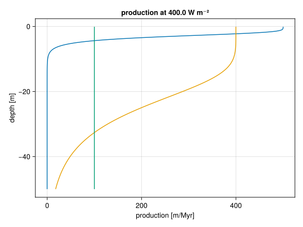

## Wheeler diagram


``` {.julia .task file=examples/visualization/wheeler_diagram.jl}
#| creates: docs/src/_fig/wheeler_diagram.png
#| requires: data/output/alcap-example.h5
#| collect: figures

module Script

using CairoMakie
using CarboKitten.Export: read_slice
using CarboKitten.Visualization: wheeler_diagram

function main()
  header, data = read_slice("data/output/alcap-example.h5", :profile)
  fig = wheeler_diagram(header, data)
  save("docs/src/_fig/wheeler_diagram.png", fig)
end

end

Script.main()
```

``` {.julia file=ext/WheelerDiagram.jl}
module WheelerDiagram

import CarboKitten.Visualization: wheeler_diagram, wheeler_diagram!
using CarboKitten.Export: Header, Data, DataSlice, read_data, read_slice
using CarboKitten.Utility: in_units_of
using Makie
using Unitful
using CarboKitten.BoundaryTrait
using CarboKitten.Stencil: convolution


const na = [CartesianIndex()]

elevation(h::Header, d::DataSlice) =
    let bl = h.initial_topography[d.slice..., na],
        sr = h.axes.t[end] * h.subsidence_rate

        bl .+ d.sediment_thickness .- sr
    end

water_depth(header::Header, data::DataSlice) =
    let h = elevation(header, data),
        wi = data.write_interval,
        s = header.subsidence_rate .* (header.axes.t[1:wi:end] .- header.axes.t[end]),
        l = header.sea_level[1:wi:end]

        h .- (s.+l)[na, :]
    end

const Rate = typeof(1.0u"m/Myr")

function sediment_accumulation!(ax::Axis, header::Header, data::DataSlice;
    smooth_size::NTuple{2,Int}=(3, 11),
    colormap=Reverse(:curl),
    range::NTuple{2,Rate}=(-100.0u"m/Myr", 100.0u"m/Myr"))
    wi = data.write_interval
    magnitude = sum(data.deposition .- data.disintegration; dims=1)[1, :, :] ./ (header.Δt * wi)
    blur = convolution(Shelf, ones(Float64, smooth_size...) ./ *(smooth_size...))
    wd = zeros(Float64, length(header.axes.x), length(header.axes.t[1:wi:end]))
    blur(water_depth(header, data) / u"m", wd)
    mag = zeros(Float64, length(header.axes.x), length(header.axes.t[1:wi:end]) - 1)
    blur(magnitude / u"m/Myr", mag)

    ax.ylabel = "time [Myr]"
    ax.xlabel = "position [km]"
    xkm = header.axes.x |> in_units_of(u"km")
    tmyr = header.axes.t[1:wi:end] |> in_units_of(u"Myr")

    sa = heatmap!(ax, xkm, tmyr, mag;
        colormap=colormap, colorrange=range ./ u"m/Myr")
    #contour!(ax, xkm, tmyr, wd;
    #    levels=[0], color=:red, linewidth=2, linestyle=:dash)
    return sa
end

function dominant_facies!(ax::Axis, header::Header, data::DataSlice;
    smooth_size::NTuple{2,Int}=(3, 11),
    colors=Makie.wong_colors())
    n_facies = size(data.production)[1]
    colormax(d) = getindex.(argmax(d; dims=1)[1, :, :], 1)

    wi = data.write_interval
    dominant_facies = colormax(data.deposition)
    blur = convolution(Shelf, ones(Float64, smooth_size...) ./ *(smooth_size...))
    wd = zeros(Float64, length(header.axes.x), length(header.axes.t[1:wi:end]))
    blur(water_depth(header, data) / u"m", wd)

    ax.ylabel = "time [Myr]"
    ax.xlabel = "position [km]"

    xkm = header.axes.x |> in_units_of(u"km")
    tmyr = header.axes.t[1:wi:end] |> in_units_of(u"Myr")
    ft = heatmap!(ax, xkm, tmyr, dominant_facies;
        colormap=cgrad(colors[1:n_facies], n_facies, categorical=true),
        colorrange=(0.5, n_facies + 0.5))
    contourf!(ax, xkm, tmyr, wd;
        levels=[0.0, 10000.0], colormap=Reverse(:grays))
    #contour!(ax, xkm, tmyr, wd;
    #    levels=[0], color=:black, linewidth=2)
    return ft
end

function wheeler_diagram!(ax1::Axis, ax2::Axis, header::Header, data::DataSlice;
    smooth_size::NTuple{2,Int}=(3, 11),
    range::NTuple{2,Rate}=(-100.0u"m/Myr", 100.0u"m/Myr"))

    linkyaxes!(ax1, ax2)
    sa = sediment_accumulation!(ax1, header, data; smooth_size=smooth_size, range=range)
    ft = dominant_facies!(ax2, header, data; smooth_size=smooth_size)
    ax2.ylabel = ""

    return sa, ft
end

function wheeler_diagram(header::Header, data::DataSlice;
    smooth_size::NTuple{2,Int}=(3, 11),
    range::NTuple{2,Rate}=(-100.0u"m/Myr", 100.0u"m/Myr"))

    fig = Figure(size=(1000, 600))
    ax1 = Axis(fig[2, 1])
    ax2 = Axis(fig[2, 2])

    sa, ft = wheeler_diagram!(ax1, ax2, header, data; smooth_size=smooth_size, range=range)

    Colorbar(fig[1, 1], sa; vertical=false, label="sediment accumulation [m/Myr]")
    Colorbar(fig[1, 2], ft; vertical=false, ticks=1:3, label="dominant facies")
    fig
end

end
```

## Production curve



``` {.julia .task file=examples/visualization/production_curve.jl}
#| creates: docs/src/_fig/production_curve.svg
#| requires: data/output/alcap-example.h5
#| collect: figures

using CairoMakie
using CarboKitten.Visualization: production_curve

save("docs/src/_fig/production_curve.svg", production_curve("data/output/alcap-example.h5"))
```

``` {.julia file=ext/ProductionCurve.jl}
module ProductionCurve

using Makie
using Unitful
using HDF5

import CarboKitten.Components.Common: AbstractInput
import CarboKitten.Visualization: production_curve!, production_curve
using CarboKitten.Components.Production: Facies, production_rate

function production_curve!(ax, input::I) where I <: AbstractInput
    ax.title = "production at $(sprint(show, input.insolation; context=:fancy_exponent=>true))"
    ax.xlabel = "production [m/Myr]"
    ax.ylabel = "depth [m]"
    ax.yreversed = true

    for f in input.facies
        depth = (0.1:0.1:50.0)u"m"
        prod = [production_rate(input.insolation, f, d) for d in depth]
        lines!(ax, prod / u"m/Myr", depth / u"m")
    end
end

function production_curve(input::I) where I <: AbstractInput
    fig = Figure()
    ax = Axis(fig[1, 1])
    production_curve!(ax, input)
    fig
end

function production_curve(filename::AbstractString)
    h5open(filename, "r") do fid
        fig = Figure()
        ax = Axis(fig[1, 1])
        production_curve!(ax, fid["input"])
        fig
    end
end

function production_curve!(ax, g::HDF5.Group; max_depth=-50.0u"m")
    a = HDF5.attributes(g)
    insolation = 400.0u"W/m^2"  # a["insolation"][] * u"W/m^2"

    ax.title = "production at $(sprint(show, insolation; context=:fancy_exponent=>true))"
    ax.xlabel = "production [m/Myr]"
    ax.ylabel = "depth [m]"

    for i in 1:a["n_facies"][]
        fa = HDF5.attributes(g["facies$(i)"])
        f = Facies(
            maximum_growth_rate = fa["maximum_growth_rate"][] * u"m/Myr",
            extinction_coefficient = fa["extinction_coefficient"][] * u"m^-1",
            saturation_intensity = fa["saturation_intensity"][] * u"W/m^2")
        depth = (0.1u"m":0.1u"m":-max_depth)
        prod = [production_rate(insolation, f, d) for d in depth]
        lines!(ax, prod / u"m/Myr", - depth / u"m")
    end
end

end
```

## Stratigraphic Column

``` {.julia file=ext/StratigraphicColumn.jl}
module StratigraphicColumn

using Makie
using Unitful

import CarboKitten.Visualization: stratigraphic_column!
using CarboKitten.Export: Header, DataColumn, stratigraphic_column, age_depth_model


function scdata(header::Header, data::DataColumn)
    n_facies = size(data.production)[1]
    n_times = length(header.axes.t) - 1
    sc = zeros(Float64, n_facies, n_times)
    for f = 1:n_facies
        sc[f, :] = stratigraphic_column(header, data, f) / u"m"
    end

    colormax(d) = getindex.(argmax(d; dims=1)[1, :], 1)
    adm = age_depth_model(data.sediment_thickness)

    return (ys_low=adm[1:end-1] / u"m", ys_high=adm[2:end] / u"m", facies=colormax(sc)[1:end])
end


function stratigraphic_column!(ax::Axis, header::Header, data::DataColumn; color=Makie.wong_colors())
    (ys_low, ys_high, facies) = scdata(header, data)
    hspan!(ax, ys_low, ys_high; color=color[facies])
end

function stratigraphic_column!(ax::Axis, header::Header, data::Observable{DataColumn}; color=Makie.wong_colors())
    _scdata = lift(d -> scdata(header, d), data)
    _ys_low = lift(d -> d.ys_low, _scdata)
    _ys_high = lift(d -> d.ys_high, _scdata)
    _color = lift(d -> color[d.facies], _scdata)
    hspan!(ax, _ys_low, _ys_high; color=_color)
end

end
```
