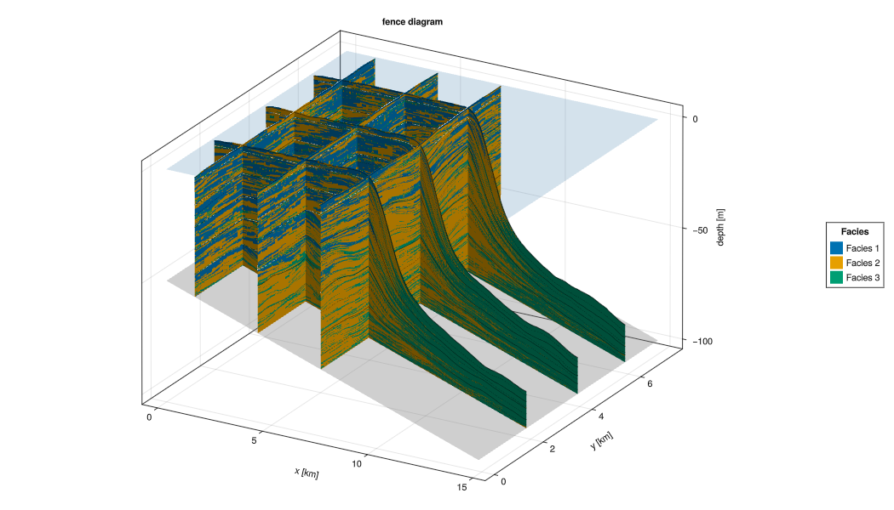
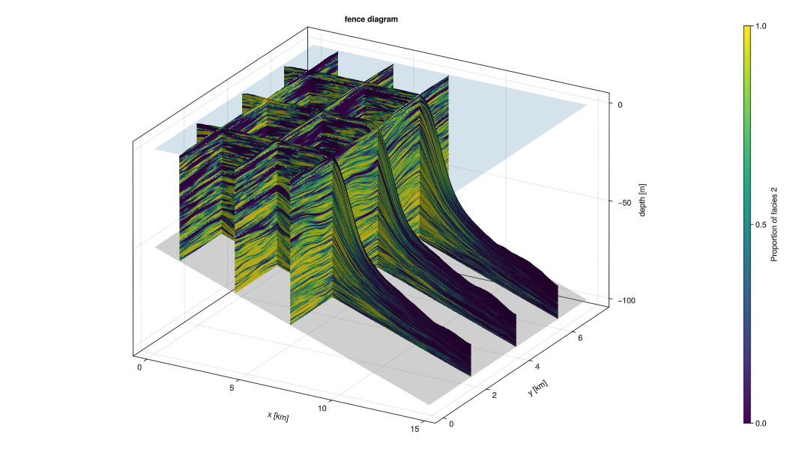

# Fence Diagrams

The fence-diagram style visualization allows users to generate multiple cross-sections through the model domain by defining the number of fences to display, along with their x and y positions. This provides an intuitive way to inspect the 3D stratigraphic architecture and examine both lateral and vertical variations in facies, sediment accumulation, or other stratigraphic properties across the platform.




### Test 

Example 1 reproduces the fence diagram above from `alcap-example.h5`, with categorical colouring for all facies. Each colour corresponds to one facies.

Example 2 reproduces the same fence diagram as example 1, but colours the fences by the proportion of a single selected facies relative to the total sediment in each cell. This makes it easier to visualize the spatial distribution and relative abundance of that facies.

Example 3 plots fence diagrams directly from memory, without creating or reading any temporary output file. Run this example immediately after running the model.

``` {.julia .task file=examples/visualization/fence_diagrams.jl}

module Script
 
using WGLMakie
using Unitful
using CarboKitten
using CarboKitten.Export: read_volume
using CarboKitten.Visualization: fence_diagram, fence_diagram!
 
# -----------------------------------------------------------------------------
# Example 1 — straight from an HDF5 file. Categorical colouring. 
# -----------------------------------------------------------------------------
#| creates: docs/src/_fig/fence_diagram_file_cat.png or docs/src/_fig/fence_diagram_file_inplace_cat.png
#| requires: data/output/alcap-example.h5
#| collect: figures

function from_file()
    fig = fence_diagram(
        "data/output/alcap-example.h5", :topography;
        x_slices = [10, 30, 50],     # grid indices
        y_slices = [2.0u"km", 4.0u"km", 6.0u"km"],       # physical positions work too
        show_unconformities = 10,
        show_coeval_lines   = true,
        show_sealevel       = true,
        color_by = :facies)
    save("docs/src/fig/fence_diagram_file_cat.png", fig)
    return fig
end
 
# Same data, but using the in-place / lower-level form so you can compose with
# other axes in your own figure.
function from_file_inplace()
    header, volume = read_volume("data/output/alcap-example.h5", :topography)
 
    fig = Figure(size = (1400, 900))
    ax  = Axis3(fig[1, 1])
    ax.azimuth   = -π/3
    ax.elevation = π/8
 
    fence_diagram!(ax, header, volume;
        x_slices = [10, 30, 50],
        y_slices = [5.0u"km"],
        show_unconformities = 10,
        show_coeval_lines   = true,
        show_bedrock        = true,
        color_by = :facies)
    save("docs/src/fig/fence_diagram_file_inplace_cat.png", fig)
    return fig
end

# -----------------------------------------------------------------------------
# Example 2 — straight from an HDF5 file. Continuous proportional colouring. 
# -----------------------------------------------------------------------------
 #| creates: docs/src/_fig/fence_diagram_file_fraction.png or docs/src/_fig/fence_diagram_file_inplace_fraction.png
#| requires: data/output/alcap-example.h5
#| collect: figures

function from_file()
    fig = fence_diagram(
        "data/output/alcap-example.h5", :topography;
        x_slices = [10, 30, 50],     # grid indices
        y_slices = [2.0u"km", 4.0u"km", 6.0u"km"],       # physical positions work too
        show_unconformities = 10,
        show_coeval_lines   = true,
        show_sealevel       = true,
        color_by = :facies_fraction,
        facies = 2,
        colormap = :viridis)
    save("docs/src/fig/fence_diagram_file_fraction.png", fig)
    return fig
end
 
# Same data, but using the in-place / lower-level form so you can compose with
# other axes in your own figure.
function from_file_inplace()
    header, volume = read_volume("data/output/alcap-example.h5", :topography)
 
    fig = Figure(size = (1400, 900))
    ax  = Axis3(fig[1, 1])
    ax.azimuth   = -π/3
    ax.elevation = π/8
 
    fence_diagram!(ax, header, volume;
        x_slices = [10, 30, 50],
        y_slices = [5.0u"km"],
        show_unconformities = 10,
        show_coeval_lines   = true,
        show_bedrock        = true,
        color_by = :facies_fraction,
        facies = 2,
        colormap = :viridis)
    save("docs/src/fig/fence_diagram_file_inplace_fraction.png", fig)
    return fig
end
# -----------------------------------------------------------------------------
# Example 2 — from MemoryOutput.
# -----------------------------------------------------------------------------
#| collect: figures

function from_memory(result)
    # `result` : object returned by `run_model(..., MemoryOutput(input))`.
    # Pick whichever volume output was registered in `input.output`.
    header = result.header
    volume = result.data_volumes[:topography]
 
    fig = fence_diagram(header, volume;
        x_slices = [div(header.grid_size[1], 4),
                    div(header.grid_size[1], 2),
                    3 * div(header.grid_size[1], 4)],
        y_slices = [div(header.grid_size[2], 2)],
        show_unconformities = true,
        show_coeval_lines   = true,
        show_bedrock        = true,
        color_by = :facies)
    return fig
end
 
end  # module Script
 
Script.from_file()
```

### Implementation
``` {.julia file="ext/FenceDiagrams.jl"}
module FenceDiagram

import CarboKitten.Visualization: fence_diagram, fence_diagram!

using CarboKitten.Visualization
using CarboKitten.Utility: in_units_of
using CarboKitten.Export: Header, Data, DataSlice, DataVolume, read_volume
using CarboKitten.Algorithms: skeleton
using CarboKitten.Output.Abstract: stratigraphic_column, water_depth

# Re-use the existing mesh helper from SedimentProfile.
# Warning : Both submodules are siblings under VisualizationExt, so a relative import works
# as long as FenceDiagram.jl is `include`d AFTER SedimentProfile.jl.
import ..SedimentProfile: explode_quad_vertices

using Makie
using GeometryBasics
using Unitful

const Rate = typeof(1.0u"m/Myr")
const Amount = typeof(1.0u"m")
const Length = typeof(1.0u"m")
const Time = typeof(1.0u"Myr")

# -----------------------------------------------------------------------------
# Helpers
# -----------------------------------------------------------------------------

# Convert a user-supplied slice position (grid index or physical length) into
# a grid index. This lets callers be either `x_slices=[10, 30]` or
# `x_slices=[5.0u"km", 15.0u"km"]`.
_to_index(axis::AbstractVector, idx::Integer) = Int(idx)
_to_index(axis::AbstractVector{<:Quantity}, pos::Quantity) =
    argmin(abs.(axis .- pos))
    
#Calculates a given facies proportion at each plotted location 
function _facies_fraction(column, facies::Integer)
    total = sum(column)
    iszero(total) && return NaN
    return column[facies] / total
end

# A fence slice must be either (Int, :) (vertical plane perpendicular to x,
# fence extending along y) or (:, Int) (perpendicular to y, fence along x).
# Returns (orientation, position_axis_values, orthogonal_coordinate).
function _slice_geometry(header::Header, data::DataSlice)
    s = data.slice
    if s[1] isa Colon && s[2] isa Integer
        return :along_x, header.axes.x, header.axes.y[s[2]]
    elseif s[1] isa Integer && s[2] isa Colon
        return :along_y, header.axes.y, header.axes.x[s[1]]
    else
        error("fence_diagram: unsupported slice $(s); need (:, Int) or (Int, :)")
    end
end

# Compute the sediment surface heights for every (position, time) cell of a
# slice. Mimics the calculation `profile_plot!` does internally to
# build its mesh, factored out so it can be lifted it into 3D.
function _surface_heights(header::Header, data::DataSlice)
    _, _, n_t = size(data.production)
    total_subsidence = (header.axes.t[end] - header.axes.t[1]) * header.subsidence_rate
    initial_topography = header.initial_topography[data.slice...]
    sc = stratigraphic_column(data)
    sc_clamped = max.(sc, zero(eltype(sc)))
    h = repeat(initial_topography .- total_subsidence, 1, n_t + 1)
    @views h[:, 2:end] .+= cumsum(sum(sc_clamped, dims=1)[1, :, :], dims=2)
    return h
end

# -----------------------------------------------------------------------------
# Single-fence mesh (3D analogue of profile_plot!)
# -----------------------------------------------------------------------------

"""
    fence_plot!(ax::Axis3, header, data::DataSlice; color, mesh_args...)
    fence_plot!(f, ax::Axis3, header, data::DataSlice; mesh_args...)

3D analogue of `profile_plot!`: render the sediment mesh of a single slice
into 3D space at the slice's actual `(x, y)` position. `color` must be an
`(n_pos, n_t)` array (same convention as `profile_plot!`). The `f` variant
generates colours by applying `f` to each `n_facies`-element deposition
column.
"""
function fence_plot!(ax::Axis3, header::Header, data::DataSlice;
                     color::AbstractArray, mesh_args...)
    _, n_pos, n_t = size(data.production)
    orient, pos_axis, fixed_coord = _slice_geometry(header, data)

    pos_km   = pos_axis    |> in_units_of(u"km")
    fixed_km = fixed_coord |> in_units_of(u"km")
    h_m      = _surface_heights(header, data) |> in_units_of(u"m")

    verts = zeros(Float64, n_pos, n_t + 1, 3)
    if orient == :along_x
        @views verts[:, :, 1] .= pos_km
        @views verts[:, :, 2] .= fixed_km
        @views verts[:, :, 3] .= h_m
    else  # :along_y
        @views verts[:, :, 1] .= fixed_km
        @views verts[:, :, 2] .= pos_km
        @views verts[:, :, 3] .= h_m
    end

    v, f = explode_quad_vertices(verts)
    c = reshape(color, n_pos * n_t)
    return mesh!(ax, v, f; color=vcat(c, c), mesh_args...)
end

function fence_plot!(f::F, ax::Axis3, header::Header, data::DataSlice;
                     mesh_args...) where {F}
    color = f.(eachslice(data.deposition, dims=(2, 3)))
    return fence_plot!(ax, header, data; color=color, mesh_args...)
end

# -----------------------------------------------------------------------------
# Decorations (bedrock surface, sea level, unconformities, coeval lines)
# -----------------------------------------------------------------------------

function _plot_bedrock!(ax::Axis3, header::Header, data::DataVolume;
                        alpha::Real=0.35)
    x_km = header.axes.x[data.slice[1]] |> in_units_of(u"km")
    y_km = header.axes.y[data.slice[2]] |> in_units_of(u"km")
    total_subsidence =
        (header.axes.t[end] - header.axes.t[1]) * header.subsidence_rate
    bedrock = (header.initial_topography[data.slice...] .- total_subsidence) |>
        in_units_of(u"m")
    surface!(ax, x_km, y_km, bedrock;
             color=fill(0.5, size(bedrock)),
             colormap=:grays, alpha=alpha, transparency=true,
             colorrange=(0.0, 1.0))
end

function _plot_sealevel!(ax::Axis3, header::Header, data::DataVolume;
                         alpha::Real=0.2)
    x_km = header.axes.x[data.slice[1]] |> in_units_of(u"km")
    y_km = header.axes.y[data.slice[2]] |> in_units_of(u"km")
    sea_level = header.sea_level[end] |> in_units_of(u"m")
    z = fill(sea_level, length(x_km), length(y_km))
    surface!(ax, x_km, y_km, z;
             color=fill(0.7, size(z)),
             colormap=:Blues, alpha=alpha, transparency=true,
             colorrange=(0.0, 1.0))
end

# 3D version of plot_unconformities from SedimentProfile.jl
function _plot_fence_unconformities!(ax::Axis3, header::Header, data::DataSlice,
                                     h_m::AbstractMatrix;
                                     minwidth::Int, kwargs...)
    orient, pos_axis, fixed_coord = _slice_geometry(header, data)
    pos_km   = pos_axis    |> in_units_of(u"km")
    fixed_km = fixed_coord |> in_units_of(u"km")

    hiatus = skeleton(water_depth(header, data) .< 0.0u"m"; minwidth=minwidth)
    isempty(hiatus[1]) && return

    verts = if orient == :along_x
        [Point3f(pos_km[pt[1]], fixed_km, h_m[pt...]) for pt in hiatus[1]]
    else
        [Point3f(fixed_km, pos_km[pt[1]], h_m[pt...]) for pt in hiatus[1]]
    end
    linesegments!(ax, vec(permutedims(verts[hiatus[2]])); kwargs...)
end

# 3D version of coeval_lines! from SedimentProfile.jl
function _plot_fence_coeval_lines!(ax::Axis3, header::Header, data::DataSlice,
                                   h_m::AbstractMatrix, tics::Vector{Int};
                                   kwargs...)
    orient, pos_axis, fixed_coord = _slice_geometry(header, data)
    pos_km   = pos_axis    |> in_units_of(u"km")
    fixed_km = fixed_coord |> in_units_of(u"km")
    n_pos = size(h_m, 1)

    for t in tics
        t = clamp(t, 1, size(h_m, 2))
        if orient == :along_x
            lines!(ax, pos_km, fill(fixed_km, n_pos), h_m[:, t]; kwargs...)
        else
            lines!(ax, fill(fixed_km, n_pos), pos_km, h_m[:, t]; kwargs...)
        end
    end
end

# Dispatch helpers so the `show_unconformities` / `show_coeval_lines` kwargs
# accept the same range of types as the equivalents on `sediment_profile!`.
_apply_unconformities!(::Axis3, ::Header, ::DataSlice, _, ::Nothing) = nothing
_apply_unconformities!(ax::Axis3, header::Header, data::DataSlice, h_m, flag::Bool) =
    flag && _plot_fence_unconformities!(ax, header, data, h_m;
        minwidth=10, color=:white, linestyle=:dash, linewidth=1)
_apply_unconformities!(ax::Axis3, header::Header, data::DataSlice, h_m, minwidth::Int) =
    _plot_fence_unconformities!(ax, header, data, h_m;
        minwidth=minwidth, color=:white, linestyle=:dash, linewidth=1)

function _apply_coeval_lines!(ax::Axis3, header::Header, data::DataSlice, h_m,
                              n_tics::Tuple{Int,Int})
    n_steps = div(header.time_steps, data.write_interval)
    n_major, n_minor = n_tics
    major_tics = collect(div.(n_steps:n_steps:n_steps*n_major, n_major) .+ 1)
    minor_tics = filter(t -> !(t in major_tics),
                        collect(div.(n_steps:n_steps:n_steps*n_minor, n_minor) .+ 1))
    _plot_fence_coeval_lines!(ax, header, data, h_m, minor_tics;
        color=:black, linewidth=0.6, linestyle=:dot)
    _plot_fence_coeval_lines!(ax, header, data, h_m, major_tics;
        color=:black, linewidth=0.8, linestyle=:solid)
end
_apply_coeval_lines!(ax::Axis3, header::Header, data::DataSlice, h_m, flag::Bool) =
    flag && _apply_coeval_lines!(ax, header, data, h_m, (4, 8))
_apply_coeval_lines!(ax::Axis3, header::Header, data::DataSlice, h_m,
                     tics::Vector{Int}) =
    _plot_fence_coeval_lines!(ax, header, data, h_m, tics;
        color=:black, linewidth=0.8, linestyle=:solid)
function _apply_coeval_lines!(ax::Axis3, header::Header, data::DataSlice, h_m,
                              tics::Vector{<:Time})
    t_axis = header.axes.t[1:data.write_interval:end]
    idx = Int[searchsortedfirst(t_axis, ti) for ti in tics]
    _plot_fence_coeval_lines!(ax, header, data, h_m, idx;
        color=:black, linewidth=0.8, linestyle=:solid)
end

# -----------------------------------------------------------------------------
# Main entry points
# -----------------------------------------------------------------------------

"""
    fence_diagram!(ax::Axis3, header::Header, data::DataVolume;
                   x_slices=[], y_slices=[], ...)

Plot a fence diagram into the given `Axis3`. Each entry of `x_slices`
specifies a vertical fence perpendicular to the x-axis (i.e. the fence
extends in the y direction); each entry of `y_slices` is a fence
perpendicular to the y-axis. Entries may be given either as grid indices
(`Int`) or as physical positions (a `Unitful.Quantity` of length, e.g.
`5.0u"km"`), and at least one slice must be provided.

Keyword arguments mirror those of `sediment_profile!` where applicable:

- `show_unconformities::Union{Nothing,Bool,Int}=true` — draw dashed white
  unconformity lines on each fence (`false`/`nothing` disables, an `Int`
  gives the `minwidth` threshold).
- `show_coeval_lines::Union{Bool,Vector{Int},Vector{Time}}=false` — draw
  time-correlation lines on each fence. `true` uses the same defaults as
  `sediment_profile!`; a vector specifies either time indices or `Myr`
  times.
- `show_bedrock::Bool=true` — overlay the (subsided) initial topography
  as a translucent gray surface.
- `show_sealevel::Bool=false` — overlay the final sea-level plane.
- `color_by::Symbol=:facies` — controls how each fence cell is coloured.
  Use `:facies` to colour by the dominant facies, or `:facies_fraction`
  to colour by the proportion of one selected facies.
- `facies::Union{Nothing,Integer}=nothing` — facies index used when
  `color_by = :facies_fraction`.
- `colormap`, `alpha`, and any other keyword arguments are forwarded to
  the per-fence `mesh!` call (default colormap is a discrete Wong palette
  matching `sediment_profile!`).
"""
function fence_diagram!(ax::Axis3, header::Header, data::DataVolume;
                        x_slices::AbstractVector=Int[],
                        y_slices::AbstractVector=Int[],
                        show_unconformities::Union{Nothing,Bool,Int}=true,
                        show_coeval_lines::Union{Bool,Tuple{Int,Int},Vector{Int},Vector{<:Time}}=false,
                        show_bedrock::Bool=true,
                        show_sealevel::Bool=false,
                        color_by::Symbol=:facies,
                        facies::Union{Nothing,Integer}=nothing,
                        colormap=nothing,
                        alpha::Real=1.0,
                        mesh_args...)
    n_facies = size(data.production, 1)

    if isempty(x_slices) && isempty(y_slices)
        error("fence_diagram!: specify at least one slice via `x_slices` or `y_slices`.")
    end

   if color_by == :facies
       color_function = argmax
       cmap = colormap === nothing ?
           cgrad(Makie.wong_colors()[1:n_facies], n_facies, categorical=true) :
           colormap
       colorrange = (1, n_facies)
   
   elseif color_by == :facies_fraction
       facies === nothing &&
           error("fence_diagram!: `facies` must be specified when `color_by = :facies_fraction`.")
   
       facies_idx = Int(facies)
   
       if facies_idx < 1 || facies_idx > n_facies
           error("fence_diagram!: `facies` must be between 1 and $(n_facies).")
       end
   
       color_function = column -> _facies_fraction(column, facies_idx)
       cmap = colormap === nothing ? :viridis : colormap
       colorrange = (0.0, 1.0)
   
   else
       error("fence_diagram!: `color_by` must be either :facies or :facies_fraction.")
   end

    x_idx = Int[_to_index(header.axes.x, p) for p in x_slices]
    y_idx = Int[_to_index(header.axes.y, p) for p in y_slices]

    # Draw context surfaces first so the fence meshes overlay them.
    show_bedrock  && _plot_bedrock!(ax, header, data)
    show_sealevel && _plot_sealevel!(ax, header, data)

    plot_ref = nothing
    slices_to_draw = Iterators.flatten((
        ((:x, i) for i in x_idx),
        ((:y, j) for j in y_idx),
    ))

    for (kind, idx) in slices_to_draw
        slice = kind == :x ? data[idx, :] : data[:, idx]

        p = fence_plot!(color_function, ax, header, slice;
                        colormap=cmap, colorrange=colorrange,
                        alpha=alpha, mesh_args...)
        plot_ref = something(plot_ref, p)

        # Decoration helpers are no-ops when their setting is disabled.
        h_m = _surface_heights(header, slice) |> in_units_of(u"m")
        _apply_coeval_lines!(ax, header, slice, h_m, show_coeval_lines)
        _apply_unconformities!(ax, header, slice, h_m, show_unconformities)
    end

    ax.xlabel = "x [km]"
    ax.ylabel = "y [km]"
    ax.zlabel = "depth [m]"
    ax.title  = "fence diagram"

    return plot_ref
end

"""
    fence_diagram(header::Header, data::DataVolume; kwargs...)
    fence_diagram(filename::AbstractString, group; kwargs...)

Convenience wrapper that builds a figure with a single `Axis3` and plots
a fence diagram into it. The first form works with data already in memory
(e.g. a `DataVolume` from `MemoryOutput`); the second reads the given
volume group from an HDF5 file produced by CarboKitten and then plots.

All keyword arguments are forwarded to `fence_diagram!`. Additionally,
`size=(w, h)` controls the figure size and `azimuth`, `elevation` set the
default camera angles.
"""
function fence_diagram(header::Header, data::DataVolume;
                       size::Tuple{Int,Int}=(1400, 800),
                       azimuth::Real=-π/3,
                       elevation::Real=π/8,
                       color_by::Symbol=:facies,
                       facies::Union{Nothing,Integer}=nothing,
                       colormap=nothing,
                       kwargs...)
    n_facies = Base.size(data.production, 1)

    fig = Figure(size=size)
    ax  = Axis3(fig[1, 1])
    ax.azimuth   = azimuth
    ax.elevation = elevation

    fence_diagram!(ax, header, data;
        color_by=color_by,
        facies=facies,
        colormap=colormap,
        kwargs...)

    if color_by == :facies
        colors = Makie.wong_colors()[1:n_facies]
        elements = [PolyElement(color=colors[i]) for i in 1:n_facies]
        labels = ["Facies $(i)" for i in 1:n_facies]
        Legend(fig[1, 2], elements, labels, "Facies")
    elseif color_by == :facies_fraction
        Colorbar(fig[1, 2];
            colormap=colormap === nothing ? :viridis : colormap,
            limits=(0, 1),
            label="Proportion of facies $(facies)")
    end

    return fig
end

function fence_diagram(filename::AbstractString,
                       group::Union{Symbol,AbstractString};
                       kwargs...)
    header, data = read_volume(filename, group)
    return fence_diagram(header, data; kwargs...)
end

end  # module

```
