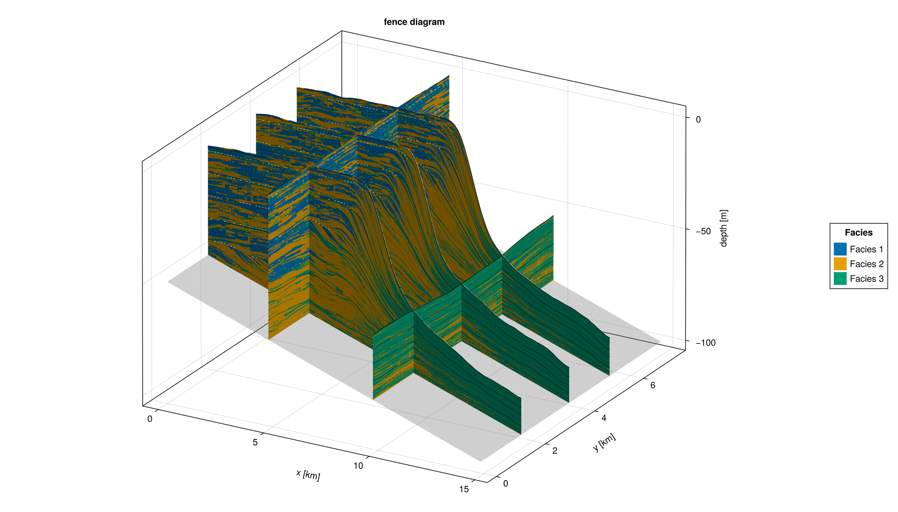

# Fence Diagrams

The fence-diagram visualization generates multiple cross-sections through the
model domain by specifying x and y slice positions. This provides an intuitive
way to inspect 3D stratigraphic architecture and examine lateral and vertical
variations in facies across the platform.


### Examples

Example 1 reproduces the fence diagram above from `alcap-example.h5` with
categorical colouring. Each colour corresponds to one facies.

Example 2 reproduces the same diagram but colours fences by the proportion of
a single selected facies, making it easier to visualise its spatial distribution
and relative abundance.

Example 3 demonstrates the **sequence form** of `fence_diagram!`. Instead of
passing a full `DataVolume`, an iterable of pre-selected `DataSlice` objects is
passed directly. This form is useful for combining slices from multiple HDF5
files, plotting all profiles saved to a `MemoryOutput`, or selecting arbitrary
subsets without loading the full volume.

Example 4 shows the **all-slices HDF5 form**: `fence_diagram(filename)` reads
every `DataSlice` group in the file and plots them all without any manual group
listing. A matching `fence_diagram(output::MemoryOutput)` form works the same
way for in-memory results.

``` {.julia .task file=examples/visualization/fence_diagrams.jl}
#| creates: docs/src/fig/fence_diagram_file_cat.png
#|          docs/src/fig/fence_diagram_file_fraction.png
#|          docs/src/fig/fence_diagram_slice_sequence.png
#| requires: data/output/alcap-example.h5
#| collect: figures

module Script

using Makie
using Unitful
using CarboKitten
using CarboKitten.Export: read_volume, read_slice
using CarboKitten.Visualization: fence_diagram, fence_diagram!

# -- Example 1: categorical colouring from HDF5 file -------------------------

function from_file_categorical()
    fig = fence_diagram(
        "data/output/alcap-example.h5", :topography;
        x_slices            = [10, 30, 50],
        y_slices            = [2.0u"km", 4.0u"km", 6.0u"km"],
        show_unconformities = 10,
        show_coeval_lines   = true,
        show_sealevel       = true,
        color_by            = :facies)
    save("docs/src/fig/fence_diagram_file_cat.png", fig)
end

# -- Example 2: proportional colouring from HDF5 file -------------------------

function from_file_fraction()
    fig = fence_diagram(
        "data/output/alcap-example.h5", :topography;
        x_slices            = [10, 30, 50],
        y_slices            = [2.0u"km", 4.0u"km", 6.0u"km"],
        show_unconformities = 10,
        show_coeval_lines   = true,
        show_sealevel       = true,
        color_by            = :facies_fraction,
        facies              = 2,
        colormap            = :viridis)
    save("docs/src/fig/fence_diagram_file_fraction.png", fig)
end

# -- Example 3: sequence of DataSlice -----------------------------------------
# Build the slice collection explicitly — any iterable works, including
# results from MemoryOutput or slices read from different files.

function from_slice_sequence()
    header, vol = read_volume("data/output/alcap-example.h5", :topography)
    nx, ny = header.grid_size

    # Pick three dip sections and two strike sections
    slices = [
        vol[:, div(ny, 4)],
        vol[:, div(ny, 2)],
        vol[:, 3 * div(ny, 4)],
        vol[div(nx, 3), :],
        vol[2 * div(nx, 3), :],
    ]

    fig = fence_diagram(header, slices;
        color_by = :facies,
        show_unconformities = true,
        show_coeval_lines   = true)
    save("docs/src/fig/fence_diagram_slice_sequence.png", fig)
end

# -- Example 4: all slices from HDF5 file ------------------------------------

function from_all_slices()
    fig = fence_diagram("data/output/alcap-example.h5";
        color_by = :facies)
    save("docs/src/fig/fence_diagram_all_slices.png", fig)
end

function main()
    from_file_categorical()
    from_file_fraction()
    from_slice_sequence()
    from_all_slices()
end

end

Script.main()
```



### Implementation

The implementation is split into three layers:

1. **`fence_plot!`** — renders a single `DataSlice` as a 3D mesh panel.
   Re-uses `explode_quad_vertices` from `SedimentProfile` and delegates height
   computation to `surface_heights` (defined in `Output.Abstract`).

2. **`fence_diagram!(ax, header, slices)`** — core sequence method. Iterates
   over any collection of `DataSlice` objects. Bedrock and sea-level surfaces
   are produced from `header` alone and are available here — no `DataVolume`
   required.

3. **`fence_diagram!(ax, header, data::DataVolume)`** — convenience method.
   Converts `x_slices`/`y_slices` arguments into `DataSlice` objects,
   adds bedrock and sea-level context surfaces, then delegates to the core
   sequence method.

#### `surface_heights`

The height array for a slice (shape `(n_pos, n_t+1)`) used to be computed
inside `FenceDiagrams.jl`. It now lives in `Output.Abstract` as
`surface_heights(header, data::Data{F,D})` and works generically for
`DataColumn`, `DataSlice`, and `DataVolume`. It is also available to
`SedimentProfile.jl` and any future visualization that needs the same quantity.

``` {.julia file=ext/FenceDiagrams.jl}
module FenceDiagram

import CarboKitten.Visualization: fence_diagram, fence_diagram!

using CarboKitten.Visualization
using CarboKitten.Utility: in_units_of
using CarboKitten.Export: Header, Data, DataSlice, DataVolume, read_volume,
    read_data, group_datasets, read_header
using CarboKitten.Output.MemoryWriter: MemoryOutput
using CarboKitten.Algorithms: skeleton
using CarboKitten.Output.Abstract: stratigraphic_column, water_depth, surface_heights

import ..SedimentProfile: explode_quad_vertices

using Makie
using GeometryBasics
using Unitful
using HDF5

const Rate   = typeof(1.0u"m/Myr")
const Amount = typeof(1.0u"m")
const Length = typeof(1.0u"m")
const Time   = typeof(1.0u"Myr")

_to_index(axis::AbstractVector, idx::Integer) = Int(idx)
_to_index(axis::AbstractVector{<:Quantity}, pos::Quantity) =
    argmin(abs.(axis .- pos))

function _facies_fraction(column, facies::Integer)
    total = sum(column)
    iszero(total) && return NaN
    return column[facies] / total
end

function _slice_geometry(header::Header, data::DataSlice)
    s = data.slice
    if s[1] isa Colon && s[2] isa Integer
        return :along_x, header.axes.x, header.axes.y[s[2]]
    elseif s[1] isa Integer && s[2] isa Colon
        return :along_y, header.axes.y, header.axes.x[s[1]]
    else
        error("fence_diagram: unsupported slice $(s); need (:, Int) or (Int, :)")
    end
end

function fence_plot!(ax::Axis3, header::Header, data::DataSlice;
                     color::AbstractArray, mesh_args...)
    _, n_pos, n_t = size(data.production)
    orient, pos_axis, fixed_coord = _slice_geometry(header, data)

    pos_km   = pos_axis    |> in_units_of(u"km")
    fixed_km = fixed_coord |> in_units_of(u"km")
    h_m      = surface_heights(header, data) |> in_units_of(u"m")

    verts = zeros(Float64, n_pos, n_t + 1, 3)
    if orient === :along_x
        @views verts[:, :, 1] .= pos_km
        @views verts[:, :, 2] .= fixed_km
        @views verts[:, :, 3] .= h_m
    else
        @views verts[:, :, 1] .= fixed_km
        @views verts[:, :, 2] .= pos_km
        @views verts[:, :, 3] .= h_m
    end

    v, f = explode_quad_vertices(verts)
    c = reshape(color, n_pos * n_t)
    return mesh!(ax, v, f; color=vcat(c, c), mesh_args...)
end

function fence_plot!(f::F, ax::Axis3, header::Header, data::DataSlice;
                     mesh_args...) where {F}
    color = f.(eachslice(data.deposition, dims=(2, 3)))
    return fence_plot!(ax, header, data; color=color, mesh_args...)
end

# Bedrock and sea-level only need the Header — initial_topography, subsidence_rate,
# sea_level and axes are all stored there. No DataVolume required.

function _plot_bedrock!(ax::Axis3, header::Header; alpha::Real=0.35)
    x_km = header.axes.x |> in_units_of(u"km")
    y_km = header.axes.y |> in_units_of(u"km")
    total_subsidence = (header.axes.t[end] - header.axes.t[1]) * header.subsidence_rate
    bedrock = (header.initial_topography .- total_subsidence) |> in_units_of(u"m")
    surface!(ax, x_km, y_km, bedrock;
             color=fill(0.5, size(bedrock)), colormap=:grays,
             alpha=alpha, transparency=true, colorrange=(0.0, 1.0))
end

function _plot_sealevel!(ax::Axis3, header::Header; alpha::Real=0.2)
    x_km = header.axes.x |> in_units_of(u"km")
    y_km = header.axes.y |> in_units_of(u"km")
    sea_level = header.sea_level[end] |> in_units_of(u"m")
    z = fill(sea_level, length(x_km), length(y_km))
    surface!(ax, x_km, y_km, z;
             color=fill(0.7, size(z)), colormap=:Blues,
             alpha=alpha, transparency=true, colorrange=(0.0, 1.0))
end

function _plot_fence_unconformities!(ax::Axis3, header::Header, data::DataSlice,
                                     h_m::AbstractMatrix; minwidth::Int, kwargs...)
    orient, pos_axis, fixed_coord = _slice_geometry(header, data)
    pos_km   = pos_axis    |> in_units_of(u"km")
    fixed_km = fixed_coord |> in_units_of(u"km")
    hiatus = skeleton(water_depth(header, data) .< 0.0u"m"; minwidth=minwidth)
    isempty(hiatus[1]) && return
    verts = if orient === :along_x
        [Point3f(pos_km[pt[1]], fixed_km, h_m[pt...]) for pt in hiatus[1]]
    else
        [Point3f(fixed_km, pos_km[pt[1]], h_m[pt...]) for pt in hiatus[1]]
    end
    linesegments!(ax, vec(permutedims(verts[hiatus[2]])); kwargs...)
end

function _plot_fence_coeval_lines!(ax::Axis3, header::Header, data::DataSlice,
                                   h_m::AbstractMatrix, tics::Vector{Int}; kwargs...)
    orient, pos_axis, fixed_coord = _slice_geometry(header, data)
    pos_km   = pos_axis    |> in_units_of(u"km")
    fixed_km = fixed_coord |> in_units_of(u"km")
    n_pos = size(h_m, 1)
    for t in tics
        t = clamp(t, 1, size(h_m, 2))
        if orient === :along_x
            lines!(ax, pos_km, fill(fixed_km, n_pos), h_m[:, t]; kwargs...)
        else
            lines!(ax, fill(fixed_km, n_pos), pos_km, h_m[:, t]; kwargs...)
        end
    end
end

_apply_unconformities!(::Axis3, ::Header, ::DataSlice, _, ::Nothing) = nothing
_apply_unconformities!(ax::Axis3, h::Header, d::DataSlice, hm, flag::Bool) =
    flag && _plot_fence_unconformities!(ax, h, d, hm;
        minwidth=10, color=:white, linestyle=:dash, linewidth=1)
_apply_unconformities!(ax::Axis3, h::Header, d::DataSlice, hm, minwidth::Int) =
    _plot_fence_unconformities!(ax, h, d, hm;
        minwidth=minwidth, color=:white, linestyle=:dash, linewidth=1)

function _apply_coeval_lines!(ax::Axis3, header::Header, data::DataSlice,
                               h_m, n_tics::Tuple{Int,Int})
    n_steps  = div(header.time_steps, data.write_interval)
    n_major, n_minor = n_tics
    major = collect(div.(n_steps:n_steps:n_steps*n_major, n_major) .+ 1)
    minor = filter(t -> !(t in major),
                   collect(div.(n_steps:n_steps:n_steps*n_minor, n_minor) .+ 1))
    _plot_fence_coeval_lines!(ax, header, data, h_m, minor;
        color=:black, linewidth=0.6, linestyle=:dot)
    _plot_fence_coeval_lines!(ax, header, data, h_m, major;
        color=:black, linewidth=0.8, linestyle=:solid)
end
_apply_coeval_lines!(ax::Axis3, h::Header, d::DataSlice, hm, flag::Bool) =
    flag && _apply_coeval_lines!(ax, h, d, hm, (4, 8))
_apply_coeval_lines!(ax::Axis3, h::Header, d::DataSlice, hm, tics::Vector{Int}) =
    _plot_fence_coeval_lines!(ax, h, d, hm, tics;
        color=:black, linewidth=0.8, linestyle=:solid)
function _apply_coeval_lines!(ax::Axis3, header::Header, data::DataSlice,
                               h_m, tics::Vector{<:Time})
    t_axis = header.axes.t[1:data.write_interval:end]
    idx = Int[searchsortedfirst(t_axis, ti) for ti in tics]
    _plot_fence_coeval_lines!(ax, header, data, h_m, idx;
        color=:black, linewidth=0.8, linestyle=:solid)
end

"""
    fence_diagram!(ax::Axis3, header::Header, slices; kwargs...)

Core fence-diagram renderer. `slices` is any iterable of `DataSlice` objects;
each slice is rendered as a vertical panel at its actual 3D position (inferred
from `data.slice`).

Bedrock and sea-level surfaces are produced from `header` alone — they do not
require a `DataVolume` — so this method produces a complete plot from just a
header and a sequence of slices. This makes it possible to plot slices read
from different HDF5 files, extracted from a `MemoryOutput`, or selected
arbitrarily from a volume.

Keyword arguments:

- `show_unconformities::Union{Nothing,Bool,Int}=true`
- `show_coeval_lines::Union{Bool,Tuple{Int,Int},Vector{Int},Vector{Time}}=false`
- `show_bedrock::Bool=true`
- `show_sealevel::Bool=false`
- `color_by::Symbol=:facies` — `:facies` or `:facies_fraction`
- `facies::Union{Nothing,Integer}=nothing` — required when `color_by=:facies_fraction`
- `colormap`, `alpha` — forwarded to `mesh!`
"""
function fence_diagram!(ax::Axis3, header::Header, slices;
                        show_unconformities::Union{Nothing,Bool,Int}=true,
                        show_coeval_lines::Union{Bool,Tuple{Int,Int},Vector{Int},Vector{<:Time}}=false,
                        show_bedrock::Bool=true,
                        show_sealevel::Bool=false,
                        color_by::Symbol=:facies,
                        facies::Union{Nothing,Integer}=nothing,
                        colormap=nothing,
                        alpha::Real=1.0,
                        mesh_args...)
    show_bedrock  && _plot_bedrock!(ax, header)
    show_sealevel && _plot_sealevel!(ax, header)

    plot_ref = nothing

    color_function, cmap, colorrange = if color_by === :facies
        (argmax, nothing, nothing)
    elseif color_by === :facies_fraction
        facies === nothing &&
            error("fence_diagram!: `facies` must be specified when `color_by=:facies_fraction`.")
        facies_idx = Int(facies)
        (col -> _facies_fraction(col, facies_idx),
         colormap === nothing ? :viridis : colormap,
         (0.0, 1.0))
    else
        error("fence_diagram!: `color_by` must be :facies or :facies_fraction, got :$(color_by)")
    end

    for slice in slices
        n_f = size(slice.production, 1)
        resolved_cmap = if color_by === :facies
            colormap === nothing ?
                cgrad(Makie.wong_colors()[1:n_f], n_f, categorical=true) : colormap
        else
            cmap
        end
        resolved_range = color_by === :facies ? (1, n_f) : colorrange

        p = fence_plot!(color_function, ax, header, slice;
                        colormap=resolved_cmap, colorrange=resolved_range,
                        alpha=alpha, mesh_args...)
        plot_ref = something(plot_ref, p)

        h_m = surface_heights(header, slice) |> in_units_of(u"m")
        _apply_coeval_lines!(ax, header, slice, h_m, show_coeval_lines)
        _apply_unconformities!(ax, header, slice, h_m, show_unconformities)
    end

    ax.xlabel = "x [km]"
    ax.ylabel = "y [km]"
    ax.zlabel = "depth [m]"
    ax.title  = "fence diagram"
    return plot_ref
end

"""
    fence_diagram!(ax::Axis3, header::Header, data::DataVolume; x_slices=[], y_slices=[], kwargs...)

Convenience method: generates `DataSlice` objects from `x_slices` and `y_slices`
and delegates entirely to the sequence method. All kwargs are forwarded.
"""
function fence_diagram!(ax::Axis3, header::Header, data::DataVolume;
                        x_slices::AbstractVector=Int[],
                        y_slices::AbstractVector=Int[],
                        kwargs...)
    isempty(x_slices) && isempty(y_slices) &&
        error("fence_diagram!: specify at least one slice via `x_slices` or `y_slices`.")

    x_idx = Int[_to_index(header.axes.x, p) for p in x_slices]
    y_idx = Int[_to_index(header.axes.y, p) for p in y_slices]

    slices = Iterators.flatten((
        (data[i, :] for i in x_idx),
        (data[:, j] for j in y_idx),
    ))
    return fence_diagram!(ax, header, slices; kwargs...)
end

function fence_diagram(header::Header, data;
                       size::Tuple{Int,Int}=(1400, 800),
                       azimuth::Real=-π/3,
                       elevation::Real=π/8,
                       color_by::Symbol=:facies,
                       facies::Union{Nothing,Integer}=nothing,
                       colormap=nothing,
                       kwargs...)
    n_facies = Base.size(data isa DataVolume ? data.production :
                         first(data).production, 1)

    fig = Figure(size=size)
    ax  = Axis3(fig[1, 1])
    ax.azimuth   = azimuth
    ax.elevation = elevation

    fence_diagram!(ax, header, data;
        color_by=color_by, facies=facies, colormap=colormap, kwargs...)

    if color_by === :facies
        colors   = Makie.wong_colors()[1:n_facies]
        elements = [PolyElement(color=colors[i]) for i in 1:n_facies]
        labels   = ["Facies $(i)" for i in 1:n_facies]
        Legend(fig[1, 2], elements, labels, "Facies")
    elseif color_by === :facies_fraction
        Colorbar(fig[1, 2];
            colormap = colormap === nothing ? :viridis : colormap,
            limits   = (0, 1),
            label    = "Proportion of facies $(facies)")
    end
    return fig
end

function fence_diagram(filename::AbstractString,
                       group::Union{Symbol,AbstractString}; kwargs...)
    header, data = read_volume(filename, group)
    return fence_diagram(header, data; kwargs...)
end

"""
    fence_diagram(filename; kwargs...)

Plot all `DataSlice` groups found in `filename` as a fence diagram.
"""
function fence_diagram(filename::AbstractString; kwargs...)
    HDF5.h5open(filename, "r") do fid
        header = read_header(fid)
        groups = group_datasets(fid)
        isempty(groups[:slice]) &&
            error("fence_diagram: no DataSlice groups found in $(filename)")
        slices = [read_data(Val{2}, fid[g]) for g in groups[:slice]]
        return fence_diagram(header, slices; kwargs...)
    end
end

"""
    fence_diagram(output::MemoryOutput; kwargs...)

Plot all `DataSlice` datasets stored in a `MemoryOutput` as a fence diagram.
"""
function fence_diagram(output::MemoryOutput; kwargs...)
    isempty(output.data_slices) &&
        error("fence_diagram: MemoryOutput contains no DataSlice datasets")
    return fence_diagram(output.header, values(output.data_slices); kwargs...)
end

end  # module
```
