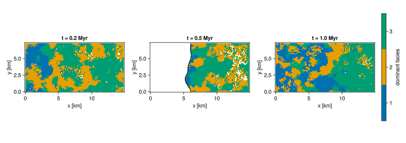
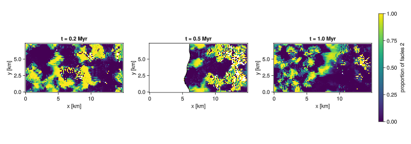

# Map View

The map-view visualization routine allows users to plot model output at selected stratigraphic positions or depths. This makes it possible to inspect 2D facies patterns, sediment distribution, and lateral organization across the platform at different stratigraphic levels.
The user can select the stratigraphic position or depth to visualize, and the routine returns a horizontal map-view of the facies distribution.




### Test

Run Example 1 to reproduce the figure above from the alcap-example.h5 file. 
Example 2 shows how to plot the map views from memory. Run it straight after the model. 

```{.julia .task file=examples/visualization/map_view.jl}
module Script

using WGLMakie
using Unitful
using CarboKitten
using CarboKitten.Export: read_volume
using CarboKitten.Visualization: map_view, map_view!

# -----------------------------------------------------------------------------
# Example 1 —  from an HDF5 file. 
# -----------------------------------------------------------------------------
function from_file()
    fig = map_view(
        "data/output/alcap-example.h5", :topography;
        times = [0.2u"Myr", 0.5u"Myr", 1.0u"Myr"],
        show = :preserved,
        show_shoreline = true,
        layout = :row,
        color_by = :facies,
    )
    save("docs/src/_fig/map_view_file_cat.png", fig)
    return fig
end

function from_file()
    fig = map_view(
        "data/output/alcap-example.h5", :topography;
        times = [0.2u"Myr", 0.5u"Myr", 1.0u"Myr"],
        show = :preserved,
        show_shoreline = true,
        layout = :row,
        color_by = :facies_fraction,
        facies=2,
        colormap= :viridis
    )
    save("docs/src/fig/map_view_file_fraction.png", fig)
    return fig
end

# Same data, in-place form so you can drop a single map into your own figure.
function from_file_inplace()
    header, volume = read_volume("data/output/alcap-example.h5", :topography)

    fig = Figure(size = (900, 700))
    ax  = Axis(fig[1, 1])
    hm  = map_view!(ax, header, volume;
        time = 0.5u"Myr",
        show = :both,
        show_shoreline = true)

    n_facies = size(volume.production, 1)
    Colorbar(fig[1, 2], hm; ticks = 1:n_facies, label = "dominant facies")
    save("docs/src/_fig/map_view_file_inplace.png", fig)
    return fig
end

# -----------------------------------------------------------------------------
# Example 2 — from MemoryOutput. 
# -----------------------------------------------------------------------------
function from_memory(result)
    # `result` is whatever was returned by `run_model(..., MemoryOutput(input))`.
    # Pick the volume key registered in `input.output`.
    header = result.header
    volume = result.data_volumes[:topography]

    # Three evenly-spaced frames through the run, given as integer indices.
    n_frames = length(header.axes.t[1:volume.write_interval:end])
    idx_pick = [div(n_frames, 4), div(n_frames, 2), n_frames]

    fig = map_view(header, volume;
        times = idx_pick,
        show = :preserved,
        layout = :row)
    return fig
end

end  # module Script

Script.from_file()
```

### Implementation
```{.julia file=ext/MapView.jl}
module MapView

import CarboKitten.Visualization: map_view, map_view!
using CarboKitten.Utility: in_units_of
using CarboKitten.Export: Header, Data, DataVolume, read_volume
using CarboKitten.Output.Abstract: stratigraphic_column, water_depth

using Makie
using Unitful

const Time = typeof(1.0u"Myr")

# Pulled verbatim from WheelerDiagram.dominant_facies! — works on
# any array whose first axis is facies. For a DataVolume snapshot the input is
# (n_facies, n_x, n_y) and the output is (n_x, n_y) Int.
_colormax(d::AbstractArray) = getindex.(argmax(d; dims=1)[1, :, :], 1)

#Calculate a given facies' proportion relative to the others in a specific location.
function _facies_fraction(d::AbstractArray, facies::Integer)
    total = dropdims(sum(d; dims = 1); dims = 1)
    selected = d[facies, :, :]

    fraction = Matrix{Union{Missing,Float64}}(undef, Base.size(total))

    for I in eachindex(total)
        if iszero(total[I])
            fraction[I] = missing
        else
            fraction[I] = Float64(ustrip(selected[I] / total[I]))
        end
    end

    return fraction
end

# Resolve a stratigraphic position into an index along the (write-interval
# corrected) time axis. Integer indices are passed through; Unitful time
# quantities are matched by nearest neighbour.
_to_time_index(t_axis::AbstractVector, idx::Integer) = idx
_to_time_index(t_axis::AbstractVector{<:Quantity}, t::Quantity) =
    argmin(abs.(t_axis .- t))

"""
    map_view!(ax, header, data;
              time             = end,
              show             = :preserved,
              colors           = Makie.wong_colors(),
              mask_emerged     = true,
              show_shoreline   = false,
              shoreline_kwargs = (color = :black, linewidth = 1.5),
              kwargs...)

Plot a single map view of the platform onto `ax`, colored by dominant facies at
the chosen stratigraphic position.

# Arguments
- `ax::Makie.Axis` — target axis.
- `header::Header` — simulation metadata.
- `data::DataVolume` — volume output (3-D dataset in x, y, t).

# Keyword arguments
- `time` — stratigraphic position. Either an integer write-frame index (1-based;
  defaults to the final frame) or a `Unitful.Quantity` time value such as
  `0.5u"Myr"`, in which case the nearest available frame is used.
- `show::Symbol` — `:model` shows what is being deposited in the chosen frame;
  `:preserved` (default) shows what is preserved in the stratigraphic column for
  that frame; `:both` overlays a translucent `:model` layer underneath the
  `:preserved` one. Same semantics as `WheelerDiagram.dominant_facies!`.
- `colors` — vector of facies colors, defaults to `Makie.wong_colors()`.
- `mask_emerged::Bool` — if `true` (default), cells that are emerged at the
  chosen frame (water_depth > 0 in CarboKitten's convention, i.e. elevation
  above sea level) are masked white.
- `show_shoreline::Bool` — if `true`, overlays a contour of the sea-level
  intersection (water_depth = 0) at the chosen frame.
- `shoreline_kwargs` — named tuple forwarded to `contour!` for the shoreline.
- `kwargs...` — forwarded to `heatmap!`.

# Returns
The `Heatmap` object (use it for attaching a `Colorbar`).
"""
function map_view!(ax::Makie.Axis, header::Header, data::DataVolume;
                   time::Union{Integer,Quantity} = length(header.axes.t[1:data.write_interval:end]),
                   show::Symbol = :preserved,
                   color_by::Symbol = :facies,
                   facies::Union{Nothing,Integer} = nothing,
                   colors = Makie.wong_colors(),
                   colormap = nothing,
                   mask_emerged::Bool = true,
                   show_shoreline::Bool = false,
                   shoreline_kwargs = (color = :black, linewidth = 1.5),
                   kwargs...)

    if show ∉ (:model, :preserved, :both)
        error("`show` must be one of :model, :preserved, :both — got $(show)")
    end

    prec = 1e-8u"m"  # below this we treat accumulation as zero (mirrors WheelerDiagram)
    n_facies = size(data.production, 1)
    wi = data.write_interval
    t_axis = header.axes.t[1:wi:end]
    t_idx = _to_time_index(t_axis, time)

    if t_idx < 1 || t_idx > length(t_axis)
        error("resolved time index $(t_idx) is out of range 1:$(length(t_axis))")
    end

    xkm = header.axes.x |> in_units_of(u"km")
    ykm = header.axes.y |> in_units_of(u"km")

    if color_by == :facies
        cmap = colormap === nothing ?
            cgrad(colors[1:n_facies], n_facies, categorical = true) :
            colormap
        colorrange = (0.5, n_facies + 0.5)
    
    elseif color_by == :facies_fraction
        facies === nothing &&
            error("map_view!: `facies` must be specified when `color_by = :facies_fraction`.")
    
        facies_idx = Int(facies)
    
        if facies_idx < 1 || facies_idx > n_facies
            error("map_view!: `facies` must be between 1 and $(n_facies).")
        end
    
        cmap = colormap === nothing ? :viridis : colormap
        colorrange = (0.0, 1.0)
    
    else
        error("map_view!: `color_by` must be either :facies or :facies_fraction.")
    end

    # Mask of emerged cells at this frame, computed once and reused for both
    # the model-mode mask and the optional shoreline contour.
    wd = water_depth(header, data)[:, :, t_idx]

    function model_values()
        d = data.deposition[:, :, :, t_idx]
    
        m = if color_by == :facies
            Matrix{Union{Missing,Int}}(_colormax(d))
        else
            _facies_fraction(d, facies_idx)
        end
    
        if mask_emerged
            m[wd .> 0u"m"] .= missing
        end
    
        return m
    end
    
    function preserved_values()
        sc_full = stratigraphic_column(data)
        sc = sc_full[:, :, :, t_idx]
    
        m = if color_by == :facies
            Matrix{Union{Missing,Int}}(_colormax(sc))
        else
            _facies_fraction(sc, facies_idx)
        end
    
        acc = dropdims(sum(sc; dims = 1); dims = 1)
        m[acc .< prec] .= missing
    
        return m
    end

    # Merge defaults with user kwargs so caller's keys cleanly override ours
    base   = (colormap = cmap, colorrange = colorrange, nan_color = :white)
    user   = (; kwargs...)
    hm_kw  = merge(base, user)

    hm = if show == :model
        heatmap!(ax, xkm, ykm, model_values(); hm_kw...)
    elseif show == :preserved
        heatmap!(ax, xkm, ykm, preserved_values(); hm_kw...)
    else  # :both — translucent model under preserved
        model_kw = merge((alpha = 0.3,), hm_kw)
        pres_kw  = merge(hm_kw, (nan_color = :transparent,))
        heatmap!(ax, xkm, ykm, model_values();     model_kw...)
        heatmap!(ax, xkm, ykm, preserved_values(); pres_kw...)
    end

    if show_shoreline
        contour!(ax, xkm, ykm, wd |> in_units_of(u"m");
            levels = [0.0], shoreline_kwargs...)
    end

    ax.xlabel = "x [km]"
    ax.ylabel = "y [km]"
    ax.aspect = DataAspect()
    t_myr = t_axis[t_idx] |> in_units_of(u"Myr")
    ax.title  = "t = $(round(t_myr; digits = 3)) Myr"

    return hm
end

"""
    map_view(header, data;
             times     = [end],
             layout    = :auto,
             colorbar  = true,
             size      = nothing,
             kwargs...) -> Makie.Figure

    map_view(filename, group; kwargs...) -> Makie.Figure

Build a figure with one map-view panel per stratigraphic position in `times`.

# Arguments
- `header::Header`, `data::DataVolume` — in-memory data (e.g. from
  `MemoryOutput`).
- *or* `filename::AbstractString`, `group::Union{Symbol,AbstractString}` —
  path to an HDF5 file and the name of the volume dataset inside it. This form
  calls `CarboKitten.Export.read_volume(filename, group)` internally.

# Keyword arguments
- `times` — vector of stratigraphic positions. Each element may be an integer
  write-frame index or a `Unitful.Quantity` time value. Defaults to a single
  panel at the final frame.
- `layout::Symbol` — `:row`, `:col`, or `:auto` (default; chooses a near-square
  grid).
- `colorbar::Bool` — add a shared colorbar for facies (default `true`).
- `size` — Makie figure size tuple; if `nothing`, a size is chosen from the
  layout.
- All other `kwargs` are forwarded to `map_view!`. Notably: `show`,
  `mask_emerged`, `show_shoreline`, `colors`.
"""
function map_view(header::Header, data::DataVolume;
                  times::AbstractVector = [length(header.axes.t[1:data.write_interval:end])],
                  layout::Symbol = :auto,
                  colorbar::Bool = true,
                  size = nothing,
                  color_by::Symbol = :facies,
                  facies::Union{Nothing,Integer} = nothing,
                  colormap = nothing,
                  kwargs...)

    n = length(times)
    if n == 0
        error("`times` must contain at least one stratigraphic position")
    end

    nrows, ncols = if layout == :row
        (1, n)
    elseif layout == :col
        (n, 1)
    elseif layout == :auto
        ncols = ceil(Int, sqrt(n))
        nrows = ceil(Int, n / ncols)
        (nrows, ncols)
    else
        error("`layout` must be :row, :col, or :auto — got $(layout)")
    end

    fig_size = something(size, (320 * ncols + (colorbar ? 120 : 40), 320 * nrows + 60))
    fig = Figure(size = fig_size)

    hm_ref = nothing
    for (i, t) in enumerate(times)
        r = div(i - 1, ncols) + 1
        c = mod(i - 1, ncols) + 1
        ax = Axis(fig[r, c])
        hm = map_view!(ax, header, data;
            time = t,
            color_by = color_by,
            facies = facies,
            colormap = colormap,
            kwargs...)
        hm_ref = something(hm_ref, hm)
    end

    if colorbar && hm_ref !== nothing
        if color_by == :facies
            n_facies = Base.size(data.production, 1)
            Colorbar(fig[1:nrows, ncols + 1], hm_ref;
                     ticks = 1:n_facies,
                     label = "dominant facies")
        elseif color_by == :facies_fraction
            Colorbar(fig[1:nrows, ncols + 1], hm_ref;
                     ticks = 0:0.25:1,
                     label = "proportion of facies $(facies)")
        end
    end

    return fig
end

function map_view(filename::AbstractString,
                  group::Union{Symbol,AbstractString};
                  kwargs...)
    header, data = read_volume(filename, group)
    return map_view(header, data; kwargs...)
end

end  # module MapView
```
