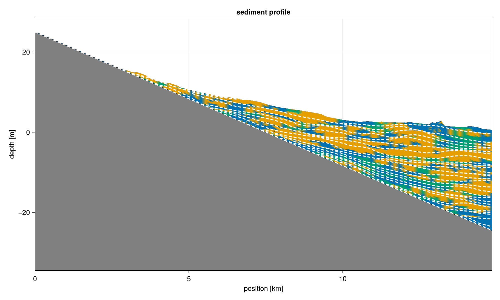
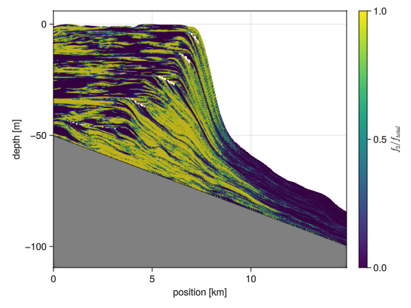

# Profile Plotting



The sediment profile is probably the most important visualization that we provide. By default it allows us to study the sediment composition of a section, by plotting the `argmax` of the deposition. In cases where significant amounts of sediment is eroded, all deposition is plotted, and it is assumed that newest depositions are shown on top of possible older ones.

``` {.julia .task file=examples/visualization/sediment_profile.jl}
#| creates: docs/src/_fig/sediment_profile.png
#| requires: data/output/alcap-example.h5
#| collect: figures

module Script
using CairoMakie
using CarboKitten.Export: read_slice
using CarboKitten.Visualization: sediment_profile

function main()
    save("docs/src/_fig/sediment_profile.png",
        sediment_profile(read_slice("data/output/alcap-example.h5", :profile)...))
end
end

Script.main()
```

If you want to visualize something other than the `argmax` of the deposition, you may use the `profile_plot!` function. For example, we can plot the fraction of second facies over total.



``` {.julia .task file=examples/visualization/profile_fraction.jl}
#| creates: docs/src/_fig/profile_fraction.png
#| requires: data/output/alcap-example.h5
#| collect: figures

module Script
using GLMakie
using CarboKitten.Export: read_slice
using CarboKitten.Visualization: profile_plot!

function main()
    (header, slice) = read_slice("data/output/alcap-example.h5", :profile)
    fig = Figure()
    ax = Axis(fig[1, 1])

    x = header.axes.x
    t = header.axes.t

    plot = profile_plot!(x -> x[2]/sum(x), ax, header, slice; colorrange=(0, 1))
    Colorbar(fig[1, 2], plot; label=L"f_2 / f_{total}")

    save("docs/src/_fig/profile_fraction.png", fig)
    fig
end
end

Script.main()
```

### Implementation

```{.julia file=ext/SedimentProfile.jl}
module SedimentProfile

import CarboKitten.Visualization: sediment_profile, sediment_profile!, profile_plot!, coeval_lines!

using CarboKitten.Visualization
using CarboKitten.Utility: in_units_of
using CarboKitten.Export: Header, Data, DataSlice, read_data, read_slice
using CarboKitten.Skeleton: skeleton

using Makie
using GeometryBasics
using Unitful

using Statistics: mean

const Rate = typeof(1.0u"m/Myr")
const Amount = typeof(1.0u"m")
const Length = typeof(1.0u"m")
const Time = typeof(1.0u"Myr")

const na = [CartesianIndex()]

elevation(h::Header, d::Data) =
    let bl = h.initial_topography[:, :, na],
        sr = (h.axes.t[end]-h.axes.t[1]) * h.subsidence_rate

        bl .+ d.sediment_thickness .- sr
    end

elevation(h::Header, d::DataSlice) =
    let bl = h.initial_topography[d.slice..., na],
        sr = (h.axes.t[end]-h.axes.t[1]) * h.subsidence_rate

        bl .+ d.sediment_thickness .- sr
    end

"""
    explode_quad_vertices(v)

Takes a three dimensional array representing a grid of vertices. This function duplicates these
vertices in the vertical direction, so that an amount of sediment can be given a single color.

Returns a tuple of vertices and faces (triangles), suitable for plotting with Makie's `mesh`
function.
"""
function explode_quad_vertices(v::Array{Float64,3})
    w, h, d = size(v)
    points = zeros(Float64, w, h - 1, 2, d)
    n_vertices = 2 * w * (h - 1)
    n_quads = (w - 1) * (h - 1)
    @views points[:, :, 1, :] = v[1:end, 1:end-1, :]
    @views points[:, :, 2, :] = v[1:end, 2:end, :]
    idx = reshape(1:n_vertices, w, (h - 1), 2)
    vtx1 = reshape(idx[1:end-1, :, 1], n_quads)
    vtx2 = reshape(idx[2:end, :, 1], n_quads)
    vtx3 = reshape(idx[2:end, :, 2], n_quads)
    vtx4 = reshape(idx[1:end-1, :, 2], n_quads)
    return reshape(points, n_vertices, d),
    vcat(hcat(vtx1, vtx2, vtx3), hcat(vtx1, vtx3, vtx4))
end

"""
    plot_unconformities(ax, header, data_slice, minwidth; kwargs...)
    plot_unconformities(ax, header, data_slice, minwidth::Bool; kwargs...)
    plot_unconformities(ax, header, data_slice, minwidth::Int; kwargs...)

Scans the given `data_slice` for unconformities, and plots those using
Makie `linesegments`. The `minwidth` argument controls for how many time
steps the platform needs to be exposed before we plot it. For `minwidth = true`
the default width of 10 time steps is taken.

Additional keyword arguments are forwarded to the `linesegments!` call.
"""
function plot_unconformities(ax::Axis, header::Header, data::DataSlice, minwidth::Nothing; kwargs...)
    @info "Not plotting unconformities, got minwidth: $(minwidth)"
end

function plot_unconformities(ax::Axis, header::Header, data::DataSlice, minwidth::Bool; kwargs...)
    if minwidth
        plot_unconformities(ax, header, data, 10; kwargs...)
    end
end

function plot_unconformities(ax::Axis, header::Header, data::DataSlice, minwidth::Int; kwargs...)
    x = header.axes.x |> in_units_of(u"km")
    wi = data.write_interval
    ξ = elevation(header, data)  # |> in_units_of(u"m")
    water_depth = ξ .- (header.subsidence_rate .* (header.axes.t[1:wi:end] .- header.axes.t[end]) .+ header.sea_level[1:wi:end])[na, :]
    hiatus = skeleton(water_depth .> 0.0u"m", minwidth=minwidth)

    if !isempty(hiatus[1])
        verts = [(x[pt[1]], ξ[pt...] |> in_units_of(u"m")) for pt in hiatus[1]]
        linesegments!(ax, vec(permutedims(verts[hiatus[2]])); kwargs...)
    end
end

"""
    coeval_lines!(ax::Axis, header::Header, data::DataSlice, tics::Bool)

Plot coeval lines using default settings. If `tics` is false, nothing is done.
"""
function coeval_lines!(ax::Axis, header::Header, data::DataSlice, n_tics::Bool)
    if !n_tics
        return
    else
        coeval_lines!(ax, header, data)
    end
end

"""
    coeval_lines!(ax::Axis, header::Header, data::DataSlice, tics::Vector{Time}; kwargs...)

Plot coeval lines for given times. The times in `tics` are looked up in `header.axes.t`
to find which indices to plot.
"""
function coeval_lines!(ax::Axis, header::Header, data::DataSlice, tics::Vector{Time}; kwargs...)
    t = header.axes.t[1:data.write_interval:end]
    indices::Vector{Int} = [searchsortedfirst(t, i) for i in tics]
    coeval_lines!(ax, header, data, indices; kwargs...)
end

"""
    coeval_lines!(ax::Axis, header::Header, data::DataSlice, n_tics::Tuple{Int, Int})

Plot coeval lines on regular intervals given by `n_tics`. The tuple gives the number of intervals
for both minor and major tics, plotted as dotted and solid black lines respectively.
If you need more control over the aestetics of these lines, use the other `coeval_lines!` methods.
"""
function coeval_lines!(ax::Axis, header::Header, data::DataSlice, n_tics::Tuple{Int, Int} = (4, 8))
    n_steps = div(header.time_steps, data.write_interval)
    n_major_tics, n_minor_tics = n_tics

    major_tics = div.(n_steps:n_steps:n_steps*n_major_tics, n_major_tics) .+ 1
    minor_tics = filter(
        t->!(t in major_tics),
        div.(n_steps:n_steps:n_steps*n_minor_tics, n_minor_tics) .+ 1) |> collect

    coeval_lines!(ax, header, data, minor_tics, color=:black, linewidth=1, linestyle=:dot)
    coeval_lines!(ax, header, data, major_tics, color=:black, linewidth=1, linestyle=:solid)
end

""" 
    coeval_lines!(ax::Axis, header::Header, data::DataSlice, tics::Vector{Int}; kwargs...)

Plot coeval lines for the given indices. The `kwargs...` are forwarded to a call to Makie's
`lines!` procedure.
"""
function coeval_lines!(ax::Axis, header::Header, data::DataSlice, tics::Vector{Int}; kwargs...)
    x = header.axes.x |> in_units_of(u"km")
    h = elevation(header, data) |> in_units_of(u"m")
    for t in tics
        lines!(ax, x, h[:, t]; kwargs...)
    end
end

function plot_sealevel!(ax::Axis, header::Header)
    sea_level = header.sea_level[end] |> in_units_of(u"m")
    hlines!(ax, sea_level, color=:lightblue, linewidth=5, label="end sea level")
end

"""
    profile_plot!(ax, header, data_slice; mesh_args...)

Generic profile plot. This sets up a mesh for plotting with the Makie `mesh!`
function, plots the initial topography and the mesh by passing `mesh_args...`.

The `color` array should have the same size as a single facies for `data.production`.
"""
function profile_plot!(ax::Axis, header::Header, data::DataSlice; color::AbstractArray, mesh_args...)
    x = header.axes.x |> in_units_of(u"km")
    t = header.axes.t |> in_units_of(u"Myr")

    n_facies, n_x, n_t = size(data.production)
    ξ = elevation(header, data)  # |> in_units_of(u"m")

    verts = zeros(Float64, n_x, n_t+1, 2)
    @views verts[:, :, 1] .= x
    @views verts[:, :, 2] .= ξ |> in_units_of(u"m")
    v, f = explode_quad_vertices(verts)

    total_subsidence = header.subsidence_rate * (header.axes.t[end] - header.axes.t[1])
    bedrock = (header.initial_topography[data.slice...] .- total_subsidence) |> in_units_of(u"m")
    lower_limit = minimum(bedrock) - 20
    band!(ax, x, lower_limit, bedrock; color=:gray, label="initial topography")
    lines!(ax, x, bedrock; color=:black, label="initial topography")
    ylims!(ax, lower_limit + 10, nothing)
    xlims!(ax, x[1], x[end])
    ax.xlabel = "position [km]"
    ax.ylabel = "depth [m]"

    c = reshape(color, n_x * n_t)
    mesh!(ax, v, f; color=vcat(c, c), mesh_args...)
end

"""
    profile_plot!(f, ax, header, data_slice; mesh_args...)

Instead of explicitely passing the color data as an array, this generates the
colors from a function `f` over the deposition data. So `f` should have signature
`AbstractVector -> Float` or possibly `AbstractVector -> RGB` (whatever Makie accepts).
Here the vector input has size of the number of facies.
"""
function profile_plot!(f::F, ax::Axis, header::Header, data::DataSlice; mesh_args...) where {F}
    color = f.(eachslice(data.deposition, dims=(2, 3)))
    profile_plot!(ax, header, data; color=color, mesh_args...)
end

"""
    sediment_profile!(ax, header, data; show_unconformities)

Plot the sediment profile, choosing colour by dominant facies type (argmax). Unconformaties
are shown when the sediment is subaerially exposed (even if sediment is still deposited
due to a set intertidal zone).
"""
function sediment_profile!(ax::Axis, header::Header, data::DataSlice;
                           show_unconformities::Union{Nothing,Bool,Int} = true,
                           show_coeval_lines::Union{Bool,Tuple{Int, Int},Vector{Int},Vector{Time}} = true,
                           show_sealevel::Bool = true)
    x = header.axes.x |> in_units_of(u"km")
    t = header.axes.t |> in_units_of(u"Myr")
    n_facies = size(data.production)[1]

    if show_sealevel
        plot_sealevel!(ax, header)
    end

    plot = profile_plot!(argmax, ax, header, data; alpha=1.0,
        colormap=cgrad(Makie.wong_colors()[1:n_facies], n_facies, categorical=true))

    coeval_lines!(ax, header, data, show_coeval_lines)

    minwidth = show_unconformities
    plot_unconformities(ax, header, data, minwidth; label = "unconformities",
                        color=:white, linestyle=:dash, linewidth=1)

    ax.title = "sediment profile"
    return plot
end

"""
    sediment_profile(header, data_slice; show_unconformities=true)

Plot the sediment profile from `data_slice`. This takes the deposited sediments and
find the dominant facies at every point. By default unconformities are shown using
dashed white lines. If this generates too much visual noise, you can increase the
treshold (default 10).
"""
function sediment_profile(header::Header, data_slice::DataSlice; show_unconformities::Union{Bool,Int,Nothing} = true)
    fig = Figure(size=(1000, 600))
    ax = Axis(fig[1, 1])
    sediment_profile!(ax, header, data_slice; show_unconformities = show_unconformities)
    return fig
end

end  # module
```
