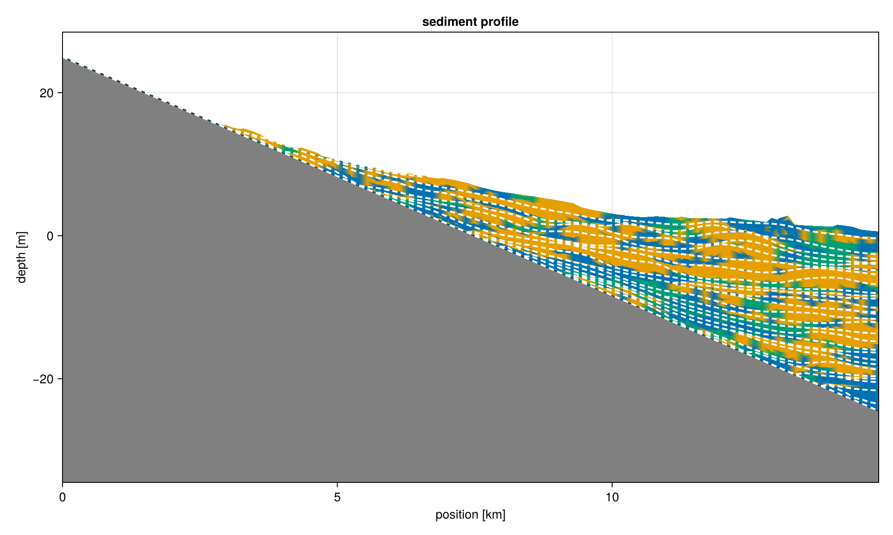
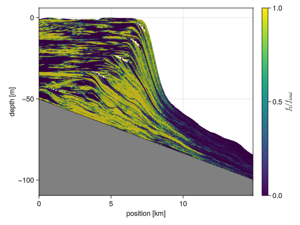
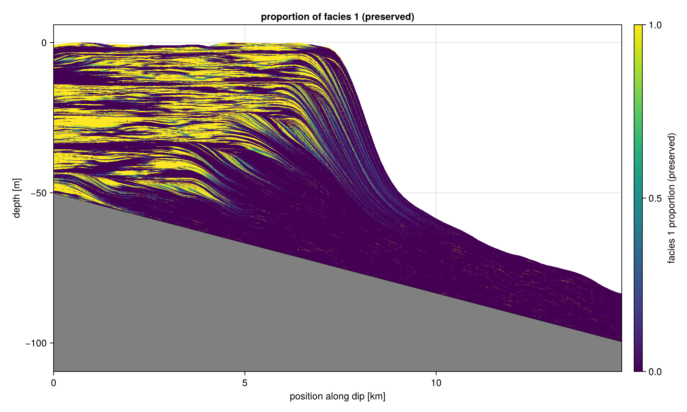

# Profile Plotting



The sediment profile is probably the most important visualization that we provide. By default it allows us to study the sediment composition of a section, by plotting the `argmax` of the deposition. In cases where significant amounts of sediment is eroded, all deposition is plotted, and it is assumed that newest depositions are shown on top of possible older ones.

``` {.julia .task file=examples/visualization/sediment_profile.jl}
#| creates: docs/src/_fig/sediment_profile.png
#| requires: data/output/alcap-example.h5
#| collect: figures

module Script
using CairoMakie
using CarboKitten.Export: read_slice
using CarboKitten.Visualization: sediment_profile

function main()
    save("docs/src/_fig/sediment_profile.png",
        sediment_profile(read_slice("data/output/alcap-example.h5", :profile)...))
end
end

Script.main()
```

If you want to visualize something other than the `argmax` of the deposition, you may use the `profile_plot!` function. For example, we can plot the fraction of second facies over total.



``` {.julia .task file=examples/visualization/profile_fraction.jl}
#| creates: docs/src/_fig/profile_fraction.png
#| requires: data/output/alcap-example.h5
#| collect: figures

module Script
using GLMakie
using CarboKitten.Export: read_slice
using CarboKitten.Visualization: profile_plot!

function main()
    (header, slice) = read_slice("data/output/alcap-example.h5", :profile)
    fig = Figure()
    ax = Axis(fig[1, 1])

    x = header.axes.x
    t = header.axes.t

    plot = profile_plot!(x -> x[2]/sum(x), ax, header, slice; colorrange=(0, 1))
    Colorbar(fig[1, 2], plot; label=L"f_2 / f_{total}")

    save("docs/src/_fig/profile_fraction.png", fig)
    fig
end
end

Script.main()
```
By default, `sediment_profile` shows the **deposited** record — raw deposition at each time step, including material that may later be eroded. To show only the **preserved** record (what survives after erosion, as computed by the stratigraphic column algorithm), pass `mode=:preserved`:

```julia
sediment_profile(header, data; mode=:preserved)
```

The default `mode=:deposited` is fully backward compatible with all existing call sites.

## Cross-section direction

A profile `DataSlice` can represent either a **dip section** (varying along x, fixed y index) or a **strike section** (fixed x index, varying along y). Both are produced by the same `DataVolume` indexing:

```julia
vol[:, j]   # dip section at y = j
vol[i, :]   # strike section at x = i
```

The correct spatial positions and axis label are inferred automatically from `data.slice` — no direction argument is needed. If `data.slice[1]` is an `Int`, the section is fixed in x and varies along y (strike); otherwise it varies along x (dip).

``` {.julia #section-positions}
"""
    _section_positions(header, data)

Return the physical positions along the spatial axis of a profile `data`.
For a dip section (varying x, fixed y) this is `header.axes.x`; for a strike
section (fixed x, varying y) this is `header.axes.y`. The distinction is made
by inspecting `data.slice`: if `data.slice[1]` is an `Int`, x is fixed and the
section runs along y.
"""
function _section_positions(header::Header, data::DataSlice)
    if data.slice[1] isa Int
        return header.axes.y |> in_units_of(u"km")
    else
        return header.axes.x |> in_units_of(u"km")
    end
end
```

## Proportion plot

Beyond the dominant-facies categorical view, it is useful to see the proportion of a specific facies relative to total sediment at each location and time step. The `sediment_proportion!` function provides this using the same mesh geometry as `sediment_profile!`.



``` {.julia .task file=examples/visualization/profile_proportion.jl}
#| creates: docs/src/_fig/profile_proportion.png
#| requires: data/output/alcap-example.h5
#| collect: figures

module Script
using CairoMakie
using CarboKitten.Export: read_slice
using CarboKitten.Visualization: sediment_proportion

function main()
    header, data = read_slice("data/output/alcap-example.h5", :profile)
    save("docs/src/_fig/profile_proportion.png",
         sediment_proportion(header, data, 1; mode=:preserved))
end
end

Script.main()
```

The `mode` keyword selects the sediment record:

- `:deposited` — proportion of raw deposition at each time step (default, consistent with the categorical `sediment_profile!`).
- `:preserved` — proportion of net preserved sediment after applying the stratigraphic column algorithm.


## Implementation

Before we plot anything, we need to make sure that only net positive sediment is still present in our data. We use the [`stratigraphic_column` algorithm](../algorithms/stratigraphic_column.md) to remove sediment from the record that is later disintegrated.

``` {.julia #profile-strat-column}


```

### Exploding Vertices

The profile plot is rendered using Makie's `mesh` function. This function accepts an array of (two-dimensional) vertices and an array of faces, usually triangles. The way mesh rendering works, is that the colour of a face is interpolated between its vertices. Now, the amount of sediment in a given column can be interpreted as sampling a location so the interpretation of colouring a vertex seems the right one. However in the depth (z) we are indicating a clear layer being **between** two depths. We need to duplicate vertices in the vertical direction in order to give ajacent layers different colours. The `explode_quad_vertices` function does exactly that:

``` {.julia #explode-vertices}
"""
    explode_quad_vertices(v)

Takes a three dimensional array representing a grid of vertices. This function duplicates these
vertices in the vertical direction, so that an amount of sediment can be given a single color.

Returns a tuple of vertices and faces (triangles), suitable for plotting with Makie's `mesh`
function.
"""
function explode_quad_vertices(v::Array{Float64,3})
    w, h, d = size(v)
    points = zeros(Float64, w, h - 1, 2, d)
    n_vertices = 2 * w * (h - 1)
    n_quads = (w - 1) * (h - 1)
    @views points[:, :, 1, :] = v[1:end, 1:end-1, :]
    @views points[:, :, 2, :] = v[1:end, 2:end, :]
    idx = reshape(1:n_vertices, w, (h - 1), 2)
    vtx1 = reshape(idx[1:end-1, :, 1], n_quads)
    vtx2 = reshape(idx[2:end, :, 1], n_quads)
    vtx3 = reshape(idx[2:end, :, 2], n_quads)
    vtx4 = reshape(idx[1:end-1, :, 2], n_quads)
    return reshape(points, n_vertices, d),
           vcat(hcat(vtx1, vtx2, vtx3), hcat(vtx1, vtx3, vtx4))
end
```

To map colours onto the returned mesh, we need to take care to duplicate each row in the input.

### Plotting Unconformities

To indicate unconformities in profile plots, we need to do two things:

1. Find those times and locations where the platform is exposed. To reduce noise we can set a minimum time span for which the platform needs to be exposed before showing up in this visualization.
2. Reduce the detected unconformities to line segments (see [the Skeleton Algorithm](../algorithms/skeleton.md)). 

``` {.julia #plot-unconformities}
"""
    plot_unconformities(ax, header, data_slice, minwidth; kwargs...)
    plot_unconformities(ax, header, data_slice, minwidth::Bool; kwargs...)
    plot_unconformities(ax, header, data_slice, minwidth::Int; kwargs...)

Scans the given `data_slice` for unconformities, and plots those using
Makie `linesegments`. The `minwidth` argument controls for how many time
steps the platform needs to be exposed before we plot it. For `minwidth = true`
the default width of 10 time steps is taken.

Additional keyword arguments are forwarded to the `linesegments!` call.
"""
function plot_unconformities(ax::Axis, header::Header, data::DataSlice, h, minwidth::Nothing; kwargs...)
    @info "Not plotting unconformities, got minwidth: $(minwidth)"
end

function plot_unconformities(ax::Axis, header::Header, data::DataSlice, h, minwidth::Bool; kwargs...)
    if minwidth
        plot_unconformities(ax, header, data, h, 10; kwargs...)
    end
end

function plot_unconformities(ax::Axis, header::Header, data::DataSlice, h, minwidth::Int; kwargs...)
    x = header.axes.x |> in_units_of(u"km")
    wi = data.write_interval
    hiatus = skeleton(water_depth(header, data) .< 0.0u"m", minwidth=minwidth)

    if !isempty(hiatus[1])
        verts = [(x[pt[1]], h[pt...] |> in_units_of(u"m")) for pt in hiatus[1]]
        linesegments!(ax, vec(permutedims(verts[hiatus[2]])); kwargs...)
    end
end
```

### Plotting Co-eval Lines

``` {.julia #plot-coeval-lines}
function age_depth_model(header::Header, data::DataSlice)
    x = header.axes.x |> in_units_of(u"km")
    t = header.axes.t |> in_units_of(u"Myr")

    n_facies, n_x, n_t = size(data.production)
    total_subsidence = (header.axes.t[end] - header.axes.t[1]) * header.subsidence_rate
    initial_topography = header.initial_topography[data.slice...]
    sc = stratigraphic_column(data)
    h = repeat(initial_topography .- total_subsidence, 1, n_t+1)
    @views h[:, 2:end] .+= cumsum(sum(sc, dims=1)[1,:,:], dims=2)
    return h
end

"""
    coeval_lines!(ax::Axis, header::Header, data::DataSlice, tics::Bool)
    coeval_lines!(ax::Axis, header::Header, data::DataSlice, adm::AbstractMatrix, tics::Bool)

Plot coeval lines using default settings. If `tics` is false, nothing is done.

The `adm` argument should contain the age-depth model for the entire slice in
units of m. This can be computed by getting the `cumsum` of the
`stratigraphic_column` of the `data` argument. If the `adm` argument is left
out, the stratigraphic column will be computed from `data` first.
"""
coeval_lines!(ax::Axis, header::Header, data::DataSlice, n_tics::Bool) =
    coeval_lines!(ax, header, data, age_depth_model(header, data), n_tics)

function coeval_lines!(ax::Axis, header::Header, data::DataSlice, adm::AbstractMatrix{Amount}, n_tics::Bool)
    if !n_tics
        return
    else
        coeval_lines!(ax, header, data, adm)
    end
end

"""
    coeval_lines!(ax::Axis, header::Header, data::DataSlice, tics::Vector{Time}; kwargs...)
    coeval_lines!(ax::Axis, header::Header, data::DataSlice, adm::AbstractMatrix, tics::Vector{Time}; kwargs...)

Plot coeval lines for given times. The times in `tics` are looked up in `header.axes.t`
to find which indices to plot.
"""
coeval_lines!(ax::Axis, header::Header, data::DataSlice, tics::Vector{Time}; kwargs...) =
    coeval_lines!(ax, header, data, age_depth_model(header, data), tics; kwargs...)

function coeval_lines!(ax::Axis, header::Header, data::DataSlice, adm::AbstractMatrix{Amount}, tics::Vector{Time}; kwargs...)
    t = header.axes.t[1:data.write_interval:end]
    indices::Vector{Int} = [searchsortedfirst(t, i) for i in tics]
    coeval_lines!(ax, header, data, adm, indices; kwargs...)
end

"""
    coeval_lines!(ax::Axis, header::Header, data::DataSlice, n_tics::Tuple{Int, Int})
    coeval_lines!(ax::Axis, header::Header, data::DataSlice, adm::AbstractMatrix, n_tics::Tuple{Int, Int})

Plot coeval lines on regular intervals given by `n_tics`. The tuple gives the number of intervals
for both minor and major tics, plotted as dotted and solid black lines respectively.
If you need more control over the aestetics of these lines, use the other `coeval_lines!` methods.
"""
coeval_lines!(ax::Axis, header::Header, data::DataSlice, n_tics::Tuple{Int, Int}; kwargs...) =
    coeval_lines!(ax, header, data, age_depth_model(header, data), n_tics; kwargs...)

function coeval_lines!(ax::Axis, header::Header, data::DataSlice, adm::AbstractMatrix{Amount}, n_tics::Tuple{Int, Int} = (4, 8))
    n_steps = div(header.time_steps, data.write_interval)
    n_major_tics, n_minor_tics = n_tics

    major_tics = div.(n_steps:n_steps:n_steps*n_major_tics, n_major_tics) .+ 1
    minor_tics = filter(
        t->!(t in major_tics),
        div.(n_steps:n_steps:n_steps*n_minor_tics, n_minor_tics) .+ 1) |> collect

    coeval_lines!(ax, header, data, adm, minor_tics, color=:black, linewidth=1, linestyle=:dot)
    coeval_lines!(ax, header, data, adm, major_tics, color=:black, linewidth=1, linestyle=:solid)
end

"""
    coeval_lines!(ax::Axis, header::Header, data::DataSlice, tics::Vector{Int}; kwargs...)
    coeval_lines!(ax::Axis, header::Header, data::DataSlice, adm::AbstractMatrix, tics::Vector{Int}; kwargs...)

Plot coeval lines for the given indices. The `kwargs...` are forwarded to a call to Makie's
`lines!` procedure.
"""
coeval_lines!(ax::Axis, header::Header, data::DataSlice, tics::Vector{Int}; kwargs...) =
    coeval_lines!(ax, header, data, age_depth_model(header, data), tics; kwargs...)

function coeval_lines!(ax::Axis, header::Header, data::DataSlice, adm::AbstractMatrix{Amount}, tics::Vector{Int}; kwargs...)
    x = header.axes.x |> in_units_of(u"km")
    h = adm |> in_units_of(u"m")
    for t in tics
        lines!(ax, x, h[:, t]; kwargs...)
    end
end

function plot_sealevel!(ax::Axis, header::Header)
    sea_level = header.sea_level[end] |> in_units_of(u"m")
    hlines!(ax, sea_level, color=:lightblue, linewidth=5, label="end sea level")
end
```

```{.julia file=ext/SedimentProfile.jl}
module SedimentProfile

import CarboKitten.Visualization: sediment_profile, sediment_profile!, profile_plot!, coeval_lines!, sediment_proportion!, sediment_proportion

using CarboKitten.Visualization
using CarboKitten.Utility: in_units_of
using CarboKitten.Export: Header, Data, DataSlice, read_data, read_slice
using CarboKitten.Algorithms: skeleton
using CarboKitten.Output.Abstract: stratigraphic_column, water_depth

using Makie
using GeometryBasics
using Unitful

using Statistics: mean

const Rate = typeof(1.0u"m/Myr")
const Amount = typeof(1.0u"m")
const Length = typeof(1.0u"m")
const Time = typeof(1.0u"Myr")

const na = [CartesianIndex()]


<<section-positions>>
<<explode-vertices>>
<<plot-unconformities>>
<<plot-coeval-lines>>

"""
    profile_plot!(ax, header, data_slice; mesh_args...)

Generic profile plot. This sets up a mesh for plotting with the Makie `mesh!`
function, plots the initial topography and the mesh by passing `mesh_args...`.

The `color` array should have the same size as a single facies for `data.production`.
"""
function profile_plot!(ax::Axis, header::Header, data::DataSlice; color::AbstractArray, mesh_args...)
    x = header.axes.x |> in_units_of(u"km")
    t = header.axes.t |> in_units_of(u"Myr")

    n_facies, n_x, n_t = size(data.production)
    total_subsidence = (header.axes.t[end] - header.axes.t[1]) * header.subsidence_rate
    initial_topography = header.initial_topography[data.slice...]
    sc = stratigraphic_column(data)
    h = repeat(initial_topography .- total_subsidence, 1, n_t+1)
    sc_clamped = max.(sc, zero(eltype(sc)))  
    @views h[:, 2:end] .+= cumsum(sum(sc_clamped, dims=1)[1,:,:], dims=2)

    verts = zeros(Float64, n_x, n_t+1, 2)
    @views verts[:, :, 1] .= x
    @views verts[:, :, 2] .= h |> in_units_of(u"m")
    v, f = explode_quad_vertices(verts)

    total_subsidence = header.subsidence_rate * (header.axes.t[end] - header.axes.t[1])
    bedrock = (header.initial_topography[data.slice...] .- total_subsidence) |> in_units_of(u"m")
    lower_limit = minimum(bedrock) - 20
    band!(ax, x, lower_limit, bedrock; color=:gray, label="initial topography")
    lines!(ax, x, bedrock; color=:black, label="initial topography")
    ylims!(ax, lower_limit + 10, nothing)
    xlims!(ax, x[1], x[end])
    ax.xlabel = "position [km]"
    ax.ylabel = "depth [m]"

    c = reshape(color, n_x * n_t)
    mesh!(ax, v, f; color=vcat(c, c), mesh_args...)
end

"""
    profile_plot!(f, ax, header, data_slice; mesh_args...)

Instead of explicitely passing the color data as an array, this generates the
colors from a function `f` over the deposition data. So `f` should have signature
`AbstractVector -> Float` or possibly `AbstractVector -> RGB` (whatever Makie accepts).
Here the vector input has size of the number of facies.
"""
function profile_plot!(f::F, ax::Axis, header::Header, data::DataSlice; mesh_args...) where {F}
    color = f.(eachslice(data.deposition, dims=(2, 3)))
    profile_plot!(ax, header, data; color=color, mesh_args...)
end

"""
    sediment_profile!(ax, header, data; show_unconformities)

Plot the sediment profile, choosing colour by dominant facies type (argmax).

`mode` selects the sediment record:

- `:deposited` — dominant facies of raw deposition at each time step (default,
  original behaviour — fully backward compatible).
- `:preserved` — dominant facies of net preserved sediment after applying the
  stratigraphic column algorithm.

Unconformities are shown when the sediment is subaerially exposed.
"""
function sediment_profile!(ax::Axis, header::Header, data::DataSlice;
                           mode::Symbol = :deposited,
                           show_unconformities::Union{Nothing,Bool,Int} = true,
                           show_coeval_lines::Union{Bool,Tuple{Int, Int},Vector{Int},Vector{Time}} = true,
                           show_sealevel::Bool = true)
    n_facies, n_x, n_t = size(data.production)
    total_subsidence = (header.axes.t[end] - header.axes.t[1]) * header.subsidence_rate
    initial_topography = header.initial_topography[data.slice...]
    sc = stratigraphic_column(data)
    h = repeat(initial_topography .- total_subsidence, 1, n_t+1)
    sc_clamped = max.(sc, zero(eltype(sc)))   
    @views h[:, 2:end] .+= cumsum(sum(sc_clamped, dims=1)[1,:,:], dims=2)

    if show_sealevel
        plot_sealevel!(ax, header)
    end

    plot = if mode === :deposited
            profile_plot!(argmax, ax, header, data; alpha=1.0,
                colormap=cgrad(Makie.wong_colors()[1:n_facies], n_facies, categorical=true))
        elseif mode === :preserved
            color = map(argmax, eachslice(sc, dims=(2, 3)))
            profile_plot!(ax, header, data; color=color, alpha=1.0,
                colormap=cgrad(Makie.wong_colors()[1:n_facies], n_facies, categorical=true))
        else
            error("mode must be :deposited or :preserved, got :$(mode)")
        end

    coeval_lines!(ax, header, data, h, show_coeval_lines)

    minwidth = show_unconformities
    plot_unconformities(ax, header, data, h, minwidth; label = "unconformities",
                        color=:white, linestyle=:dash, linewidth=1)

    ax.title = "sediment profile ($(mode))"
    return plot
end

"""
sediment_profile(header, data_slice; mode=:deposited, show_unconformities=true)

Plot the sediment profile from `data_slice`. Dominant facies colour is chosen by
`argmax`. `mode` selects `:deposited` (default, backward compatible) or
`:preserved` sediment. By default unconformities are shown using dashed white
lines.
"""
function sediment_profile(header::Header, data_slice::DataSlice;
                           mode::Symbol = :deposited,
                           show_unconformities::Union{Bool,Int,Nothing} = true)
    fig = Figure(size=(1000, 600))
    ax = Axis(fig[1, 1])
    sediment_profile!(ax, header, data_slice; mode=mode, show_unconformities=show_unconformities)
    return fig
end

"""
    sediment_proportion!(ax, header, data, facies_index;
                         mode=:deposited, colorrange=(0,1), colormap=:viridis)

Plot the proportion of `facies_index` relative to total sediment using the same
stratigraphic mesh as `sediment_profile!`.

`mode` selects the sediment record:

- `:deposited` — proportion of raw deposition (`data.deposition`).
- `:preserved` — proportion of net preserved sediment (`stratigraphic_column`).

Returns the `mesh!` plot object (for attaching a `Colorbar`).
"""
function sediment_proportion!(ax::Axis, header::Header, data::DataSlice, facies_index::Int;
                               mode::Symbol = :deposited,
                               colorrange::Tuple = (0.0, 1.0),
                               colormap = :viridis)
    n_facies = size(data.production, 1)
    @assert 1 <= facies_index <= n_facies "facies_index $(facies_index) out of range 1:$(n_facies)"

    source = if mode === :deposited
        data.deposition
    elseif mode === :preserved
        stratigraphic_column(data)
    else
        error("mode must be :deposited or :preserved, got :$(mode)")
    end

    proportion = map(eachslice(source, dims=(2, 3))) do col
        total = sum(col)
        total > zero(total) ? col[facies_index] / total : 0.0
    end

    plot = profile_plot!(ax, header, data; color=proportion,
        colorrange=colorrange, colormap=colormap)
    ax.title = "proportion of facies $(facies_index) ($(mode))"
    return plot
end

"""
    sediment_proportion(header, data, facies_index; mode=:deposited, kwargs...)

Standalone proportion figure. See `sediment_proportion!` for keyword arguments.
"""
function sediment_proportion(header::Header, data::DataSlice, facies_index::Int;
                              mode::Symbol = :deposited,
                              colorrange::Tuple = (0.0, 1.0),
                              colormap = :viridis)
    fig = Figure(size=(1000, 600))
    ax  = Axis(fig[1, 1])
    plot = sediment_proportion!(ax, header, data, facies_index;
        mode=mode, colorrange=colorrange, colormap=colormap)
    Colorbar(fig[1, 2], plot; label="facies $(facies_index) proportion ($(mode))")
    return fig
end

end  # module
```
