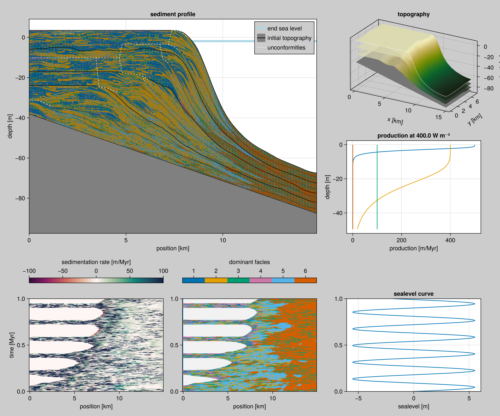
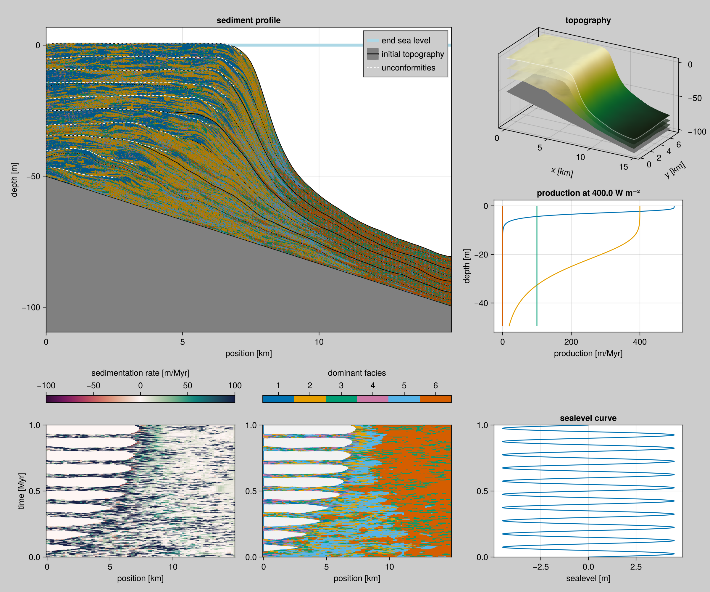

Visualization Tests
===================

Visualization routines are hard to test. There are several options here:

- Perform regression tests against generated output files. Problem: The output of `GLMakie` depends on the graphics card that is used to render the images. We should expect better from `CairoMakie`, but no such luck. Perhaps this could work if we're very strict about the Makie versions that we test on. For now, we don't perform automated regression tests on visualization.
- Test that the plotting functions don't throw exceptions.
- Test the inner logic in those visualizations that are more involved.
- Generate plots on a set of model runs automatically and compare manually.

The rest of this page is doing that last thing.

Results
-------





Runs
----

We have the following examples for each model.

- [CAP Example](../models/ca-with-production.md)
- [ALCAP Example](../models/alcap.md)
- [Without CA (ALP)](../models/without-ca.md)
- TODO [With Denudation](../models/with-denudation.md)

And some extras to stress test the visualization.

### Standard Facies

``` {.julia #standard-facies}
const FACIES = [
    ALCAP.Facies(
        maximum_growth_rate=500u"m/Myr",
        extinction_coefficient=0.8u"m^-1",
        saturation_intensity=60u"W/m^2",
        diffusion_coefficient=50.0u"m/yr",
        name="euphotic"),
    ALCAP.Facies(
        maximum_growth_rate=400u"m/Myr",
        extinction_coefficient=0.1u"m^-1",
        saturation_intensity=60u"W/m^2",
        diffusion_coefficient=25.0u"m/yr",
        name="oligophotic"),
    ALCAP.Facies(
        maximum_growth_rate=100u"m/Myr",
        extinction_coefficient=0.005u"m^-1",
        saturation_intensity=60u"W/m^2",
        diffusion_coefficient=12.5u"m/yr",
        name="aphotic"),

    ALCAP.Facies(
        active=false,
        diffusion_coefficient=50.0u"m/yr",
        name="euphotic transported"),
    ALCAP.Facies(
        active=false,
        diffusion_coefficient=50.0u"m/yr",
        name="oligophotic transported"),
    ALCAP.Facies(
        active=false,
        diffusion_coefficient=50.0u"m/yr",
        name="aphotic transported")
]
```

### Extreme Submarine Erosion

This run has an extreme disintegration rate.

``` {.julia #extreme-erosion-parameters}
subsidence_rate=38.0u"m/Myr",
disintegration_rate=80.0u"m/Myr",
```

Other parameters are unchanged from our usual settings.

``` {.julia .task file=examples/extreme-erosion/run.jl}
#| creates:
#|   - data/output/alcap-extreme-erosion.h5
module ScriptExtremeErosion

using Unitful
using CarboKitten
using CarboKitten.Export: read_slice, data_export, CSV

const PATH = "data/output"
const TAG = "alcap-extreme-erosion"

<<standard-facies>>

const PERIOD = 0.18u"Myr"
const AMPLITUDE = 5.5u"m"

const INPUT = ALCAP.Input(
    tag="$TAG",
    box=Box{Coast}(grid_size=(100, 50), phys_scale=150.0u"m"),
    time=TimeProperties(
        Δt=0.0002u"Myr",
        steps=5000),
    output=Dict(
        :topography => OutputSpec(slice=(:,:), write_interval=10),
        :profile => OutputSpec(slice=(:, 25), write_interval=1)),
    ca_interval=1,
    initial_topography=(x, y) -> -x / 300.0,
    sea_level=t -> AMPLITUDE * sin(2π * t / PERIOD),
    disintegration_transfer=p->[0.0u"m", 0.0u"m", 0.0u"m", p[1]+p[4], p[2]+p[5], p[3]+p[6]],
    insolation=400.0u"W/m^2",
    sediment_buffer_size=150,  
    depositional_resolution=1.0u"m",  
    facies=FACIES,
    <<extreme-erosion-parameters>>
)

main() = run_model(Model{ALCAP}, INPUT, "$(PATH)/$(TAG).h5")
end  # module ScriptExtremeErosion

ScriptExtremeErosion.main()
```

### Extreme Sea Level Fluctuations

``` {.julia file=examples/extreme-sealevel/run.jl}
module ScriptRapidOscillation

using Unitful
using CarboKitten
using CarboKitten.Export: read_slice, data_export, CSV

const PATH = "data/output"
const TAG = "alcap-rapid-oscillation"

<<standard-facies>>

const PERIOD = 0.1u"Myr"
const AMPLITUDE = 4.5u"m"

const INPUT = ALCAP.Input(
    tag="$TAG",
    box=Box{Coast}(grid_size=(100, 50), phys_scale=150.0u"m"),
    time=TimeProperties(
        Δt=0.0002u"Myr",
        steps=5000),
    output=Dict(
        :topography => OutputSpec(slice=(:,:), write_interval=10),
        :profile => OutputSpec(slice=(:, 25), write_interval=1)),
    ca_interval=1,
    initial_topography=(x, y) -> -x / 300.0,
    sea_level=t -> AMPLITUDE * sin(2π * t / PERIOD),
    subsidence_rate=50.0u"m/Myr",
    disintegration_rate=65.0u"m/Myr",  
    disintegration_transfer=p->[0.0u"m", 0.0u"m", 0.0u"m", p[1]+p[4], p[2]+p[5], p[3]+p[6]],
    insolation=400.0u"W/m^2",
    sediment_buffer_size=150,  
    depositional_resolution=1.0u"m",  
    facies=FACIES)

main() = run_model(Model{ALCAP}, INPUT, "$(PATH)/$(TAG).h5")

end

ScriptRapidOscillation.main()
```

Plotting
--------

``` {.julia .task file=examples/visualization/stress-test.jl}
#| requires:
#|   - data/output/alcap-extreme-erosion.h5
#|   - data/output/alcap-rapid-oscillation.h5
#| creates:
#|   - docs/src/_fig/alcap-extreme-erosion.png
#|   - docs/src/_fig/alcap-rapid-oscillation.h5
#| collect: figures
using GLMakie
using CarboKitten.Visualization

GLMakie.activate!()

fig_erosion = summary_plot("data/output/alcap-extreme-erosion.h5")
save("docs/src/_fig/alcap-extreme-erosion.png", fig_erosion)

fig_oscillation = summary_plot("data/output/alcap-rapid-oscillation.h5")
save("docs/src/_fig/alcap-rapid-oscillation.png", fig_oscillation)
```
