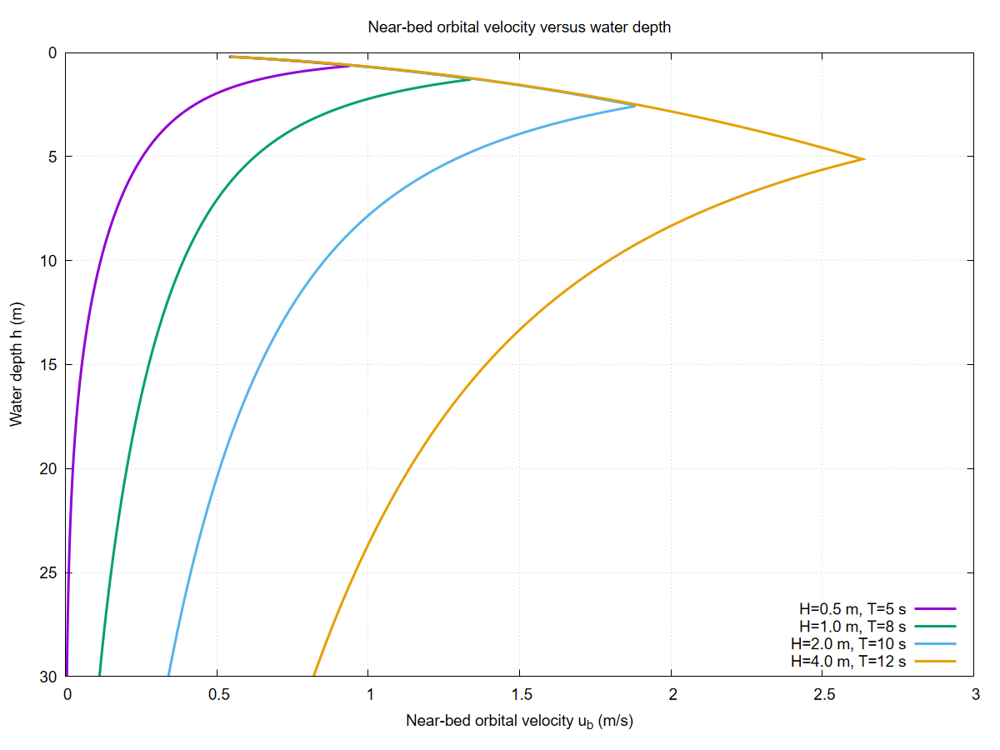
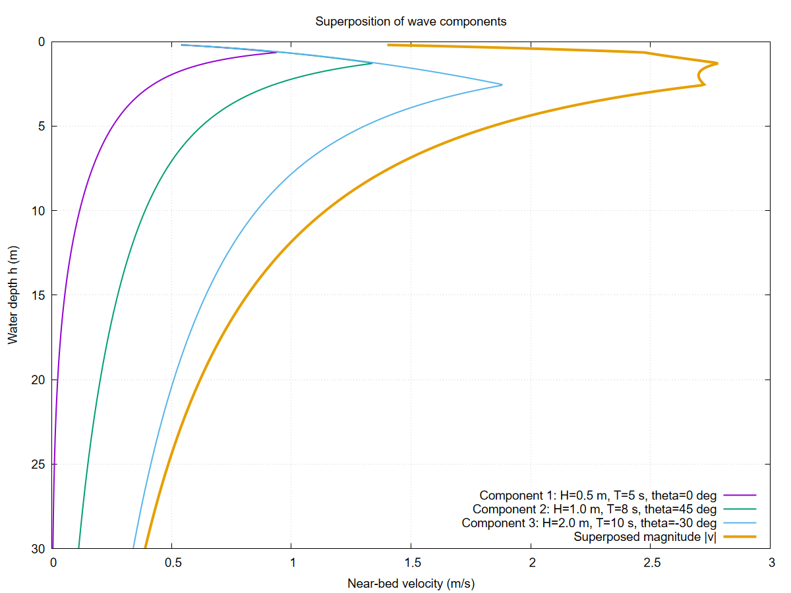
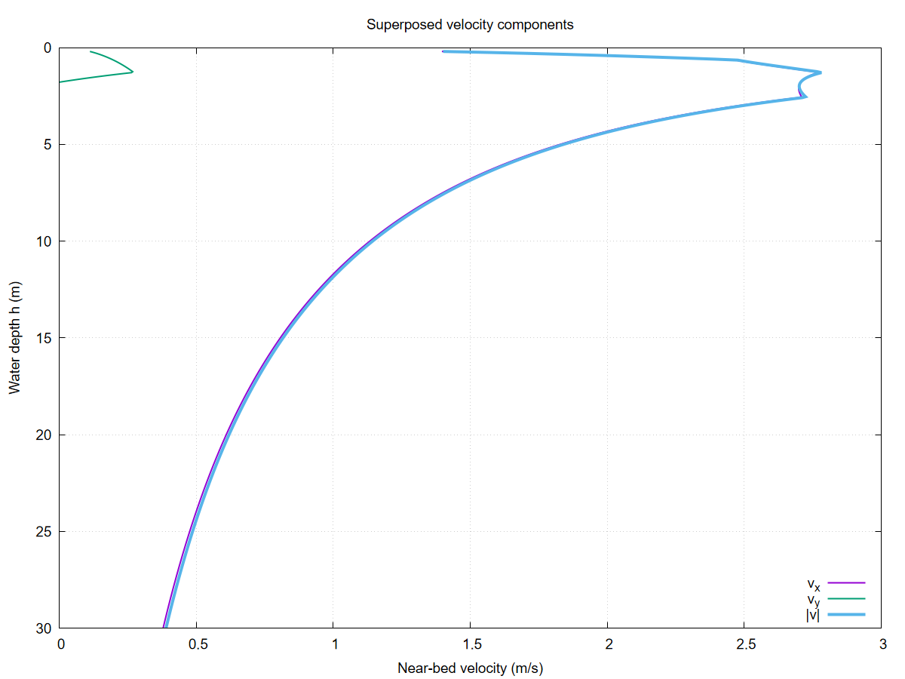

# Wave Field

The `WaveField` module extends CarboKitten's wave transport with physically consistent wave dynamics based on linear (Airy) wave theory. It provides a callable `AiryWaveField` struct that plugs directly into the existing `Facies.wave_velocity` interface — no changes to the transport solver or active layer code are required.

## Motivation

The original transport module represents wave action through a single depth-dependent velocity function `wave_velocity(h) -> (velocity, shear)`. While flexible, this approach requires the user to hand-craft a closure for each scenario. The `AiryWaveField` type automates this by computing physically consistent near-bed orbital velocities from standard wave parameters (amplitude, period, direction).

## Linear wave theory

Each wave component is defined by amplitude $H$, period $T$, propagation direction $\theta$, phase offset $\varphi_0$, and a base attenuation coefficient.

### Dispersion relation

Wavelength is computed dynamically at each grid cell using the full dispersion relation:

$$\omega^2 = g k \tanh(k h)$$

where $\omega = 2\pi/T$ is angular frequency, $k$ is wave number, $g$ is gravitational acceleration, and $h$ is local water depth. The equation is solved numerically using a Newton–Raphson iteration with the deep-water approximation $k_0 = \omega^2/g$ as initial guess. This formulation ensures correct behavior across deep, intermediate, and shallow water regimes.

### Depth-limited breaking

To prevent unrealistic growth in shallow water, wave height is limited by a breaker index formulation (McCowan criterion):

$$H_{\mathrm{eff}} = \min(H, \gamma_b \cdot h)$$

with $\gamma_b = 0.78$ by default, corresponding to the classical shallow-water breaking index. This prevents wave heights from exceeding approximately 78% of local water depth.

### Near-bed orbital velocity

The near-bed orbital velocity amplitude is:

$$u_b = \frac{\pi H_{\mathrm{eff}}}{T \sinh(k h)}$$

This expression decays rapidly with depth and approaches deep-water behavior for large $kh$.



### Multi-directional superposition

Multiple wave components can be superposed. The total near-bed velocity vector is:

$$\mathbf{v} = \sum_i u_{b,i} \, \hat{\mathbf{d}}_i$$

where $\hat{\mathbf{d}}_i = (\cos\theta_i, \sin\theta_i)$ is the propagation direction of component $i$.




### Energy flux

Wave energy flux per unit crest length is:

$$E = \frac{1}{8} \rho g H_{\mathrm{eff}}^2 \, c_g$$

where group velocity $c_g = c \cdot n$ with phase velocity $c = \omega/k$ and the group velocity factor:

$$n = \frac{1}{2}\left(1 + \frac{2kh}{\sinh 2kh}\right)$$

## Usage

The `AiryWaveField` is a drop-in replacement for the lambda-based `wave_velocity` closures. Existing closures (including the default no-transport and `v_const`) continue to work unchanged.

    using CarboKitten.WaveField: AiryWaveField, AiryWaveComponent

    # Single dominant swell from the west
    wf = AiryWaveField(components=[
        AiryWaveComponent(amplitude=1.5u"m", period=8.0u"s", direction=0.0),
    ])

    # Multi-directional sea state
    wf = AiryWaveField(components=[
        AiryWaveComponent(amplitude=1.5u"m", period=8.0u"s", direction=0.0),
        AiryWaveComponent(amplitude=0.5u"m", period=5.0u"s", direction=π/4),
    ], breaker_index=0.78)

    # Plug into a facies definition
    facies = ALCAP.Facies(
        wave_velocity = wf,
        transport_coefficient = 50.0u"m/yr",
        ...)

## Backward compatibility

The `Facies.wave_velocity` field accepts any callable with signature `water_depth -> (Vec2{velocity}, Vec2{shear})`. The existing lambda-based closures and `v_const` helpers satisfy this interface. `AiryWaveField` is simply a new callable that also satisfies it. No existing code changes, no dispatch ambiguity, no type constraints broken.

## Implementation

``` {.julia file=src/WaveField.jl}
module WaveField

using Unitful
using GeometryBasics

export AiryWaveComponent, AiryWaveField, energy_flux, group_velocity

# =============================================================================
# Types
# =============================================================================

"""
    AiryWaveComponent(; amplitude, period, direction, phase=0.0, attenuation=0.0u"m^-1")

A single monochromatic wave component:

- `amplitude` — wave height H (crest-to-trough) in meters.
- `period` — wave period T in seconds.
- `direction` — propagation angle θ in radians (0 = +x, π/2 = +y).
- `phase` — phase offset φ₀ in radians.
- `attenuation` — spatial decay coefficient (e.g. for bottom friction).
"""
@kwdef struct AiryWaveComponent
    amplitude::typeof(1.0u"m")       = 1.0u"m"
    period::typeof(1.0u"s")          = 10.0u"s"
    direction::Float64               = 0.0
    phase::Float64                   = 0.0
    attenuation::typeof(1.0u"m^-1")  = 0.0u"m^-1"
end

"""
    AiryWaveField(; components, breaker_index=0.78, gravity=9.81u"m/s^2", density=1025.0u"kg/m^3")

A superposition of `AiryWaveComponent`s. Callable: `wf(water_depth)` returns
`(Vec2{velocity}, Vec2{shear})` compatible with the existing
`Facies.wave_velocity` interface in `Components.ActiveLayer`.

Existing lambda-based wave velocities (including the default no-transport
closure and `v_const`) continue to work — this type is an alternative, not
a replacement.

- `breaker_index` — γ_b for depth-limited breaking (default 0.78).
- `gravity` — gravitational acceleration.
- `density` — water density (for energy flux diagnostics).
"""
@kwdef struct AiryWaveField
    components::Vector{AiryWaveComponent} = AiryWaveComponent[]
    breaker_index::Float64               = 0.78
    gravity::typeof(1.0u"m/s^2")         = 9.81u"m/s^2"
    density::typeof(1.0u"kg/m^3")        = 1025.0u"kg/m^3"
end

# =============================================================================
# Dispersion relation
# =============================================================================

"""
    solve_dispersion(ω, h, g; tol, maxiter) -> k

Solve ω² = g k tanh(k h) for wave number k using Newton–Raphson iteration,
starting from the deep-water approximation k₀ = ω²/g. All arguments are
plain Float64 in SI units.
"""
function solve_dispersion(ω::Float64, h::Float64, g::Float64;
                          tol::Float64=1e-8, maxiter::Int=50)
    h <= 0.0 && return 0.0
    k = ω^2 / g                        # deep-water initial guess
    for _ in 1:maxiter
        kh = k * h
        th = tanh(kh)
        f  = ω^2 - g * k * th
        df = -g * (th + k * h * (1.0 - th^2))
        abs(df) < 1e-30 && break
        dk = -f / df
        k += dk
        abs(dk) < tol * abs(k) && break
    end
    return max(k, 0.0)
end

# =============================================================================
# Per-component orbital velocity (all SI, no units)
# =============================================================================

"""
    _orbital_velocity(H, T, k, h, γ_b) -> (u_b, H_eff)

Near-bed orbital velocity amplitude and depth-limited wave height.
All arguments in SI (m, s), returns (m/s, m).
"""
function _orbital_velocity(H::Float64, T::Float64, k::Float64, h::Float64, γ_b::Float64)
    h <= 0.0 && return (0.0, 0.0)

    # Depth-limited breaking
    H_eff = min(H, γ_b * h)

    # u_b = π H / (T sinh(kh))
    kh = k * h
    sh = sinh(max(kh, 1e-10))
    u_b = π * H_eff / (T * sh)

    return (u_b, H_eff)
end

# =============================================================================
# Velocity vector at a given depth (SI, no units)
# =============================================================================

function _velocity_si(wf::AiryWaveField, h::Float64)
    g  = ustrip(u"m/s^2", wf.gravity)
    γ_b = wf.breaker_index
    vx = 0.0
    vy = 0.0

    for comp in wf.components
        H  = ustrip(u"m", comp.amplitude)
        T  = ustrip(u"s", comp.period)
        ω  = 2π / T
        k  = solve_dispersion(ω, h, g)
        u_b, _ = _orbital_velocity(H, T, k, h, γ_b)

        vx += u_b * cos(comp.direction)
        vy += u_b * sin(comp.direction)
    end

    return (vx, vy)
end

# =============================================================================
# Callable interface: (::AiryWaveField)(water_depth) -> (Vec2, Vec2)
# =============================================================================

"""
    (wf::AiryWaveField)(water_depth)

Evaluate the wave field at `water_depth`. Returns
`(velocity::Vec2, shear::Vec2)` in units of m/s and 1/s respectively,
compatible with the `Facies.wave_velocity` interface.

Velocity is the vector sum of near-bed orbital velocity amplitudes directed
along each component's propagation direction. Shear is d(velocity)/d(depth),
computed by central finite differences.
"""
function (wf::AiryWaveField)(water_depth)
    h = ustrip(u"m", water_depth)

    vx, vy = _velocity_si(wf, h)

    # Shear = dv/dh via central differences
    δ = max(abs(h) * 1e-4, 1e-4)
    vx_p, vy_p = _velocity_si(wf, h + δ)
    vx_m, vy_m = _velocity_si(wf, max(0.0, h - δ))
    sx = (vx_p - vx_m) / (2δ)
    sy = (vy_p - vy_m) / (2δ)

    return (Vec2(vx * u"m/s", vy * u"m/s"),
            Vec2(sx * u"s^-1", sy * u"s^-1"))
end

# =============================================================================
# Diagnostics: group velocity and energy flux
# =============================================================================

"""
    group_velocity(comp, h, g) -> c_g  [m/s]

Group velocity from linear theory: c_g = c · n where
n = ½(1 + 2kh / sinh(2kh)) and c = ω/k.
"""
function group_velocity(comp::AiryWaveComponent, h_m::Float64, g::Float64)
    T  = ustrip(u"s", comp.period)
    ω  = 2π / T
    k  = solve_dispersion(ω, h_m, g)
    k <= 0.0 && return 0.0
    kh = k * h_m
    c  = ω / k
    n  = 0.5 * (1.0 + 2kh / sinh(max(2kh, 1e-10)))
    return c * n
end

"""
    energy_flux(wf::AiryWaveField, water_depth) -> E  [W/m]

Total wave energy flux per unit crest length from all components:
E = Σ (1/8) ρ g H_eff² c_g
"""
function energy_flux(wf::AiryWaveField, water_depth)
    h  = ustrip(u"m", water_depth)
    g  = ustrip(u"m/s^2", wf.gravity)
    ρ  = ustrip(u"kg/m^3", wf.density)
    γ_b = wf.breaker_index

    E = 0.0
    for comp in wf.components
        H  = ustrip(u"m", comp.amplitude)
        T  = ustrip(u"s", comp.period)
        ω  = 2π / T
        k  = solve_dispersion(ω, h, g)
        _, H_eff = _orbital_velocity(H, T, k, h, γ_b)
        c_g = group_velocity(comp, h, g)
        E += (1.0 / 8.0) * ρ * g * H_eff^2 * c_g
    end
    return E * u"W/m"
end

end
```

## Tests

```{.julia .task file=examples/wavefield/airy_test.jl}
module AiryTest

using Unitful
using CarboKitten
using CarboKitten.WaveField: AiryWaveField, AiryWaveComponent, energy_flux

# ── 1. Basic sanity: single swell ──────────────────────────────────────

wf = AiryWaveField(components=[
    AiryWaveComponent(amplitude=1.5u"m", period=8.0u"s", direction=0.0),
])

# Evaluate at several depths
for h in [5.0, 10.0, 20.0, 50.0, 100.0]
    v, s = wf(h * u"m")
    E = energy_flux(wf, h * u"m")
    println("h=$(h)m  v=$(v)  shear=$(s)  E=$(E)")
end

# ── 2. Verify breaking: velocity should plateau in very shallow water ──

v_deep, _  = wf(50.0u"m")
v_shallow, _ = wf(0.5u"m")
println("\nDeep velocity: $(v_deep)")
println("Shallow velocity (depth-limited): $(v_shallow)")

# ── 3. Multi-directional sea state ─────────────────────────────────────

wf2 = AiryWaveField(components=[
    AiryWaveComponent(amplitude=1.5u"m", period=8.0u"s", direction=0.0),
    AiryWaveComponent(amplitude=0.5u"m", period=5.0u"s", direction=π/4),
    AiryWaveComponent(amplitude=0.3u"m", period=12.0u"s", direction=-π/6),
])

v, s = wf2(10.0u"m")
println("\nMulti-directional at 10m: v=$(v)  shear=$(s)")

# ── 4. Plug into ALCAP facies (backward compat demo) ───────────────────

input = ALCAP.Input(
    tag = "airy-wave-test",
    box = Box{Coast}(grid_size=(50, 25), phys_scale=150.0u"m"),
    time = TimeProperties(Δt=0.02u"Myr", steps=10),
    output = Dict(
        :profile => OutputSpec(slice=(:, 13), write_interval=10)),
    ca_interval = 1,
    initial_topography = (x, y) -> -x / 300.0,
    sea_level = t -> 4.0u"m" * sin(2π * t / 0.2u"Myr"),
    subsidence_rate = 50.0u"m/Myr",
    disintegration_rate = 50.0u"m/Myr",
    lithification_time = 100.0u"yr",
    insolation = 400.0u"W/m^2",
    sediment_buffer_size = 50,
    depositional_resolution = 0.5u"m",
    facies = [ALCAP.Facies(
        viability_range = (4, 10),
        activation_range = (6, 10),
        production = ALCAP.Example.FACIES[1].production,
        transport_coefficient = 50.0u"m/yr",
        wave_velocity = wf,
        name = "airy-swell")])

mkpath("data/output")
run_model(Model{ALCAP}, input, "data/output/airy-wave-test.h5")
println("\nModel run complete → data/output/airy-wave-test.h5")

end
```
